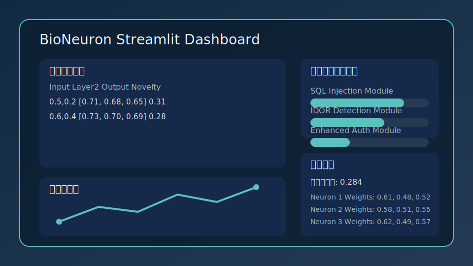

# BioNeuronAI

[繁體中文](#繁體中文) | [English](#english)

---

## 繁體中文

**生物啟發的新穎性檢測與安全協同框架**


### ✨ 特性

- 🧠 **Hebbian 學習**：具備突觸可塑性與短期記憶佇列。
- 🔍 **新穎性評分**：提供 0~1 區間的探索強度指標。
- 🛡️ **安全模組**：增強認證、SQLi、IDOR 偵測全覆蓋。
- 🛠️ **多語工具鏈**：所有註解與提示皆含 `[ZH]/[EN]` 雙語標籤。
- 📚 **文件系統**：MkDocs 自動生成 API、白皮書與教程。

### 🚀 快速開始


# 啟動 CLI 示範
bioneuron-cli


# 保存並重新載入神經元狀態
state_path = Path("neuron_state.npz")
neuron.save_state(state_path)
reloaded = BioNeuron.load_state(state_path)

# 使用多層網路並持久化
net = BioNet()
net.configure_online_learning(window_size=5, stability_coefficient=0.05)
l2_out, l1_out = net.forward([0.5, 0.8])

net.learn([0.5, 0.8])
net.save_state("network_state.npz")
```


### NetworkBuilder：透過設定構建網路

```python
from bioneuronai import NetworkBuilder

builder = NetworkBuilder()
config = {
    "input_dim": 2,
    "layers": [
        {"type": "lif", "count": 2, "params": {"threshold": 0.4}},
        {"type": "anti_hebb", "count": 1},
    ],
}
network = builder.build_from_config(config)
output, activations = network.forward([1.0, 0.5])
# 若有監督目標，可提供各層對應的 targets（可省略則使用神經元自身輸出）
network.learn([1.0, 0.5], targets=[[0.8, 0.2], [0.1]])
```

> 💡 小技巧：保存的 `.npz` 檔案可直接部署於長期服務中。
> 重啟時呼叫 `BioNeuron.load_state()` 或 `BioNet.load_state()` 便能回復先前的記憶與權重。


### 命令行界面


`bioneuron-cli` 現在使用 [Typer](https://typer.tiangolo.com/) 架構，提供批次處理、互動式選單與統計顯示。

```bash


# 啟動互動式 CLI，啟用在線學習並指定持久化檔案
bioneuron-cli --online-window 8 --stability 0.08 --save ./network_state.npz

# 從既有檔案載入
bioneuron-cli --load ./network_state.npz
```

在 CLI 中可於運行期間輸入 `save <path>` 或 `load <path>` 動態切換持久化檔案。

## 💾 模型持久化與部署

BioNeuronAI 內建序列化 API，支援使用 `numpy.savez` 生成自包含的 `.npz` 檔案。推薦的部署流程：

1. 使用 `BioNeuron` 或 `BioNet` 訓練模型並調整在線學習參數（滑動窗口 + 穩定性係數）。
2. 呼叫 `save_state()` 將權重、記憶與閾值寫入檔案。
3. 在服務啟動時透過 `load_state()` 還原模型；若需要持續學習，可再次呼叫 `configure_online_learning()`。
4. 週期性地在 CLI 或應用程式內呼叫 `save_state()`，確保即時學習成果被保存。

範例：

```python
model_path = Path("./persistent/net_state.npz")
net.save_state(model_path)

# 部署時
net = BioNet.load_state(model_path)
net.configure_online_learning(window_size=10, stability_coefficient=0.05)
```

## 🔍 新穎性驅動的檢索門控

利用 `bioneuronai.agents.retrieval_controller` 模組即可在聊天或助理應用中導入新穎性門控邏輯。當最新輸入與既有上下文差異夠大時，系統會自動呼叫檢索器擷取相關背景，適合整合檢索增強生成 (RAG)。對話內容可以是單純的字串列表，也能直接使用 OpenAI/Anthropic 風格的訊息字典（需包含 `content` 欄位）。

```python
from bioneuronai.agents.retrieval_controller import (
    InMemoryVectorRetriever,
    RetrievalController,
)

retriever = InMemoryVectorRetriever({
    "intro": "RAG enriches answers with retrieved documents.",
    "vectors": "Vector search compares embedding similarity.",
})
controller = RetrievalController(retriever, novelty_threshold=0.5)

conversation = [
    {"role": "system", "content": "You are a research assistant."},
    {"role": "user", "content": "hi"},
    {"role": "assistant", "content": "let's keep chatting about neural models"},
    {"role": "user", "content": "what is retrieval augmented generation?"},
]

decision = controller.maybe_retrieve(conversation)
if decision.triggered:
    print(decision.results)  # ['intro']
```

更多完整範例請參考 `examples/rag_chatbot.py`。


## 📖 範例


- 技術白皮書：`docs/whitepaper.md`
- API 參考：`docs/api/`
- 教程：`docs/tutorials/`（涵蓋 RAG、工具閘門、儀表板、強化學習）


- `examples/basic_demo.py`: 基礎前向傳播與學習範例
- `examples/streamlit_dashboard.py`: 即時視覺化儀表板

```bash

# 本地啟動 Streamlit 儀表板
pip install "bioneuronai[examples]"
streamlit run examples/streamlit_dashboard.py
```



#### Docker 快速啟動

```bash
docker run --rm -it -p 8501:8501 \
  -v "$(pwd)":/app -w /app python:3.11-slim \
  bash -lc "pip install --no-cache-dir 'bioneuronai[examples]' && \
            streamlit run examples/streamlit_dashboard.py --server.headless true"
```

訪問 <http://localhost:8501> 即可看到即時輸出、新穎性曲線與安全模組掃描進度。若使用本機環境，執行 `streamlit run examples/streamlit_dashboard.py` 並依照側欄操作即可。

python examples/basic_demo.py
python examples/rag_chatbot.py
```


## 🌐 官方網站與資源

- [GitHub Pages 官方網站](docs/index.md)：最新版本公告、發展路線圖與使用者故事。
- [案例研究與量化成效報告](docs/case-study.md)：新穎性閘門與安全模組的實務成效。
- [社群活動規劃](docs/community-engagement.md)：黑客松、工作坊資訊與贊助方案。
- [產業/學術 PoC 流程](docs/poc-process.md)：合作流程、部署需求與支援範圍。


## 🧪 測試

```bash
# 執行所有測試（含 CLI 端到端驗證）
pytest tests/ -v

**Bio-inspired novelty gating with safety-aligned modules.**


## 📈 好奇心基準結果

- 隨機策略於 CartPole 執行 5 個回合時，平均好奇心獎勵約為 **6.91**，平均外在回合獎勵為 **32.0**。
- 逐步曲線及回合統計存於 `examples/artifacts/curiosity_benchmark.json`（執行 `examples/curiosity_benchmark.py` 產生，產物未隨倉庫一併提交）。
- 若安裝 matplotlib，腳本會額外輸出 `examples/artifacts/curiosity_benchmark.png` 用於視覺化好奇心與環境獎勵。

## 📚 API 文檔

### ✨ Features

- 🧠 **Hebbian Learning** with short-term memory buffers.
- 🔍 **Novelty Scoring** delivering normalized curiosity signals.
- 🛡️ **Safety Modules** covering enhanced auth, SQLi, and IDOR detection.
- 🛠️ **Bilingual Tooling** where prompts and comments follow `[ZH]/[EN]` labels.
- 📚 **Documentation Suite** powered by MkDocs with auto-generated API pages.

### 🚀 Quickstart


### BioLayer、BioNet 與 NetworkBuilder

- `BioLayer`: 多神經元層級抽象，可注入不同神經元類型
- `BioNet`: 可透過設定檔（dict/JSON/YAML）動態建立拓樸
- `NetworkBuilder`: 用於註冊客製神經元並建構多層拓樸

### 神經元類型比較

| 類型 | 激活行為 | 學習規則 | 新穎性評分 |
| --- | --- | --- | --- |
| `BioNeuron` | 線性疊加並套用閾值 | 經典 Hebbian 增強高相關輸入 | 以輸入差異為主 | 
| `LIFNeuron` | 漏電積分後觸發尖峰，含不應期 | 尖峰時強化權重、未觸發時緩慢衰減 | 追蹤輸入變化並保留尖峰歷史 |
| `AntiHebbNeuron` | 平滑抑制輸出，偏好不相關訊號 | 相關輸入時抑制權重，藉 decorrelation 回復平衡 | 綜合輸入差異與權重變化 |

如需擴充自訂神經元類型，可繼承 `BaseBioNeuron` 並透過 `NetworkBuilder.register_neuron_type()` 註冊，即可在設定中使用自訂名稱載入。

## 🛠️ 開發


# Launch the interactive CLI demo
bioneuron-cli


BioNeuronai/
├── src/bioneuronai/     # 核心代碼
│   ├── __init__.py
│   ├── core.py          # 主要實現
│   └── agents/          # 新穎性檢索控制器等代理工具
├── tests/               # 測試套件
│   ├── test_core.py
│   └── test_retrieval_controller.py
├── examples/            # 使用範例
│   ├── basic_demo.py
│   └── rag_chatbot.py
├── pyproject.toml       # 項目配置
└── README.md

```


```bash
pytest tests/ -v
pytest tests/ --cov=bioneuronai
```

### 📚 Documentation Highlights

- Technical whitepaper: `docs/whitepaper.md`
- API reference: `docs/api/`
- Tutorials: `docs/tutorials/` (RAG, tool gating, dashboard, RL)

See the [CHANGELOG](CHANGELOG.md) for release history and upgrade notes.
