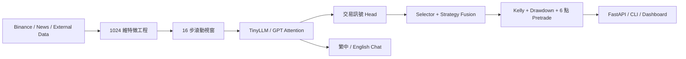

# 🧠 BioNeuronAI

[](https://github.com/kyle0527/BioNeuronai/actions/workflows/ci.yml)
[](pyproject.toml)
[](docker-compose.yml)
[](LICENSE)
[](https://github.com/kyle0527/BioNeuronai/commits/main)
[](https://github.com/kyle0527/BioNeuronai/stargazers)

> **111.6M 參數 GPT 雙模態量化系統**：同一套 TinyLLM 架構支援「交易訊號預測」與「雙語對話」，並把 16 步滾動 Attention、Walk-Forward 回測、Kelly 倉位與 RAG pretrade 風控放進一條可部署的交易管線。


```mermaid
flowchart LR
    MD[Binance / News / External Data] --> FP[1024 維特徵工程]
    FP --> WIN[16 步滾動視窗]
    WIN --> GPT[TinyLLM / GPT Attention]
    GPT --> SIG[交易訊號 Head]
    GPT --> CHAT[繁中 / English Chat]
    SIG --> FUSION[Selector + Strategy Fusion]
    FUSION --> RISK[Kelly + Drawdown + 6 點 Pretrade]
    RISK --> API[FastAPI / CLI / Dashboard]
```

## ⚡ Quick Demo

```bash
python -m pip install --index-url https://download.pytorch.org/whl/cpu torch==2.8.0+cpu torchvision==0.23.0+cpu torchaudio==2.8.0+cpu
python -m pip install -e .
python -m uvicorn bioneuronai.api.app:app --host 127.0.0.1 --port 8000
curl http://127.0.0.1:8000/api/v1/status
python main.py pretrade --symbol BTCUSDT --action long
python main.py chat --symbol BTCUSDT --language zh
python main.py trade --paper-live --paper-balance 10000
```

## 🎯 為什麼這個專案不一樣？

- 🧬 **雙模態 GPT 設計**：TinyLLM 架構支援文字生成與數值訊號模式；現行正式主線已明確切分交易 checkpoint 與 ChatEngine 權重角色。
- 📊 **真實 IS/OOS Walk-Forward 路線**：用 replay / backtest 管線把策略驗證從 notebook 拉回工程流程。
- 🛡️ **Kelly Criterion 倉位 + RAG pretrade 檢查**：下單前檢查資金、事件、新聞、流動性與風控閥值。
- ⚡ **16 步滾動 Attention 視窗**：不是只看單根 K 線，而是跨時間步推論市場結構。

## 📌 視覺化證據

| 證據 | 位置 | 狀態 |
|------|------|------|
| 系統架構圖 | [docs/assets/architecture.mmd](docs/assets/architecture.mmd) | ✅ Mermaid 原始圖 |
| TinyLLM 推論流程 | [docs/assets/tinyllm_inference_flow.mmd](docs/assets/tinyllm_inference_flow.mmd) | ✅ Mermaid 原始圖 |
| 回測績效圖 | [docs/assets/performance_artifacts.md](docs/assets/performance_artifacts.md) | 🟡 基準圖已產出；訓練後固定區間比較仍待補 |
| 30 秒 Demo GIF | [docs/assets/README.md](docs/assets/README.md) | 🟡 錄製清單已建立 |

## 📊 實測效能

> 下表只收錄已跑完並可重現的數據。尚未完成的訓練或回測不以「設計目標」冒充實測結果。

| 指標 | 數值 | 證據 |
|---|---:|---|
| Local API status | `ready=true`、`blocking=[]` | `GET /api/v1/status` |
| API / Frontend source | 已可啟動 | 本機 Python 3.13 + PyTorch CPU 2.8.0、frontend build 已確認；Docker image 留到最後重建 |
| 即時 K 線圖 | 已可顯示並輪詢更新 | `GET /api/v1/market/klines`；Operations 的 Live Market Chart 每 3 秒更新最後一根 candle |
| Operations Dashboard 版面 | 已修復長 JSON / 歷史紀錄溢出 | 2026-05-19 本機瀏覽器驗證 Operations、Validation、Config、Dev Tools、Chat：無卡片重疊、無水平撐版 |
| Pretrade API | 成功完成檢查並因風控條件 `REJECT` | `POST /api/v1/pretrade` |
| Paper-live 執行層 | 已實作並完成短流程啟停 | 主網行情 + 本地虛擬成交；2026-05-19 本機 API 驗證 `ai_model_loaded=true`、`paper_trading=true`，不送 Binance order |
| 回測績效 | 基礎短區間可跑；正式 gate 仍阻擋 live | 雲端訓練產物已接回 runtime；readiness-gate 因 BTC/ETH `4h` 資料缺失仍阻擋正式上線 |
| 推論延遲 | 待固定硬體基準測試 | [docs/TESTING_AND_VALIDATION_GUIDE.md](docs/TESTING_AND_VALIDATION_GUIDE.md) |

## 🧭 深度閱讀

- [Design Blog](docs/blog/README.md): 雙模態 GPT、16 步 Attention、Walk-Forward 的設計決策。
- [ADR](docs/adr/README.md): 重要架構決策紀錄。
- [Architecture Overview](docs/ARCHITECTURE_OVERVIEW.md): 正式主線架構。
- [Quickstart v2.1](docs/manuals/03_QUICKSTART.md): 本地與 Docker 操作。

**最後更新**: 2026年5月19日<br>
**版本**: v2.1 正式主線 / v2.2 訓練後驗證期

> **部署狀態（2026-05-19）**：`frontend/devops-d/` 是目前前端主線，首頁已改為 Operations 面板，並已修復 Trade Control JSON、News response、Request History 大量紀錄與 Chat 長文字的版面溢出問題。本機 API 以 Python 3.13、PyTorch CPU 2.8.0、現役交易模型與 TinyLLM 聊天模型作為 readiness 基準；`/api/v1/status` 會回報 `ready`、`blocking` 與逐項 readiness。Docker 目前不作正式進度依據，待本機自然語言、交易判斷與操作流程收斂後再重建 image。

---

## 📋 目錄

1. [系統架構](#系統架構)
2. [系統亮點](#系統亮點)
3. [快速開始](#快速開始)
4. [Docker 部署](#docker-部署)
5. [REST API](#rest-api)
6. [項目結構](#項目結構)
7. [核心功能](#核心功能)
8. [完整文檔](#完整文檔)
9. [子目錄文檔](#子目錄文檔)
10. [歸檔說明](#歸檔說明)
11. [授權](#授權)

---

## 🏗️ 系統架構

BioNeuronAI 採用分層架構設計，從底層基礎設施到頂層應用，共5層：

```
┌─────────────────────────────────────────────────────────────────┐
│                     第5層 - 應用層 (Application)                 │
│  tools/ - 工具腳本 | 驗證腳本 | 數據下載器 | 快速啟動               │
└─────────────────────────────────────────────────────────────────┘
                              ↓
┌─────────────────────────────────────────────────────────────────┐
│                    第4層 - 分析層 (Analysis)                     │
│  特徵工程 | 市場狀態識別 | 新聞分析 | 關鍵字系統 | 每日報告         │
└─────────────────────────────────────────────────────────────────┘
                              ↓
┌─────────────────────────────────────────────────────────────────┐
│                  第3層 - 交易管理層 (Trading Mgmt)                │
│  市場分析器 | 風險管理 | 計劃控制 | 交易前檢查 | 配對選擇器         │
└─────────────────────────────────────────────────────────────────┘
                              ↓
┌─────────────────────────────────────────────────────────────────┐
│                    第2層 - 策略層 (Strategy)                     │
│  趨勢追隨 | 均值回歸 | 突破交易 | 策略融合 | 策略進化系統           │
│  (競技場 | 階段路由器 | 組合優化器)                               │
└─────────────────────────────────────────────────────────────────┘
                              ↓
┌─────────────────────────────────────────────────────────────────┐
│                   第1層 - 核心引擎層 (Core Engine)                │
│  AI 推論引擎 | 交易引擎 | 策略進化引擎                             │
└─────────────────────────────────────────────────────────────────┘
                              ↓
┌─────────────────────────────────────────────────────────────────┐
│                 第0層 - 基礎設施層 (Infrastructure)               │
│  數據連接器 (Binance API, Web API) | 數據庫 | Schema 定義         │
└─────────────────────────────────────────────────────────────────┘
```

---

## ✨ 系統亮點

### 核心特性

| 特性 | 描述 | 狀態 |
|------|------|------|
| 🧠 **AI 神經網路** | 交易推論與 TinyLLM 對話模型已切分；主交易 checkpoint 與 ChatEngine 權重角色已明確化 | ✅ 完成 |
| 🔗 **推論引擎整合** | 完整 InferenceEngine 連接 AI 大腦與交易系統 | ✅ 完成 |
| 🧬 **策略競爭系統** | 基因演算法「養蠱場」+ 階段路由 + 組合優化 | ⚠️ 進行中 |
| 📊 **1024 維特徵** | 價格、成交量、訂單簿、技術指標等 10 大類 | ✅ 完成 |
| 🎯 **多策略融合** | Selector + AI Fusion 正式主線 | ✅ 完成 |
| 🛡️ **企業級風險** | 4 等級風險控制、Kelly Criterion、動態回撤 | ✅ 完成 |
| 📰 **新聞分析** | 181 關鍵字過濾、情感分析、預測驗證 | ✅ 完成 |
| 📈 **市場狀態識別** | 10 種市場環境自動識別 (趨勢、震盪、突破) | ✅ 完成 |
| 🔌 **Binance API** | 完整 REST + WebSocket + 歷史數據 | ✅ 完成 |
| 🌐 **外部數據整合** | 恐慌貪婪指數、全球市值、DeFi TVL、穩定幣 | ✅ 完成 |
| 📋 **實際操作驗證** | 本地 API / frontend 連線、`/api/v1/status`、trade status、model status 已確認 | ✅ 完成 |
| 🐳 **Docker 部署** | 多階段建構映像、docker-compose profiles | ✅ 完成 |
| 🌐 **FastAPI REST API** | REST 端點、CORS、本地 UI 整合、交易模式控制 | ✅ 完成 |
| 🧾 **Paper-live 模式** | Binance 主網行情 + 本地虛擬成交帳本，不送出真實訂單 | ✅ 完成 |
| ⚡ **RAG 快取** | TTL 記憶體快取，重複查詢跳過向量搜尋 | ✅ 完成 |
| 💬 **雙語對話** | ChatEngine（繁中/英）透過 CLI `chat` 與 API `/api/v1/chat` 存取 | ✅ 完成 |
| 🎯 **滾動推論視窗** | InferenceEngine 維護 16 步特徵 deque，Transformer Attention 跨時間步推論 | ✅ 完成 |

### 技術指標

```
代碼行數:     ~15,000+ 行
驗證方式:     Docker 實際啟動 + API endpoint 操作驗證
API 延遲:     REST < 100ms, WebSocket < 10ms（設計目標）
AI 推論:      CPU ~50-120ms/次（T=16），GPU ~5-15ms/次
回測速度:     1000 bars/s
```

### 三大核心系統

1. **🧬 基因演算法策略競爭**
   - `StrategyArena` 已改接正式 replay
   - `StrategyPortfolioOptimizer` 已改接正式 replay
   - 目前固定策略層仍在調整，因此競爭結果已可信、但仍在校正中

2. **🎯 多層策略融合系統**
   - AI 模型預測 (40%)
   - 傳統技術指標 (60%)
   - 新聞情緒權重調整
   - 市場狀態動態路由

3. **🛡️ 企業級風險管理**
   - 6點交易前檢查
   - Kelly Criterion 倉位計算
   - 動態回撤監控
   - 12項統計指標追蹤

---

## 🚀 快速開始

### 四種啟動方式差異

| 入口 | 實際操作 | 主要用途 | 功能差異 |
|---|---|---|---|
| CLI | `python main.py <command>` | 單次任務、回測、paper-live、readiness gate、AI chat | 最直接驗證後端與資料，不需要常駐服務 |
| API | `uvicorn bioneuronai.api.app:app ...` | 提供 UI / 外部自動化呼叫 | 長時間服務；UI 必須依賴它 |
| UI | `frontend/devops-d` 的 Vite / Docker frontend | 人工操作、監控、API Playground、交易控制 | 不直接跑 AI；所有資料透過 API 取得 |
| Docker | `docker compose ...` | 部署、乾淨環境、容器化 CLI/API/UI | 修改程式後需 rebuild；歷史 K 線與 runtime artifact 不打進 image，透過 `./backtest:/app/backtest` 掛載 |

詳細差異見 [啟動方式差異](docs/STARTUP_MODES.md) 與 [開機開始與關機手冊](docs/manuals/02_STARTUP_AND_SHUTDOWN.md)。

### 方式一：CLI（本地 Python，一次性任務）

#### 1. 安裝依賴
```bash
python -m pip install --upgrade pip
python -m pip install --index-url https://download.pytorch.org/whl/cpu torch==2.8.0+cpu torchvision==0.23.0+cpu torchaudio==2.8.0+cpu
python -m pip install -e .
```

目前本機主線採用全域 Python 3.13，不使用專案內虛擬環境。PyTorch 2.9+ / 2.12+ 在目前 Windows 本機會發生 `c10.dll` 載入失敗，因此固定使用已確認可 import 的官方 CPU 2.8.0 組合；後續若 PyTorch 新版修復此問題，再更新 `pyproject.toml` 與手冊。

#### 2. 取得模型權重（Git LFS）
```bash
# 安裝 Git LFS（若尚未安裝）
# macOS: brew install git-lfs
# Ubuntu: sudo apt install git-lfs

git lfs install
git lfs pull

# 驗證：交易模型權重應約 445 MB
ls -lh model/my_100m_model*.pth
```

#### 3. 配置 API 金鑰
複製 `.env.example` 為 `.env` 並填入金鑰：
```bash
cp .env.example .env
# 編輯 .env：
BINANCE_API_KEY=your_api_key
BINANCE_API_SECRET=your_secret_key
BINANCE_TESTNET=false  # false = 正式網路（mainnet）；true = 測試網
```

#### 4. 運行交易系統（CLI 入口）

```bash
# 系統健康與 readiness 檢查（需 PyTorch、現役模型、聊天模型與設定檔）
python -m bioneuronai.cli.main status

# 交易前 6 點 RAG 檢查
python -m bioneuronai.cli.main pretrade --symbol BTCUSDT --action long

# 每日計劃
python -m bioneuronai.cli.main plan --symbol BTCUSDT

# 新聞情緒分析
python -m bioneuronai.cli.main news --symbol BTCUSDT

# 歷史回測（需 torch 以啟用 AI 策略）
python -m bioneuronai.cli.main backtest --symbol BTCUSDT --interval 1h --start-date 2020-01-01 --end-date 2020-01-03 --warmup-bars 10

# 正式交易前 readiness gate（BTC/ETH 多時間框架矩陣；不送真實訂單）
python -m bioneuronai.cli.main readiness-gate --dry-run

# 紙交易模擬（需歷史數據）
python -m bioneuronai.cli.main simulate --symbol BTCUSDT

# 雙語 AI 對話助理（繁中/英，需 torch + 已訓練模型）
python -m bioneuronai.cli.main chat --symbol BTCUSDT --language zh

# 主網行情 + 本地虛擬成交，不送出 Binance 訂單
python -m bioneuronai.cli.main trade --symbol BTCUSDT --paper-live --paper-balance 10000

# 測試網 AI 自動交易（需 torch + testnet API 金鑰）
python -m bioneuronai.cli.main trade --symbol BTCUSDT --testnet
```

### 方式二：Docker（最後重建路線）

```bash
# 系統狀態檢查（無需任何本地依賴）
docker compose run --rm status

# 交易前檢查
docker compose run --rm pretrade

# 啟動 FastAPI REST API 伺服器
docker compose up api
```

目前 Docker 不作為本輪主要驗證入口；等本機自然語言、交易判斷與操作流程收斂後，再依 [Docker 部署](#docker-部署) 與 [REST API](#rest-api) 章節重建。

### 方式三：本地 API + UI

```bash
# 終端 1：啟動 API
python -m uvicorn bioneuronai.api.app:app --host 127.0.0.1 --port 8000

# 終端 2：啟動 Operations Dashboard
cd frontend/devops-d
npm run dev
```

UI 需連到 API。若瀏覽器出現 `Failed to fetch`，優先確認 API 是否正在 `http://127.0.0.1:8000` 運行，以及 `VITE_API_BASE_URL` / CORS 設定是否一致。

---

## 🐳 Docker 部署

### 前置需求

- Docker 20.10+
- Docker Compose v2

### 啟動方式

```bash
# 一次性命令（run & exit）
docker compose run --rm status          # 系統健康檢查
docker compose run --rm pretrade        # 交易前 6 點檢查
docker compose run --rm plan            # 10 步驟交易計劃
docker compose run --rm news            # 新聞情緒分析

# 背景服務
docker compose up api                   # FastAPI 伺服器（port 8000）

# 交易服務（預設 testnet；paper/live 請覆寫 command 或用 API/UI 控制）
BINANCE_API_KEY=xxx BINANCE_API_SECRET=yyy \
  docker compose --profile trade up trade
```

### 環境變數

| 變數 | 說明 | 預設值 |
|------|------|--------|
| `BINANCE_API_KEY` | Binance API 金鑰 | — |
| `BINANCE_API_SECRET` | Binance API Secret | — |
| `BINANCE_TESTNET` | 是否使用測試網 | `true` |
| `SYMBOL` | 預設交易對 | `BTCUSDT` |

### 架構說明

Dockerfile 採用多階段建構：
1. **builder stage**：編譯 ta-lib C 函式庫、安裝 Python 依賴
2. **runtime stage**：精簡 `python:slim` 最新線映像，非 root 用戶執行

---

## 🌐 REST API

FastAPI REST API 伺服器提供目前 UI 與外部自動化需要的主要操作端點；部分 CLI 能力仍只保留在 `main.py`。

### 啟動

```bash
# Docker（後續重建）
docker compose up api

# 本地主線
python -m uvicorn bioneuronai.api.app:app --host 127.0.0.1 --port 8000
```

Swagger UI：`http://localhost:8000/docs`

### 端點一覽

| 方法 | 端點 | 說明 |
|------|------|------|
| `GET` | `/api/v1/status` | 系統健康狀態 |
| `GET` | `/api/v1/market/klines` | Binance Futures 最新 K 線，供即時圖表使用 |
| `POST` | `/api/v1/news` | 新聞情緒分析 |
| `POST` | `/api/v1/pretrade` | 交易前 6 點 RAG / 風控檢查 |
| `POST` | `/api/v1/backtest/run` | 歷史回測（同步執行） |
| `POST` | `/api/v1/backtest/simulate` | 紙交易模擬 |
| `GET` | `/api/v1/backtest/catalog` | 可用回測資料清單 |
| `GET` | `/api/v1/backtest/inspect` | 回測資料詳細資訊 |
| `GET` | `/api/v1/backtest/runs` | 回測執行記錄列表 |
| `GET` | `/api/v1/backtest/runs/{run_id}` | 單筆回測結果 |
| `GET` | `/backtest/ui` | 回測 Web UI |
| `POST` | `/api/v1/binance/validate` | 驗證 Binance API 金鑰 |
| `POST` | `/api/v1/trade/start` | 啟動交易監控；支援 `monitor_only`、`paper_live`、`testnet_auto`、`live_auto` |
| `GET` | `/api/v1/trade/status` | 查詢交易監控、AI 模型與 paper 狀態 |
| `POST` | `/api/v1/trade/stop` | 停止交易監控 |
| `POST` | `/api/v1/chat` | 雙語 AI 對話（繁中/英，多輪記憶） |
| `DELETE` | `/api/v1/chat/{conversation_id}` | 清除指定對話歷史 |
| `GET` | `/api/v1/dashboard` | 儀板即時資料 |
| `POST` | `/api/v1/orders` | 建立訂單 |
| `DELETE` | `/api/v1/positions/{position_id}` | 刪除持倉記錄 |

### 範例

```bash
# 系統狀態
curl http://localhost:8000/api/v1/status

# 查詢交易 runtime 狀態
curl http://localhost:8000/api/v1/trade/status

# 查詢目前模型來源與載入狀態
curl http://localhost:8000/api/v1/model/status
```

---

## 📁 項目結構

```
BioNeuronai/
├── 🐳 Dockerfile                 # 多階段建構映像（builder + runtime）
├── 🐳 docker-compose.yml         # Service profiles（status/news/plan/api/trade）
├── 🐳 .dockerignore              # Docker 建構排除清單
│
├── main.py                      # ✅ 統一 CLI 入口（委派給 src/bioneuronai/cli/main.py）
│                                 #    直接執行：python main.py <command>
│
├── 📁 src/                       # 原始碼主目錄
│   ├── bioneuronai/              # 核心交易系統（5 層架構）
│   │   ├── api/app.py            # ✅ FastAPI REST API 伺服器（官方 HTTP 入口）
│   │   ├── cli/main.py           # ✅ CLI 實作（官方 CLI 入口）
│   │   ├── core/                 # 核心引擎（AI 推論 + 交易引擎 + 進化引擎）
│   │   ├── data/                 # 數據層（Binance API + 資料庫 + Web 數據）
│   │   ├── strategies/           # 策略層（11 種策略 + 融合 + 進化）
│   │   ├── risk_management/      # 風險管理（倉位 + 風控）
│   │   ├── trading/              # 交易管理（回測 + SOP + 自動化）
│   │   └── analysis/             # 分析層（新聞 + 關鍵字 + 特徵工程）
│   ├── nlp/                      # TinyLLM 雙模態模型、ChatEngine、訓練工具
│   │   └── training/             # 訓練腳本（unified_trainer、build_vocab 等）
│   ├── rag/                      # RAG 檢索增強生成（含 TTL 快取）
│   └── schemas/                  # Pydantic v2 數據模型（75+ 個）
│
├── 📁 tools/                     # 🔧 開發與運維工具腳本（非正式入口）
│
├── 📁 frontend/
│   ├── devops-d/                 # ✅ 目前前端主線（Operations Dashboard）
│   ├── admin-da/                 # ⏸ 管理儀板（第二階段，暫緩）
│   └── trading/                  # ⏸ 交易 UI（第二階段，暫緩）
│
├── 📁 model/                     # AI 模型權重
│   ├── my_100m_model.pth         # 交易推論 checkpoint
│   ├── my_100m_model_trained_20260510.pth # 目前 active_model.json 指向的主線權重
│   ├── tiny_llm_100m.pth         # TinyLLM 文字模型 checkpoint（ChatEngine / NLP）
│   └── tokenizer/
│       └── vocab.json            # BilingualTokenizer 詞彙（由 build_vocab.py 產生）
│
├── 📁 config/                    # 配置文件
│   ├── trading_config.py         # 交易參數配置
│   ├── trading_costs.py          # 交易成本配置
│   └── market_keywords.json      # 市場關鍵詞
│
├── 📁 backtest/                  # 主回測引擎（BacktestEngine + replay service）
├── 📁 data_downloads/            # 歷史數據存放目錄
├── 📁 docs/                      # 📚 完整文檔
└── 📁 archived/                  # 歸檔文件（舊腳本 / 舊模型定義 / 本機 runtime artifacts）
```

> **入口點說明**：`main.py` 是根目錄方便入口，內部直接呼叫 `src/bioneuronai/cli/main.py`，兩者等效。`tools/` 下的腳本為開發輔助工具，不是正式執行入口。


---

## 🧠 AI 推論系統架構

### 核心組件

```
┌─────────────────────────────────────────────────────────────────┐
│                      InferenceEngine (神經連結)                  │
├─────────────────────────────────────────────────────────────────┤
│  ┌─────────────┐  ┌──────────────────┐  ┌──────────┐  ┌──────┐ │
│  │ ModelLoader │→ │  FeaturePipeline │→ │Predictor │→ │Signal│ │
│  │(載入 TinyLLM│  │  1024 維特徵      │  │TinyLLM   │  │Inter-│ │
│  │ 111.6M 權重)│  │  deque(maxlen=16)│  │forward_  │  │preter│ │
│  └─────────────┘  │  →(16,1024) seq  │  │signal()  │  └──────┘ │
│                   └──────────────────┘  │→(B,512)  │           │
│                                         └──────────┘           │
└─────────────────────────────────────────────────────────────────┘
                              ↓
┌─────────────────────────────────────────────────────────────────┐
│                     TradingEngine (交易引擎)                     │
├─────────────────────────────────────────────────────────────────┤
│  AI Signal Fusion = AI 預測 (40%) + 策略信號 (60%)               │
│  → 最終交易決策                                                  │
└─────────────────────────────────────────────────────────────────┘

┌─────────────────────────────────────────────────────────────────┐
│                       ChatEngine (對話助理)                      │
├─────────────────────────────────────────────────────────────────┤
│  TinyLLM.generate() ← model/tiny_llm_100m.pth                   │
│  CLI: bioneuronai chat  /  API: POST /api/v1/chat               │
└─────────────────────────────────────────────────────────────────┘
```

### 特徵工程 (1024 維)

| 類別 | 維度 | 描述 |
|------|------|------|
| 價格特徵 | 128 | OHLCV、回報率、波動率 |
| 成交量特徵 | 96 | 成交量剖面、買賣量比 |
| 訂單簿特徵 | 128 | 深度、價差、不平衡度 |
| 技術指標 | 192 | RSI、MACD、布林帶等 |
| 微結構特徵 | 96 | 成交頻率、訂單流 |
| 市場狀態 | 64 | 趨勢強度、波動regime |
| 時間特徵 | 64 | 小時、星期、月份 |
| 情緒特徵 | 96 | 恐懼指數、多空比 |
| 清算特徵 | 96 | 清算熱力圖 |
| 資金費率 | 64 | 費率趨勢 |

### 市場狀態檢測 (10 種)

```
STRONG_UPTREND     ↗↗  強勢上漲
UPTREND            ↗   上漲趨勢
WEAK_UPTREND       →↗  弱勢上漲
RANGING            ↔   橫盤震盪
WEAK_DOWNTREND     →↘  弱勢下跌
DOWNTREND          ↘   下跌趨勢
STRONG_DOWNTREND   ↘↘  強勢下跌
HIGH_VOLATILITY    ⚡   高波動
BREAKOUT           💥   突破
CONSOLIDATION      📦   整理
```

---

## 🌐 外部數據整合系統 (v2.0 新增)

### 數據源支持

| 數據源 | 描述 | 更新頻率 | API 密鑰 |
|--------|------|----------|----------|
| **Alternative.me** | 恐慌貪婪指數 (0-100) | 每24小時 | ❌ 不需要 |
| **CoinGecko** | 全球市值、BTC/ETH占比 | 實時 | ❌ 免費版 |
| **DefiLlama** | DeFi TVL 數據 | 每小時 | ❌ 不需要 |
| **CoinGecko** | 穩定幣供應量 | 實時 | ❌ 免費版 |

### 市場情緒計算 (新增)

```python
from bioneuronai.trading.market_analyzer import MarketAnalyzer

analyzer = MarketAnalyzer()

# 抓取外部數據（15分鐘緩存）
external_data = await analyzer.fetch_external_data()

# 計算綜合市場情緒
sentiment = await analyzer.calculate_comprehensive_sentiment(
    klines=market_klines,
    external_data=external_data
)

# 情緒得分組成：
# - 恐慌貪婪指數 (30%)
# - 技術指標 (30%)
# - 市場動量 (25%)
# - 新聞情緒 (15%)
```

### 宏觀市場掃描 (交易計劃步驟2)

```python
# 完整宏觀市場分析
scan_result = await analyzer.scan_macro_market("daily")

# 返回數據：
# - 恐慌貪婪指數 + 解讀
# - 全球市值 + 24h變化
# - BTC/ETH 市場占比
# - DeFi TVL
# - 穩定幣供應
# - 市場狀態評估
```

**實際操作驗證**: `python main.py plan --symbol BTCUSDT` 與 `python main.py pretrade --symbol BTCUSDT --action long`  
**詳細文檔**: [架構總覽](docs/ARCHITECTURE_OVERVIEW.md)

---

## 💡 核心功能

### 🎯 六大交易策略

| 策略 | 類型 | 適用場景 |
|------|------|----------|
| **Trend Following** | 趨勢跟隨 | 明確趨勢行情 |
| **Swing Trading** | 波段交易 | 中期趨勢轉折 |
| **Mean Reversion** | 均值回歸 | 震盪橫盤市場 |
| **Breakout Trading** | 突破交易 | 整理後趨勢啟動 |
| **Direction Change** | 方向轉換 | DC 算法偵測反轉 |
| **Pair Trading** | 配對交易 | 相關資產價差套利 |

### 🛡️ 風險管理系統 (v2.1 重大升級)

#### 四大核心功能
| 功能 | 描述 | 狀態 |
|------|------|------|
| **交易檢查** | 6 點驗證：信心度、回撤、交易次數、餘額、警報、槓桿 | ✅ 完成 |
| **交易記錄** | 自動記錄交易、更新每日計數器、追蹤回撤 | ✅ 完成 |
| **統計分析** | 12 項指標：勝率、獲利因子、夏普比率等 | ✅ 完成 |
| **餘額管理** | 峰值追蹤、回撤計算、自動警報 | ✅ 完成 |

#### 四級風險等級
```python
CONSERVATIVE: 每筆 1%風險，最大回撤 5%，夏普比率 > 0.8
MODERATE:     每筆 2%風險，最大回撤 10%，夏普比率 > 0.6  ⭐ 推薦
AGGRESSIVE:   每筆 3%風險，最大回撤 15%，夏普比率 > 0.5
HIGH_RISK:    每筆 5%風險，最大回撤 20%，夏普比率 > 0.3
```

#### 統計指標示例
- 📈 **勝率**: 62.68% (84勝/50敗)
- 💰 **獲利因子**: 2.08 (盈利/虧損比)
- 📊 **夏普比率**: 1.87 (風險調整後報酬)
- 📉 **最大回撤**: -8.45% (峰值下跌)

**詳細文檔**: [架構總覽](docs/ARCHITECTURE_OVERVIEW.md)

### 📡 Binance Futures API 完整整合

| API 類型 | 功能 | 狀態 |
|----------|------|------|
| **WebSocket** | 實時行情、深度、清算數據 (毫秒級) | ✅ 完成 |
| **REST - 基礎** | 訂單執行、倉位查詢、槓桿設置 | ✅ 完成 |
| **REST - 高級** | 訂單簿、資金費率、未平倉合約、K線數據 | ✅ 完成 |
| **測試網支持** | Testnet 完整支持 | ✅ 完成 |

**詳細文檔**: [操作手冊](docs/manuals/04_CLI_OPERATION.md)

### 🌐 外部數據整合

| API 接口 | 數據內容 | 狀態 |
|----------|----------|------|
| **Alternative.me** | 恐慌貪婪指數 | ✅ 完成 |
| **CoinGecko** | 全球市值、穩定幣 | ✅ 完成 |
| **DefiLlama** | DeFi TVL | ✅ 完成 |
| **市場情緒計算** | 綜合情緒分數 | ✅ 完成 |
| **宏觀市場掃描** | 步驟2完整實現 | ✅ 完成 |

**詳細文檔**: [數據存儲整合](archived/reports/DATA_STORAGE_INTEGRATION.md)

---

## ⚙️ 配置說明

### 環境變數（.env）

API 金鑰與環境設定統一透過 `.env` 管理，**不應硬編碼至程式碼**：

```bash
# 複製範本並填入值
cp .env.example .env
```

```bash
BINANCE_API_KEY=your_api_key
BINANCE_API_SECRET=your_secret_key
BINANCE_TESTNET=true          # true: 測試網, false: 實盤
CRYPTOPANIC_API_TOKEN=free    # 新聞 API（free 為免費方案）
```

### 交易參數（config/trading_config.py）

```python
# 交易配置
SYMBOL = "BTCUSDT"           # 交易對
LEVERAGE = 10                 # 槓桿倍數 (1-125)
POSITION_SIZE_USDT = 100     # 單次交易金額

# 風險管理
STOP_LOSS_PERCENTAGE = 2.0   # 止損百分比
TAKE_PROFIT_PERCENTAGE = 4.0 # 止盈百分比
MAX_TRADES_PER_DAY = 10      # 每日最大交易次數
MAX_DRAWDOWN = 0.10          # 最大回撤 10%

# AI 配置
ENABLE_AI_MODEL = True       # 啟用 AI 模型
AI_MIN_CONFIDENCE = 0.6      # AI 最低置信度
AI_SIGNAL_WEIGHT = 0.4       # AI 信號權重
```

---

## 📖 完整文檔

| 文檔 | 描述 |
|------|------|
| 📘 [系統主手冊](docs/manuals/00_MASTER_MANUAL.md) | **系統入口與架構哲學，必讀** |
| 📗 [快速開始 v2.1](docs/manuals/03_QUICKSTART.md) | 本機 Python 3.13 + 環境變數快速架設；Docker 最後重建 |
| 📙 [操作手冊](docs/manuals/04_CLI_OPERATION.md) | CLI 指令與 API 實際操作 |
| 📕 [架構總覽](docs/ARCHITECTURE_OVERVIEW.md) | 系統全局資料流與模組分工 |
| 📓 [回測系統指南](docs/manuals/08_BACKTEST_SYSTEM.md) | BacktestEngine 使用說明 |
| 🧾 [部署準備紀錄 2026-04-17](archived/reports/DEPLOYMENT_READINESS_RECORD_20260417.md) | 前端選型、分析/策略/AI 盤點與部署前阻塞 |
| 🧠 [TinyLLM 模型指南](archived/tech/TINYLLM_MODEL_GUIDE.md) | 雙模態模型架構與訓練策略 |
| 📖 [文檔索引](docs/README.md) | 所有文檔完整導航 |

---

## ✅ 實際運作驗證

```bash
# 系統健康
python main.py status

# 資料盤點
python main.py backtest-data --symbol BTCUSDT --interval 1h

# 正式交易前 readiness gate；不送真實訂單
python main.py readiness-gate --dry-run

# 主網行情 + 本地虛擬成交；不送 Binance order
python main.py trade --symbol BTCUSDT --paper-live --paper-balance 10000
```

本專案目前以實際 CLI / API / UI runtime 行為作為主要驗證方式；`tests/` 僅保留 CI smoke 用途，不作為功能完成的主要證據。舊 training / output / backtest runtime 記錄已歸檔，正式工作目錄只保留最近一份可對照的訓練輸出與最新 runtime。

---

## ⚠️ 風險警告

> **⚠️ 重要提示**
> 
> - 加密貨幣期貨交易具有**極高風險**，可能損失全部本金
> - 請務必先在 **Testnet 測試網**充分測試
> - 建議從**小額資金**開始，設置合理止損
> - AI 預測僅供參考，**不保證盈利**
> - 本系統不構成投資建議

---

### 模組狀態一覽

| 模組 | 狀態 | 說明 |
|------|------|------|
| **TinyLLM 模型架構** | ✅ 完成 | 111.6M 參數，GPT 雙模態（訊號 + 對話） |
| **InferenceEngine** | ✅ 完成 | 16 步滾動視窗，reset_buffer() 已整合回測 |
| **ChatEngine** | ✅ 完成 | 繁中/英雙語，CLI chat + API /chat |
| **訓練系統** | ✅ 完成 | unified_trainer、build_vocab、signal 資料收集 |
| **推論引擎延遲** | ✅ 正常 | CPU 50-120ms，GPU 5-15ms（T=16） |
| **風險管理** | ✅ 完成 | risk_management/ 模組，Kelly Criterion |
| **外部數據整合** | ✅ 完成 | 恐懼貪婪、CoinGecko、DefiLlama |
| **新聞分析器** | ✅ 完成 | 181 關鍵字、47 文章源 |
| **Binance API** | ✅ 完成 | REST + WebSocket 完整 |
| **回測引擎** | ✅ 完成 | BacktestEngine + replay service |
| **特徵工程** | ✅ 完成 | 1024 維特徵（10 類） |
| **策略融合** | ✅ 完成 | 六大策略 + AI Fusion |
| **AI 模型訓練** | ✅ 第一輪完成並已接回 runtime | `best_model_run1.pth`、`best_model_run2.pth` 與 `my_100m_model_trained_20260510.pth` 已在 `model/`；Docker 內已驗證 `loaded=True` |

---

## 🆕 更新內容

### 最新里程碑：v2.1 TinyLLM 雙模態整合 (2026-04)

1. ✅ **TinyLLM 雙模態架構** — 一份 GPT 權重同時服務交易訊號預測與自然語言對話
2. ✅ **numeric_proj 2 層加深** — Linear(1024→1536)+GELU+LN → Linear(1536→768)+LN（111.6M）
3. ✅ **16 步滾動推論視窗** — deque(maxlen=16)，Transformer Attention 跨時間步推論
4. ✅ **回測 reset_buffer()** — 換 episode 時清空滾動視窗，避免資料污染
5. ✅ **訓練系統整合** — unified_trainer、build_vocab、signal_history.jsonl 收集
6. ✅ **ChatEngine 完整整合** — CLI `chat`、API `/api/v1/chat`，修正 tokenizer 路徑與 encode() 介面

### v2.1 系統全面收斂 (Docker + FastAPI + CLI)

1. ✅ **Docker 部署基礎建設** — 多階段 Dockerfile + docker-compose service profiles
2. ✅ **FastAPI REST API** — 完整端點，支援背景工作查詢
3. ✅ **RAG TTL 快取** — UnifiedRetriever 加入記憶體快取，減少重複向量搜尋
4. ✅ **CLI 全面審計修復** — 收斂為單一入口 `main.py`
5. ✅ **模組路徑解耦** — 徹底分離 `planning/` 與 `trading/`
6. ✅ **文件治理** — 全面封存舊版互動選單手冊，確保單一事實來源

### v2.0 數據整合與架構升級 (2026-02 ~ 2026-03)

#### 外部數據整合系統
1. ✅ **WebDataFetcher** - 統一外部數據抓取器
   - Alternative.me (恐慌貪婪指數)
   - CoinGecko (全球市值、穩定幣)
   - DefiLlama (DeFi TVL)
   - 異步並行抓取 + 重試機制

2. ✅ **MarketAnalyzer 增強** - 市場情緒分析
   - `calculate_comprehensive_sentiment()` - 綜合情緒計算
   - `scan_macro_market()` - 完整宏觀掃描
   - 15分鐘數據緩存機制

3. ✅ **TradingPlanController** - 步驟2實現
   - 移除模擬數據，整合真實 API
   - 恐慌貪婪指數 + 解讀
   - 市場狀態評估 + 建議

4. ✅ **Schema 擴展** - 新增 8 個數據模型
   - `external_data.py` (276 行)
   - 完整 Pydantic v2 驗證

**實際操作驗證**: `python main.py plan --symbol BTCUSDT`、`python main.py news --symbol BTCUSDT`、`python main.py pretrade --symbol BTCUSDT --action long`

### v2.1 風險管理升級 (2026-01-22)

### 風險管理系統完整實現
1. ✅ **check_can_trade()** - 6 點交易驗證檢查
2. ✅ **record_trade()** - 自動交易記錄與追蹤
3. ✅ **get_risk_statistics()** - 12 項風險統計指標
4. ✅ **update_balance()** - 餘額與回撤管理

### 多幣種支持
- 移除所有硬編碼的 "BTCUSDT"
- 交易引擎支持任意交易對
- 策略模組動態配置交易對

### 完整文檔
- 📘 [風險管理完整手冊](archived/docs_v2_1_legacy/RISK_MANAGEMENT_MANUAL.legacy_20260406.md) - 7 大章節
- 💾 [數據存儲整合方案](archived/reports/DATA_STORAGE_INTEGRATION.md) - 完整架構

---

## � 子目錄文檔

| 目錄 | README | 說明 |
|------|--------|------|
| `src/` | [src/README.md](src/README.md) | 原始碼總覽 |
| `src/bioneuronai/` | [src/bioneuronai/README.md](src/bioneuronai/README.md) | 核心交易系統（CLI、API、core、strategies 等） |
| `src/nlp/` | — | TinyLLM、ChatEngine、BilingualTokenizer、訓練工具 |
| `model/` | [model/README.md](model/README.md) | 交易模型與 TinyLLM 權重說明 |
| `config/` | [config/README.md](config/README.md) | 交易參數配置 |
| `backtest/` | [backtest/README.md](backtest/README.md) | 主回測引擎（BacktestEngine + replay service） |
| `data_downloads/` | [data_downloads/README.md](data_downloads/README.md) | 歷史 K 線數據存放說明 |
| `tools/` | [tools/README.md](tools/README.md) | 開發與運維工具腳本 |
| `docs/` | [docs/README.md](docs/README.md) | 文檔完整索引 |
| `archived/` | [archived/README.md](archived/README.md) | 歸檔文件（舊版手冊與腳本） |

---

## �🗂️ 歸檔說明

本項目歷史版本和開發文件已移至 `archived/` 目錄：

- **archived/old_docs/** - 舊版文檔（含過時分析報告）
- **archived/old_scripts/** - 舊版腳本（use_crypto_trader.py 等）
- **archived/pytorch_100m_model.py** - 模型定義（供參考）
- **archived/docs_v3/** - v3 版文檔

詳見 [archived/ARCHIVE_INDEX.md](archived/ARCHIVE_INDEX.md)

---

## 📝 授權

MIT License

---

## 🤝 貢獻

歡迎提交 Issue 和 Pull Request！

---

**🎯 開始你的 AI 交易之旅！**

```bash
python tools/ai_trade_nexttick.py
```

