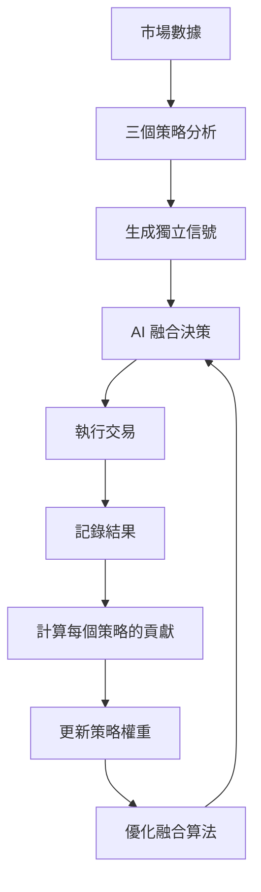

> ⚠️ **歸檔文檔** - 此為舊版策略指南，已於 2026年1月26日歸檔  
> 📖 **最新文檔**: 請參閱 [BIONEURONAI_MASTER_MANUAL.md](../../docs/BIONEURONAI_MASTER_MANUAL.md) 第 8-9 章（交易策略系統）

---

# 📚 交易策略完整使用指南

## 目錄

1. [三大核心策略](#三大核心策略)
2. [AI 融合策略](#ai-融合策略)
3. [策略選擇建議](#策略選擇建議)
4. [實戰使用方法](#實戰使用方法)
5. [AI 自我進化機制](#ai-自我進化機制)

---

## 三大核心策略

### 🔵 策略一：RSI 背離策略

#### 原理
RSI (Relative Strength Index) 相對強弱指數測量價格動量。當價格和 RSI 出現背離時,通常預示趨勢反轉。

#### 交易信號

**牛背離（買入信號）**
```
價格形態：創新低（Lower Low）
RSI 形態：未創新低（Higher Low）
→ 底部背離,可能反彈
```

**熊背離（賣出信號）**
```
價格形態：創新高（Higher High）
RSI 形態：未創新高（Lower High）
→ 頂部背離,可能回調
```

**超買超賣**
- RSI > 70：超買區域,考慮賣出
- RSI < 30：超賣區域,考慮買入

#### 最佳應用場景
- ✅ 震盪市場
- ✅ 區間交易
- ✅ 尋找反轉點
- ❌ 強勢單邊趨勢（容易被突破）

#### 真實案例
```
BTC 價格: $43,000 → $42,800 → $42,500 (連續新低)
RSI: 28 → 32 → 35 (未創新低,反而上升)
→ 牛背離確認
→ 買入信號
→ 目標: $43,500 (1.5% 反彈)
→ 止損: $42,200
```

---

### 🟢 策略二：布林帶突破策略

#### 原理
布林帶基於標準差構建動態支撐阻力帶:
- **上軌** = 中軌 + 2倍標準差
- **中軌** = 20 期簡單移動平均線
- **下軌** = 中軌 - 2倍標準差

#### 交易信號

**1. 突破上軌 + 成交量放大**
```
情境：價格突破上軌,成交量 > 平均的 1.5 倍
解讀：強勢突破
策略：追多
```

**2. 跌破下軌 + 成交量放大**
```
情境：價格跌破下軌,成交量 > 平均的 1.5 倍
解讀：恐慌性拋售
策略：超賣反彈做多
```

**3. 布林帶收縮（Squeeze）**
```
帶寬 < 10%：極度收縮
→ 大行情前兆
→ 等待方向突破
```

**4. 均值回歸**
```
價格遠離中軌（偏離度 > 30%）
→ 回歸中軌交易
- 價格在上軌附近 → 做空回歸
- 價格在下軌附近 → 做多回歸
```

#### 最佳應用場景
- ✅ 趨勢市場
- ✅ 突破交易
- ✅ 波動率交易
- ❌ 極端單邊行情（可能連續觸及軌道）

#### 真實案例
```
ETH 價格: $2,280
布林帶: 上軌 $2,300 | 中軌 $2,250 | 下軌 $2,200
帶寬: 4.4% (極度收縮)
成交量: 150% 平均值

→ 價格突破上軌至 $2,310
→ 布林帶突破 + 成交量確認
→ 強勢做多
→ 目標: $2,350 (上軌 + 帶寬延伸)
→ 止損: $2,280 (中軌上方)
```

---

### 🟡 策略三：MACD 趨勢跟隨策略

#### 原理
MACD (Moving Average Convergence Divergence) 由三個組件構成:
- **MACD 線** = 12 EMA - 26 EMA
- **信號線** = MACD 線的 9 EMA
- **柱狀圖** = MACD 線 - 信號線

#### 交易信號

**金叉（買入信號）**
```
MACD 線上穿信號線
→ 多頭動能啟動
→ 買入
```

**死叉（賣出信號）**
```
MACD 線下穿信號線
→ 空頭動能啟動
→ 賣出
```

**增強信號**
```
金叉 + MACD 在零軸上方 → 強買信號（多頭市場）
死叉 + MACD 在零軸下方 → 強賣信號（空頭市場）
```

**柱狀圖分析**
```
柱狀圖擴張 → 動量增強
柱狀圖收縮 → 動量減弱（可能反轉）
```

#### 最佳應用場景
- ✅ 明確趨勢市場
- ✅ 中長線交易
- ✅ 趨勢跟隨
- ❌ 震盪市場（假信號多）

#### 真實案例
```
BNB 價格走勢圖
MACD 線: -2.5 → 0.5 (上穿信號線)
信號線: 1.8
柱狀圖: -4.3 → 1.3 (快速擴張)
MACD 位置: 零軸上方

→ 金叉確認
→ 零軸上方（多頭市場）
→ 柱狀圖擴張（動量增強）
→ 三重確認買入信號
→ 目標: +6% (2:1 風險回報)
→ 止損: -3%
```

---

## 🤖 AI 融合策略

### 核心概念

AI 融合策略不是簡單地疊加三個策略,而是：
1. **智能評估**：分析每個策略的信號強度
2. **動態權重**：根據歷史表現調整權重
3. **自我學習**：持續優化融合方法
4. **風險控制**：多維度確認信號

### 融合機制

#### 1. 加權投票系統
```python
買入分數 = Σ(策略置信度 × 策略權重)

例如:
RSI 策略: BUY (置信度 0.7, 權重 0.3) → 0.21
布林帶策略: BUY (置信度 0.8, 權重 0.4) → 0.32
MACD 策略: HOLD (置信度 0.0, 權重 0.3) → 0.00
----------------------------------------
總買入分數 = 0.53

如果買入分數 > 0.5 → 執行買入
```

#### 2. 動態權重調整

**評分標準**
```python
策略評分 = 平均收益率 × 0.4 + 
          勝率 × 0.3 + 
          夏普比率 × 0.3

夏普比率 = 平均收益 / 收益標準差
```

**權重更新**
```python
新權重 = 舊權重 × 0.7 + 策略評分 × 0.3
# 指數移動平均,避免劇烈變化
```

#### 3. 信號確認機制

**三級確認**
- Level 1: 至少一個策略信號 > 0.5
- Level 2: 加權總分 > 0.5
- Level 3: 無相反方向的強信號

### 實戰示例

```
時刻 T = 2026-01-19 10:30
BTC 價格: $50,250

各策略分析:
┌────────────────┬────────┬─────────┬────────┬────────┐
│ 策略           │ 信號   │ 置信度  │ 權重   │ 貢獻   │
├────────────────┼────────┼─────────┼────────┼────────┤
│ RSI 背離       │ BUY    │ 0.75    │ 0.35   │ 0.263  │
│ 布林帶突破     │ BUY    │ 0.82    │ 0.40   │ 0.328  │
│ MACD 趨勢      │ HOLD   │ 0.00    │ 0.25   │ 0.000  │
└────────────────┴────────┴─────────┴────────┴────────┘

融合結果:
買入分數: 0.591
賣出分數: 0.000
→ 最終信號: BUY
→ 融合置信度: 0.59
→ 止損: $49,245 (2%)
→ 止盈: $51,255 (2%)

原因分析:
✓ RSI 背離: 牛背離 - RSI=32.5
✓ 布林帶: 突破下軌,成交量放大 1.8x
○ MACD: 趨勢中性

策略權重來自過去 100 筆交易表現:
RSI 背離: 勝率 62%, 平均收益 1.2%
布林帶: 勝率 58%, 平均收益 1.5%
MACD: 勝率 55%, 平均收益 0.9%
```

---

## 策略選擇建議

### 市場環境分析

#### 📊 震盪市場
**特徵**: 價格在區間內來回波動,無明確趨勢

**推薦策略**:
1. ⭐⭐⭐ RSI 背離策略
2. ⭐⭐ 布林帶策略（均值回歸）
3. ⭐ MACD 策略（容易假信號）

**操作建議**:
- 高拋低吸
- 快進快出
- 嚴格止損

#### 📈 上升趨勢市場
**特徵**: 價格連續創新高,回調淺

**推薦策略**:
1. ⭐⭐⭐ MACD 趨勢跟隨
2. ⭐⭐⭐ 布林帶突破
3. ⭐⭐ RSI 背離（只做回調後的多單）

**操作建議**:
- 順勢而為
- 回調買入
- 移動止損

#### 📉 下降趨勢市場
**特徵**: 價格連續創新低,反彈弱

**推薦策略**:
1. ⭐⭐⭐ MACD 趨勢跟隨
2. ⭐⭐ 布林帶突破
3. ⭐ RSI 背離（謹慎抄底）

**操作建議**:
- 順勢做空
- 反彈賣出
- 嚴格止損

#### 🎯 高波動市場
**特徵**: 價格劇烈波動,布林帶擴張

**推薦策略**:
1. ⭐⭐⭐ AI 融合策略
2. ⭐⭐⭐ 布林帶策略
3. ⭐⭐ RSI 策略

**操作建議**:
- 等待極端位置
- 快速進出
- 加大止損空間

### 交易風格匹配

| 交易風格 | 時間週期 | 推薦策略 | 持倉時間 |
|---------|---------|---------|---------|
| 超短線 (Scalping) | 1-5 分鐘 | RSI + 布林帶 | 幾分鐘 |
| 日內交易 (Day Trading) | 5-30 分鐘 | AI 融合 | 幾小時 |
| 波段交易 (Swing Trading) | 1-4 小時 | MACD + 布林帶 | 幾天 |
| 趨勢交易 (Position Trading) | 4 小時-日線 | MACD | 幾週 |

---

## 實戰使用方法

### 步驟一：配置策略

編輯 `config/trading_config.py`:

```python
# 選擇策略
ACTIVE_STRATEGY = "AI_Fusion"  # 或 "RSI_Divergence", "Bollinger_Bands", "MACD_Trend"

# RSI 參數（如果使用 RSI 策略）
RSI_PERIOD = 14
RSI_OVERBOUGHT = 70
RSI_OVERSOLD = 30

# 布林帶參數
BOLLINGER_PERIOD = 20
BOLLINGER_STD_DEV = 2.0

# MACD 參數
MACD_FAST_PERIOD = 12
MACD_SLOW_PERIOD = 26
MACD_SIGNAL_PERIOD = 9

# AI 融合參數
AI_ENABLE_DYNAMIC_WEIGHTS = True
AI_MIN_TRADES_FOR_ADJUSTMENT = 10
```

### 步驟二：測試策略

先用測試腳本驗證:

```bash
python test_trading_strategies.py
```

觀察:
1. 各策略的信號質量
2. 融合策略的綜合表現
3. AI 權重調整過程

### 步驟三：測試網實盤

1. 在測試網運行 1-2 週
2. 記錄所有交易
3. 分析信號準確度
4. 觀察 AI 學習曲線

```bash
python use_crypto_trader.py
# 選擇選項 3: Start monitoring
```

### 步驟四：優化參數

根據測試結果調整:

**如果信號太多**:
- 提高最小置信度閾值
- 增加 RSI 週期
- 增加布林帶標準差倍數

**如果信號太少**:
- 降低置信度閾值
- 減少 RSI 週期
- 減少布林帶標準差倍數

**如果假信號多**:
- 啟用 AI 融合策略
- 增加確認條件
- 結合成交量分析

### 步驟五：漸進式上線

```
Week 1-2: 測試網,觀察模式
Week 3-4: 測試網,小額真實測試
Week 5+: 正式網,逐步增加資金
```

---

## AI 自我進化機制

### 學習流程



### 性能指標

AI 根據以下指標評估每個策略:

1. **總收益率** (Total Return)
   ```
   Σ(所有交易的盈虧百分比)
   ```

2. **平均收益率** (Average Return)
   ```
   總收益率 / 交易次數
   ```

3. **勝率** (Win Rate)
   ```
   盈利交易數 / 總交易數 × 100%
   ```

4. **夏普比率** (Sharpe Ratio)
   ```
   平均收益率 / 收益標準差
   衡量風險調整後的收益
   ```

5. **最大回撤** (Maximum Drawdown)
   ```
   從峰值到谷底的最大跌幅
   ```

### 權重調整示例

```
初始狀態（均等權重）:
RSI: 0.333, 布林帶: 0.333, MACD: 0.333

經過 50 筆交易:
┌──────────┬────────┬────────┬──────────┐
│ 策略     │ 勝率   │ 平均收益│ 夏普比率 │
├──────────┼────────┼────────┼──────────┤
│ RSI      │ 65%    │ 1.2%   │ 0.42     │
│ 布林帶   │ 58%    │ 1.5%   │ 0.38     │
│ MACD     │ 52%    │ 0.8%   │ 0.25     │
└──────────┴────────┴────────┴──────────┘

計算評分:
RSI: (0.012 × 0.4) + (0.65 × 0.3) + (0.42 × 0.3) = 0.326
布林帶: (0.015 × 0.4) + (0.58 × 0.3) + (0.38 × 0.3) = 0.294
MACD: (0.008 × 0.4) + (0.52 × 0.3) + (0.25 × 0.3) = 0.234

調整後權重:
RSI: 0.383 (↑)
布林帶: 0.345 (↑)
MACD: 0.272 (↓)

→ RSI 表現最好,獲得最高權重
→ MACD 表現較弱,權重降低
→ 系統持續學習和優化
```

### 持續優化

AI 每 10 筆交易後:
1. 重新計算所有策略的性能指標
2. 調整策略權重
3. 優化信號融合算法
4. 保存學習進度

這確保系統能夠:
- ✅ 適應市場變化
- ✅ 發現最有效的策略組合
- ✅ 減少虧損策略的影響
- ✅ 放大盈利策略的貢獻

---

## 風險警告

⚠️ **重要提示**

1. **沒有完美的策略**
   - 所有策略都有失效的時候
   - 過去表現不代表未來結果

2. **市場環境會變化**
   - 震盪市場適合的策略 ≠ 趨勢市場
   - AI 需要時間適應新環境

3. **AI 也會犯錯**
   - AI 基於歷史數據學習
   - 黑天鵝事件無法預測

4. **必須做好風險控制**
   - 嚴格止損
   - 控制倉位
   - 分散投資

---

## 總結

### 選擇指南

**我是新手** → 從 RSI 策略開始,規則簡單明確

**我想穩健交易** → 使用 AI 融合策略,多維度確認

**我追求趨勢** → 使用 MACD 策略,順勢而為

**我喜歡波動** → 使用布林帶策略,捕捉極端位置

**我想讓 AI 優化** → 啟用融合策略,自動學習最佳組合

### 成功要素

1. **理解每個策略的原理**
2. **在測試網充分練習**
3. **記錄和分析每筆交易**
4. **持續學習和優化**
5. **嚴格執行風險管理**

祝交易順利！🚀
