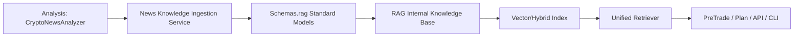

# Analysis 與 RAG 整合改善計畫
> 版本：v1.0  
> 日期：2026-03-30  
> 目標：將新聞分析結果（Analysis）穩定轉化為可檢索知識（RAG），落實單一路徑與單一事實來源（SSOT）。

---

## 0. 當前進度（2026-03-31）

### 已完成
- ✅ B.3：`rag/services/news_adapter.py` 已提供唯一入庫入口 `ingest_news_analysis(...)`。
- ✅ B.3：`rag/internal/knowledge_base.py` 已提供新聞專用 API `add_news_analysis(...)`。
- ✅ B.6：`analysis/news/analyzer.py` 分析後已自動呼叫 RAG 入庫。
- ✅ PreTrade 新聞檢查已改為 RAG 單一路徑（移除 legacy fallback），並回傳 `OK/NO_DATA/ERROR`。
- ✅ 入庫可觀測性補強：新增 `ingest_news_analysis_with_status(...)`，可明確區分 `NO_DATA` 與 `ERROR`。

### 進行中
- 🔄 D.6（待做）：建立 CLI/API 共用的 Application Facade，進一步降低入口層重複組裝。

### 跨模組重複功能盤點（2026-03-31）

#### 已確認重複/雙軌
- `CLI plan` 有雙路徑：`TradingPlanController` + `analysis.daily_report.SOPAutomationSystem` fallback。
- `TradingEngine` 內同時存在 `PreTradeCheckSystem` 路徑與 `news_analyzer.get_quick_summary()/analyze_news()` 直接路徑。
- `RAG services` 匯出 `PreTradeCheckSystem`（跨層暴露），與 `bioneuronai.trading` 主入口有職責重疊風險。

#### 本輪已處理
- ✅ `src/bioneuronai/cli/main.py::cmd_plan` 已改為單一路徑，只走 `TradingPlanController`，失敗直接回報。
- ✅ `src/rag/services/__init__.py` 已移除 `PreTradeCheckSystem` re-export，RAG 服務層邊界收斂。
- ✅ `src/bioneuronai/core/trading_engine.py` 新聞風險評估已收斂到 `PreTradeCheckSystem/RAG` 單一路徑，不再直接依賴 `get_quick_summary()/should_trade()`。

#### D Phase 狀態
- D.1：已完成
- D.2：已完成
- D.3：已完成
- D.4：已完成
- D.5：已完成

---

## 1. 目的與範圍

### 1.1 目的
- 建立「新聞分析 -> 知識入庫 -> RAG 檢索」的單一路徑。
- 消除重複定義、重複流程與雙軌行為。
- 讓交易前檢查、日報、檢索結果都引用同一份可追溯知識。

### 1.2 範圍內
- `src/bioneuronai/analysis/news/`
- `src/rag/services/`
- `src/rag/core/`
- `src/rag/internal/`
- `src/schemas/rag.py`
- 相關調用入口（CLI/API/Trading 的新聞檢查與檢索調用）
- 相關 `.md` 文件同步

### 1.3 範圍外（本期不做）
- AI 模型架構與訓練流程重寫（`src/nlp/`）
- 策略績效演算法大改
- 交易撮合與下單邏輯改版

---

## 2. 核心原則

### 2.1 SSOT 原則
- 跨模組資料契約只認 `src/schemas/rag.py`。
- 不允許在 `analysis` 或 `rag` 重新定義同義模型。

### 2.2 單一路徑原則
- 新聞知識寫入入口唯一化。
- 檢索層只讀統一知識來源，不再自行重算或拼接不一致資料。

### 2.3 職責邊界
- Analysis：生成結構化事實（抽取、評分、分類、事件判定）。
- RAG Services：做標準化、去重、寫入、壽命管理。
- RAG Core：查詢、排序、融合結果，不做分析器業務決策。
- RAG Internal：儲存與索引基礎能力。

### 2.4 文件同步原則
- 每次改動必須同步更新 `.md`，避免程式與文件偏移。
- 刪除舊路徑時，文件不得留殘留引用。

---

## 3. 目標架構（To-Be）



### 3.1 一句話定義
- Analysis 產出「事實」。
- RAG 產出「可查詢知識」。
- Trading/PreTrade 消費「已標準化結果」。

---

## 4. 分階段執行計畫（3 份可落地）

## Part A：基準建立與差異盤點（先做）

### A.1 產出內容
- 現況資料流清單（來源、欄位、調用路徑）。
- 重複定義清單（class/enum/model + 實際引用處）。
- 風險矩陣（功能風險、相容風險、資料一致性風險）。

### A.2 執行步驟
1. 掃描 `analysis/news` 目前輸出資料結構與欄位。
2. 掃描 `rag/services/news_adapter.py`、`rag/core/retriever.py` 輸入輸出欄位。
3. 對齊 `schemas/rag.py`，標記缺欄與同義欄位衝突。
4. 產出「欄位字典」與「映射表」。

### A.3 驗收標準
- 能回答每個欄位從哪來、寫到哪、誰使用。
- 能列出所有非 SSOT 定義（含檔案與行號）。

### A.4 預估工時
- 1-2 天。

---

## Part B：主幹整合實作（核心）

### B.1 目標
- 建立唯一新聞知識寫入服務，並讓 retriever 只讀統一知識源。

### B.2 檔案級工作清單

1. `src/schemas/rag.py`
- 補齊新聞知識契約必要欄位（若缺）。
- 固化欄位名稱：`relevance_score`、`event_score`、`event_type`、`timestamp`、`source` 等。
- 保持 `to_dict()` 序列化一致。

2. `src/rag/services/news_adapter.py`
- 僅保留適配與呼叫，不重複定義 schema。
- 明確輸出符合 `schemas.rag` 契約。

3. `src/rag/services/`（新增或改現有 service）
- 實作唯一入口：`ingest_news_analysis(...)`。
- 負責：
  - 欄位標準化
  - 去重（title+source+time window）
  - metadata 補全（symbol, category, decay/ttl）
  - 寫入 knowledge base / index

4. `src/rag/internal/knowledge_base.py`
- 新增/強化新聞知識寫入 API。
- 支援查詢條件：symbol、time range、event type、relevance 門檻。

5. `src/rag/core/retriever.py`
- 只讀統一知識來源。
- 移除/禁止本地拼湊型結果格式。
- 保持輸出 `schemas.rag.RetrievalResult`。

6. `src/bioneuronai/analysis/news/analyzer.py`（或調度入口）
- 新聞分析結束後，呼叫 RAG ingest service。
- 不直接寫索引，不直接寫外部檢索格式。

7. `src/bioneuronai/trading/pretrade_automation.py`
- 新聞檢查消費 RAG 標準化結果，不再依賴不一致中介資料。

### B.3 驗收標準
- 跑一次新聞分析後，RAG 可查到同批知識項。
- `pretrade` 可取得一致欄位（sentiment/event score）。
- 無新增重複 schema 定義。

### B.4 預估工時
- 3-5 天。

---

## Part C：遷移清理、刪除與文件收斂（防回歸）

### C.1 遷移策略
1. 先改引用，再刪舊實作。
2. 先做 smoke 驗證，再做實體刪除。
3. 刪除後全域搜尋確保無殘留 import/path。

### C.2 刪除準則（必須同時成立）
- 功能路徑已有單一路徑替代。
- 無任何 `.py` 活躍引用。
- 對應 `.md` 已更新。
- CLI/API/status 指令可正常。

### C.3 文件同步清單
- `docs/ARCHITECTURE_OVERVIEW.md`
- `docs/PROJECT_STRUCTURE.md`
- `docs/SRC_DIRECTORY_ANALYSIS.md`
- `docs/FEATURE_STATUS.md`
- `docs/TECH_DEBT_AND_ROADMAP.md`
- `src/bioneuronai/trading/README.md`
- `src/bioneuronai/analysis/README.md`
- `src/rag/core/README.md`
- `src/rag/services/README.md`

### C.4 驗收標準
- 無舊路徑殘留。
- 文檔描述與程式實際一致。
- `main.py status` 正常。

### C.5 預估工時
- 2-3 天。

---

## 5. 詳細任務分解（WBS）

### 5.1 契約層（Schema）
- 定義欄位：`id, symbol, title, content, source, published_at, sentiment_score, event_type, event_score, relevance_score, timestamp, metadata`。
- 統一枚舉：來源、類別、風險層級。
- 明確兼容策略：新增欄位要給預設值，避免破壞舊流程。

### 5.2 服務層（Ingestion）
- 入庫前標準化。
- 去重策略可配置（嚴格/寬鬆）。
- 失敗重試與錯誤可觀測（log + reason）。

### 5.3 檢索層（Retriever）
- 結果排序：relevance + recency + source confidence。
- 可選時間窗口與 symbol filter。
- 不同來源結果融合規則固定化。

### 5.4 交易消費層（PreTrade/Plan）
- 統一讀取欄位，不再分兩套 fallback 欄位命名。
- 重大事件判定閾值集中配置。

### 5.5 文件與治理
- 每次刪除 `.py` 前先更新 `.md` 方案段。
- 每次 schema 變動更新 changelog。

---

## 6. 風險與控制

### 6.1 主要風險
1. 欄位命名不一致導致運行錯誤。
2. 舊路徑殘留導致雙寫入。
3. 刪除過早導致隱藏引用失效。
4. 文件不同步造成團隊誤判。

### 6.2 控制措施
1. 合併前先建立欄位映射測試。
2. 全域 `rg` 檢查舊 import/path。
3. 先轉發層、後刪除（必要時）。
4. 以 `status/news/pretrade/plan` 做回歸 smoke。

---

## 7. 驗證與測試策略

### 7.1 功能測試
- 測試 1：`analysis.news` 執行後，RAG 可查詢到新知識。
- 測試 2：`pretrade` 使用 RAG 結果，回傳欄位完整。
- 測試 3：重複新聞輸入不會重複入庫。

### 7.2 相容測試
- 既有命令：`python main.py status`
- 新聞流程：`python main.py news --symbol BTCUSDT`
- 交易前檢查：`python main.py pretrade --symbol BTCUSDT --action long`

### 7.3 結構檢查
- `py_compile` 編譯檢查核心檔案。
- 全域搜尋確認無舊路徑殘留。
- 文檔引用檢查（`.md`）。

---

## 8. 里程碑與交付物

### M1（Part A 完成）
- 交付：差異盤點報告 + 欄位映射表。

### M2（Part B 完成）
- 交付：可運行主幹整合，新聞知識可查。

### M3（Part C 完成）
- 交付：刪除清單、文件更新清單、最終驗收報告。

---

## 9. 刪除與保留決策模板

### 9.1 決策表
| 對象 | 現況 | 替代路徑 | 是否刪除 | 理由 |
|------|------|----------|----------|------|
| 舊流程 A | 重複 | 新流程 A' | Yes/No | 是否有活躍引用 |

### 9.2 刪除前 Checklist
- [ ] 無 `.py` 活躍 import
- [ ] 無 `.md` 主路徑引用
- [ ] CLI/API smoke 通過
- [ ] 已在 changelog 記錄

### 9.3 刪除後 Checklist
- [ ] 全域搜尋殘留為 0
- [ ] 文件指向新路徑
- [ ] 回歸命令成功

---

## 10. 建議先後順序（實作建議）

1. 先做 Part A（盤點與契約對齊）。
2. 再做 Part B（主幹寫入與檢索統一）。
3. 最後做 Part C（刪除、文檔收斂、回歸）。

---

## 11. 成功定義（Definition of Done）

- Analysis 與 RAG 有且只有一條正式整合路徑。
- 跨模組新聞知識模型只來自 `schemas/rag.py`。
- 交易前檢查與檢索都消費同一份知識結果。
- 舊重複路徑已清理，且 `.md` 文件全部對齊。

---

## 12. 模組重複功能重規劃（全專案）

### 12.1 重複矩陣（現況）

| 範圍 | 重複/雙軌現象 | 風險 | 目標收斂 |
|------|---------------|------|----------|
| 計劃生成入口 | `cli.main::cmd_plan` 曾有 `TradingPlanController` + `SOPAutomationSystem` fallback | 結果格式不一致、維運分裂 | ✅ 已收斂為單一路徑 `TradingPlanController` |
| 新聞消費（交易引擎） | `TradingEngine` 同時用 `PreTradeCheckSystem` 與 `news_analyzer.get_quick_summary/analyze_news` | 同一事件可能被兩套邏輯解讀 | ✅ 已收斂為 pretrade/RAG 單一路徑 |
| RAG 服務邊界 | `rag/services` re-export `PreTradeCheckSystem` | 分層耦合，邊界不清 | ✅ 已收斂：`rag/services` 僅保留 RAG 服務 API |
| 計劃系統職責 | `trading_plan_system.py` 與 `plan_controller.py` 都在做計劃編排 | 兩套流程長期分岔 | ✅ 已收斂：`trading_plan_system` 改為相容包裝器，委派 `plan_controller` |

### 12.2 To-Be 架構（重規劃）

1. `analysis/news`：只負責分析與結構化結果。
2. `rag/services`：只負責入庫、查詢適配，不輸出交易流程類別。
3. `trading/pretrade`：唯一交易前新聞判斷入口。
4. `trading/plan_controller`：唯一交易計劃編排入口。
5. `cli/api`：只調用上述正式入口，不做跨層 fallback。

### 12.3 分批落地（D Phase）

1. D.1（已完成）：
- `cmd_plan` 移除 legacy fallback，失敗直接回報。

2. D.2（已完成）：
- `TradingEngine` 已移除直接 `get_quick_summary()/should_trade()` 使用，統一由 pretrade/RAG 結果驅動。

3. D.3（已完成）：
- `rag/services/__init__.py` 已停止 re-export `PreTradeCheckSystem`，避免跨層耦合。

4. D.4（已完成）：
- `trading_plan_system.py` 已改為相容包裝器，`TradingPlanGenerator` 統一委派 `TradingPlanController`。

5. D.5（已完成）：
- 文件全量同步 + `rg` 殘留檢查 + smoke 回歸。

### 12.4 驗收命令（D Phase）

```bash
python main.py status
python main.py news --symbol BTCUSDT
python main.py pretrade --symbol BTCUSDT --action long
python main.py plan
rg -n "SOPAutomationSystem.*fallback|get_quick_summary\\(|from rag.services import PreTradeCheckSystem" src docs
```
