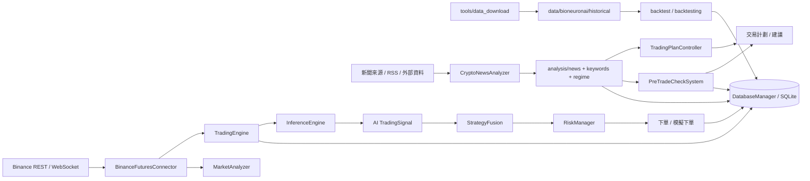
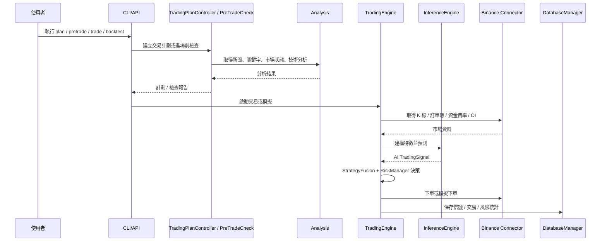

# BioNeuronai 系統架構總覽

> 更新日期: 2026-03-23
> 依據: 實際程式入口、核心模組 import 關係、`tools/PROJECT_REPORT_20260322_221527.txt` 第 103-604 行目錄樹

---

## 目的

本文件描述目前專案的實際系統架構，而不是只根據文件命名推測。重點包含：

- 對外入口
- 核心交易主鏈
- 回測與資料供應鏈
- RAG / NLP / Schema 等支援型子系統
- 模組職責與邊界

---

## 1. 總體架構圖

```mermaid
flowchart TD
    U[使用者 / 外部系統] --> CLI[CLI 入口\nmain.py / bioneuronai.cli.main]
    U --> API[FastAPI 入口\nbioneuronai.api.app]

    CLI --> TE[TradingEngine\n核心交易引擎]
    CLI --> TPC[TradingPlanController\n10 步驟交易計劃]
    CLI --> PTC[PreTradeCheckSystem\n交易前檢查]
    CLI --> CNA[CryptoNewsAnalyzer\n新聞分析]
    CLI --> BT1[backtest/\n主回測子系統]

    API --> TPC
    API --> PTC
    API --> CNA
    API --> BT1

    TE --> IE[InferenceEngine\nAI 推論管線]
    IE --> TM[交易推論模型\nmodel/my_100m_model.pth]
    IE --> FP[FeaturePipeline\n1024 維特徵]

    TE --> TS[trading_strategies.py\nStrategyFusion]
    TE --> TRM[trading/risk_manager.py]
    TE --> DATAIF[data/\nBinanceFuturesConnector\nDatabaseManager]
    TE --> ANALYSIS[bioneuronai.analysis]
    TE --> EVO[core/self_improvement.py]

    TPC --> MA[MarketAnalyzer]
    TPC --> SS[StrategySelector]
    TPC --> PS[PairSelector]
    TPC --> TRM
    TPC --> ANALYSIS

    ANALYSIS --> NEWS[news]
    ANALYSIS --> KW[keywords]
    ANALYSIS --> FE[feature_engineering]
    ANALYSIS --> MR[market_regime]
    ANALYSIS --> DR[daily_report]

    TRM --> RMCORE[risk_management/\nposition_manager.py]

    BT1 --> MOCK[MockBinanceConnector]
    BT1 --> HDS[HistoricalDataStream]
    BT1 --> VA[VirtualAccount]
    BT1 -. 模擬交易所介面 .-> TE

    BT2[backtesting/\n歷史回測 / Walk-forward / 成本分析]

    RAG[src/rag\n正式 RAG 子系統]
    NLP[src/nlp\n獨立 LLM / 訓練工具]
    SCH[src/schemas\n共享資料契約]
    TOOLS[tools/data_download\n歷史資料下載工具]
    STORE[data/\nhistorical | trading | validation | rag | nlp]
    MODELS[model/\n交易模型 + TinyLLM 模型]

    RAG --> PTC
    RAG --> NEWS
    NLP --> MODELS
    TOOLS --> STORE
    STORE --> BT1
    STORE --> BT2
    EVO --> STORE
    DATAIF --> STORE
    SCH --> API
    SCH --> TE
    SCH --> ANALYSIS
    SCH --> RAG
    MODELS --> TM
```

---

## 2. 分層說明

### 2.1 對外入口層

- `main.py`: 專案根目錄統一入口，將 `src/` 加入路徑後轉交給 CLI。
- `src/bioneuronai/cli/main.py`: 真正的命令列入口，負責 `status`、`plan`、`pretrade`、`news`、`backtest`、`simulate`、`trade`。
- `src/bioneuronai/api/app.py`: FastAPI 服務，將交易計劃、新聞分析、進場前檢查、回測、模擬包成 HTTP API。

### 2.2 核心交易層

- `src/bioneuronai/core/trading_engine.py`: 專案執行中樞。
- 直接整合：
  - `InferenceEngine`
  - `StrategyFusion`
  - `RiskManager`
  - `BinanceFuturesConnector`
  - `DatabaseManager`
  - `CryptoNewsAnalyzer`
  - `PreTradeCheckSystem`

這一層負責把市場數據、AI 訊號、策略決策、風控和資料持久化串成可執行交易流程。

### 2.3 AI 推論層

- `src/bioneuronai/core/inference_engine.py`
- 核心流程：
  - `ModelLoader`: 載入 `.pth` 模型
  - `FeaturePipeline`: 將 K 線、訂單簿、市場微結構等資料組成 1024 維特徵
  - `Predictor`: 執行模型推論
  - `SignalInterpreter`: 將模型輸出轉為交易訊號

主要交易模型目前對應 `model/my_100m_model.pth`。

### 2.4 分析層

- `src/bioneuronai/analysis/`
- 子域：
  - `daily_report/`: 每日分析與報告組裝
  - `keywords/`: 關鍵字載入、管理、自我學習
  - `news/`: 新聞抓取、規則評估、預測追蹤
  - `feature_engineering.py`: 市場微結構、成交量分布、清算熱區
  - `market_regime.py`: 市場環境辨識

這一層既服務 `TradingEngine`，也服務 `TradingPlanController` 與 `RAG`。

### 2.5 交易協調層

- `src/bioneuronai/trading/`
- 關鍵模組：
  - `plan_controller.py`: 10 步驟交易計劃總控
  - `pretrade_automation.py`: 進場前檢查
  - `market_analyzer.py`: 市場分析
  - `strategy_selector.py`: 策略選擇
  - `pair_selector.py`: 交易對篩選
  - `risk_manager.py`: 交易流程用的風控封裝
  - `sop_automation.py`: SOP 執行流程

這一層偏向「決策編排」與「流程控制」，不直接取代核心風控與模型。

### 2.6 策略層

- `src/bioneuronai/strategies/`: 新版策略模組
- `src/bioneuronai/trading_strategies.py`: 舊有但仍被核心直接使用的融合策略總入口

目前架構呈現新舊並行：

- `strategies/` 偏向模組化策略實作與擴充
- `trading_strategies.py` 仍是 `TradingEngine` 直接依賴的融合層

### 2.7 風控層

風控分成兩個層次：

- `src/bioneuronai/risk_management/position_manager.py`
  - 風險資料結構
  - 倉位 sizing
  - 投組風險與風險參數
- `src/bioneuronai/trading/risk_manager.py`
  - 交易流程中的風控協調器
  - 依賴 `risk_management` 的核心結構與演算法

### 2.8 回測與驗證層

回測相關有兩條線：

- `backtest/`
  - `MockBinanceConnector`
  - `HistoricalDataStream`
  - `VirtualAccount`
  - `BacktestEngine`
  - 設計目標是模擬真實交易所接口，讓 `TradingEngine` 能幾乎無感切換到歷史資料模式

- `backtesting/`
  - `historical_backtest.py`
  - `walk_forward.py`
  - `cost_calculator.py`
  - 偏歷史分析、成本計算與 Walk-forward 驗證

### 2.9 RAG 與 NLP 支援子系統

- `src/rag/`
  - 正式 RAG 模組
  - 包含 `core/`, `internal/`, `services/`, `monitoring/`
  - 與 `analysis.news`、`PreTradeCheckSystem` 整合

- `src/nlp/`
  - 獨立 LLM / tokenizer / training 工具鏈
  - 管理 TinyLLM、LoRA、量化、訓練與模型導出
  - `rag_system.py` 已屬舊路徑，正式 RAG 以 `src/rag/` 為主

### 2.10 Schema 契約層

- `src/schemas/`
- 內容包括：
  - `api.py`
  - `backtesting.py`
  - `database.py`
  - `events.py`
  - `market.py`
  - `ml_models.py`
  - `orders.py`
  - `portfolio.py`
  - `positions.py`
  - `rag.py`
  - `risk.py`
  - `strategy.py`
  - `trading.py`

這一層是跨模組共享的資料契約，應視為底層基礎設施，而不是附屬檔案夾。

---

## 3. 資料流架構圖



---

## 4. 交易執行時序圖



---

## 5. 模組職責表

| 模組 | 主要職責 | 在主流程中的位置 |
|------|------|------|
| `main.py` | 專案根入口 | 外層入口 |
| `src/bioneuronai/cli/` | CLI 命令分派 | 對外入口 |
| `src/bioneuronai/api/` | REST API 包裝 | 對外入口 |
| `src/bioneuronai/core/` | 交易引擎、AI 推論、進化系統 | 核心中樞 |
| `src/bioneuronai/analysis/` | 新聞、關鍵字、特徵、市場環境 | 決策支援 |
| `src/bioneuronai/trading/` | 計劃控制、pretrade、SOP、風控封裝 | 交易協調 |
| `src/bioneuronai/strategies/` | 各類策略與融合策略 | 策略實作 |
| `src/bioneuronai/data/` | 交易所接口、資料庫、外部資料服務 | 基礎設施 |
| `src/bioneuronai/risk_management/` | 核心風控結構與計算 | 基礎風控 |
| `src/schemas/` | 共用資料模型 | 契約層 |
| `backtest/` | 模擬交易所式回測 | 主回測線 |
| `backtesting/` | 歷史回測 / Walk-forward / 成本分析 | 驗證線 |
| `src/rag/` | 正式 RAG 系統 | 支援子系統 |
| `src/nlp/` | TinyLLM / 訓練 / 量化工具 | 支援子系統 |
| `tools/data_download/` | 歷史資料抓取與餵入 | 資料供應鏈 |
| `data/` | 歷史、交易、進化、驗證、RAG、NLP 資料落地 | 持久化層 |
| `model/` | 交易模型與 NLP 模型資產 | 模型資產層 |

---

## 6. 目前觀察到的架構特徵

### 6.1 主幹是 CLI first，API second

FastAPI 主要是把既有業務能力包成 HTTP 端點，核心業務仍集中在 CLI 與內部模組。

### 6.2 專案存在新舊並行

以下情況代表架構正在演進中：

- `backtest/` 與 `backtesting/` 並存
- `strategies/` 與 `trading_strategies.py` 並存
- `src/rag/` 已正式化，但 `src/nlp/rag_system.py` 仍保留舊接口

### 6.3 資料層已經多域化

`data/` 不只是單一 `trading.db`，而是分成：

- `historical`
- `trading`
- `validation`
- `evolution`
- `rag`
- `nlp`

這意味著未來若要拆服務或做資料治理，已有清楚的子域基礎。

---

## 7. 建議閱讀順序

若要理解整個系統，建議依序閱讀：

1. `main.py`
2. `src/bioneuronai/cli/main.py`
3. `src/bioneuronai/core/trading_engine.py`
4. `src/bioneuronai/core/inference_engine.py`
5. `src/bioneuronai/trading/plan_controller.py`
6. `src/bioneuronai/trading/pretrade_automation.py`
7. `src/bioneuronai/analysis/`
8. `backtest/`
9. `src/rag/`
10. `src/schemas/`

---

## 8. 相關文件

- `docs/PROJECT_STRUCTURE.md`
- `docs/SRC_DIRECTORY_ANALYSIS.md`
- `docs/tech/MODULAR_ARCHITECTURE_GUIDE.md`
- `docs/RAG_TECHNICAL_MANUAL.md`
- `src/bioneuronai/core/README.md`
- `tools/PROJECT_REPORT_20260322_221527.txt`
