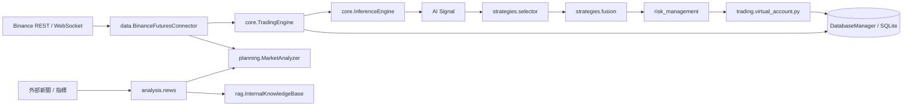

# BioNeuronai 系統架構總覽

**用途**: 描述目前專案的正式主線架構 (`v2.1`)，提供開發者對外入口、核心交易主鏈與資料供應鏈的總體視野。  
**版本**: v2.1
**更新日期**: 2026-04-17

---

## 📑 目錄

<!-- toc -->

- [1. 總體架構圖](#1-%E7%B8%BD%E9%AB%94%E6%9E%B6%E6%A7%8B%E5%9C%96)
- [2. 分層說明](#2-%E5%88%86%E5%B1%A4%E8%AA%AA%E6%98%8E)
  * [2.1 對外入口層](#21-%E5%B0%8D%E5%A4%96%E5%85%A5%E5%8F%A3%E5%B1%A4)
  * [2.1a 前端子系統 (`frontend/`)](#21a-%E5%89%8D%E7%AB%AF%E5%AD%90%E7%B3%BB%E7%B5%B1-frontend)
  * [2.2 核心交易層](#22-%E6%A0%B8%E5%BF%83%E4%BA%A4%E6%98%93%E5%B1%A4)
  * [2.3 策略層 (`strategies/`)](#23-%E7%AD%96%E7%95%A5%E5%B1%A4-strategies)
  * [2.4 規劃層 (`planning/`)](#24-%E8%A6%8F%E5%8A%83%E5%B1%A4-planning)
  * [2.5 交易與帳戶事實層 (`trading/`)](#25-%E4%BA%A4%E6%98%93%E8%88%87%E5%B8%B3%E6%88%B6%E4%BA%8B%E5%AF%A6%E5%B1%A4-trading)
  * [2.6 風控層 (`risk_management/`)](#26-%E9%A2%A8%E6%8E%A7%E5%B1%A4-risk_management)
  * [2.7 數據與支援層 (`data/`, `schemas/`, `rag/`, `nlp/`)](#27-%E6%95%B8%E6%93%9A%E8%88%87%E6%94%AF%E6%8F%B4%E5%B1%A4-data-schemas-rag-nlp)
- [3. 資料流架構圖](#3-%E8%B3%87%E6%96%99%E6%B5%81%E6%9E%B6%E6%A7%8B%E5%9C%96)
- [4. 交易執行時序圖](#4-%E4%BA%A4%E6%98%93%E5%9F%B7%E8%A1%8C%E6%99%82%E5%BA%8F%E5%9C%96)
- [5. 模組職責表](#5-%E6%A8%A1%E7%B5%84%E8%81%B7%E8%B2%AC%E8%A1%A8)
- [6. 建議閱讀順序](#6-%E5%BB%BA%E8%AD%B0%E9%96%B1%E8%AE%80%E9%A0%86%E5%BA%8F)

<!-- tocstop -->

---

## 1. 總體架構圖

```mermaid
flowchart TD
    U[使用者 / 外部系統] --> FE_D[frontend/devops-d\n第一階段前端主線\nReact 19 + Vite 7]
    FE_A[frontend/admin-da\n暫緩\nReact 19 + Vite 7]
    FE_T[frontend/trading\n暫緩\nReact 19 + Vite 7]
    U --> CLI[CLI 入口\nmain.py / bioneuronai.cli.main]

    FE_D --> API[FastAPI 入口\nbioneuronai.api.app\nlocalhost:8000]
    CLI --> API
    CLI --> TE[TradingEngine\n核心交易引擎]
    CLI --> PLN[planning/\n高階計劃與盤前檢查]
    CLI --> CNA[analysis.news\n新聞分析]
    CLI --> BT1[backtest/\n主回測子系統]
    API --> PLN
    API --> CNA
    API --> BT1

    TE --> IE[InferenceEngine\nAI 推論管線]
    IE --> TM[交易推論模型\nmodel/my_100m_model.pth]
    IE --> FP[FeaturePipeline\n1024 維特徵]

    TE --> SEL[strategies/selector\nStrategySelector]
    TE --> TS[strategies/strategy_fusion\nAIStrategyFusion]
    TE --> RMCORE[risk_management/\n核心風控]
    TE --> DATAIF[data/\nBinanceFuturesConnector\nDatabaseManager]
    TE --> EVO[core/self_improvement.py]

    PLN --> MA[MarketAnalyzer]
    PLN --> PS[PairSelector]
    PLN --> PRET[PretradeAutomation]

    RMCORE --> T_ACC[trading/virtual_account.py\n帳戶事實層起點]

    BT1 -. 以 mock connector / replay 介面接入 .-> TE

    RAG[src/rag\n正式 RAG 子系統]
    NLP[src/nlp\nTinyLLM 雙模態 / ChatEngine / 訓練工具]
    STORE[data/\nhistorical | trading | validation | rag | nlp]
    CHAT[ChatEngine\n雙語對話助理]

    RAG --> PLN
    NLP --> TM
    NLP --> CHAT
    CLI --> CHAT
    API --> CHAT
    STORE --> BT1
    EVO --> STORE
    DATAIF --> STORE
```

---

## 2. 分層說明

### 2.1 對外入口層

- `main.py`: 專案根目錄統一入口，將 `src/` 加入路徑後轉交給 CLI。
- `src/bioneuronai/cli/main.py`: 真正的命令列入口，負責 `status`、`plan`、`pretrade`、`news`、`backtest`、`simulate`、`trade` 等。
- `src/bioneuronai/api/app.py`: FastAPI 服務（`localhost:8000`），將各交易能力封裝成 HTTP API 供前端與外部呼叫。

### 2.1a 前端子系統 (`frontend/`)

`frontend/` 下目前保留三個 React 19 + Vite 7 + TypeScript 應用，但 2026-04-17 的部署決策是**先只推進 `frontend/devops-d/`**。`admin-da` 與 `trading` 保留原始碼，暫不列入第一階段部署驗收。

| 目錄 | 用途 | 部署狀態 |
|------|------|---------|
| `frontend/devops-d/` | DevOps 監控面板：系統狀態、新聞分析、回測、ChatBot、Pre-Trade、交易控制、API Playground | 第一階段主線；已補齊 `src/lib`、完成 `npm.cmd run build` |
| `frontend/admin-da/` | 管理後台：儀表板、風控指標、最大回撤、盤前清單、稽核日誌 | 暫緩；部分後端端點仍需確認 |
| `frontend/trading/` | 交易操作介面：即時概覽、分析、回測、Chat 助理、交易控制（WebSocket + 價格預警） | 暫緩；WebSocket 與部分 API 對接仍需確認 |

**目前驗收入口**：
```bash
cd frontend/devops-d  &&  npm run dev   # → http://localhost:5173
```

後端 API 預設仍為 `http://localhost:8000`。

### 2.2 核心交易層

- `src/bioneuronai/core/trading_engine.py`: 專案執行中樞，整合 AI 推理、策略融合、資料庫落檔等。
- `src/bioneuronai/core/inference_engine.py`: 負責提煉 1024 維特徵，維護 16 步滾動特徵視窗。*(註：目前正式交易主線預設關閉載入 `model/my_100m_model.pth`，該深度學習模型處於待命狀態，實際決策依靠演算法進行動態融合。)*

### 2.3 策略層 (`strategies/`)

此層主要存放固定策略、策略選擇與競技融合機制。
- **Selector 與 Fusion**: 目前正式主線使用 `strategies/selector/core.py` 與 `strategies/strategy_fusion.py`。
- **Arena / Optimizer**: `strategies/strategy_arena.py` 與 `portfolio_optimizer.py` 已改用真 replay 評估，但仍屬持續收斂中的高階競爭層。

### 2.4 規劃層 (`planning/`)

負責較高階的決策、宏觀市場掃描與執行 SOP：
- 交易計劃控制與產出
- 盤前檢查 (Pretrade)
- 分析宏觀盤勢
- 交易對選擇 (Pair selection)

### 2.5 交易與帳戶事實層 (`trading/`)

負責管理訂單、帳戶餘額、持倉狀態：
- **`virtual_account.py`**: 目前已成為正式交易事實層的第一個核心檔案，主要服務 replay / mock execution 與帳戶狀態查詢。

### 2.6 風控層 (`risk_management/`)

負責運算倉位大小(sizing)、評估曝險、並控管整體投組的風險閥值，提供客觀標準給 `planning/` 與 `core/` 使用。

### 2.7 數據與支援層 (`data/`, `schemas/`, `rag/`, `nlp/`)

- `data/`: 外部 API (如幣安合約、新聞爬蟲)、SQLite 資料庫寫入的實作。
- `schemas/`: 規範跨模組使用的 Pydantic v2 模型（訂單、訊號、K 線等），為單一事實來源。
- `rag/`: 供新聞分析或交易前檢查檢索外部趨勢，寫入 `InternalKnowledgeBase`。

---

## 3. 資料流架構圖



---

## 4. 交易執行時序圖

1. **User / CLI** 啟動 `plan` 或 `trade`。
2. **`planning/`** 進行市場大盤分析、關鍵字搜尋，產出交易對與計劃建議。
3. **`core.TradingEngine`** 啟動主流程，由 `data/` 抓取當下 K 線。
4. **`core.InferenceEngine`** 生成特徵 *(註：深度神經網路模型預設為待命不介入)*。
5. **`strategies/selector` + `strategies/strategy_fusion`** 進行動態策略融合。這裡的「AI Fusion」主要透過啟發式演算法，結合勝率 (`win_rate`)、市場體制與新聞分數 (`event_score`) 來動態調整傳統策略權重。
6. **`risk_management`** 決定倉位與風險阻擋。
7. **`trading.VirtualAccount`** 在 replay / mock 路徑下紀錄持倉、餘額與掛單事實。
8. **`data.DatabaseManager`** 可負責寫入操作紀錄與歷史，但不應在此文件中寫成所有狀態都已完全統一由資料庫接管。

---

## 5. 模組職責表

| 模組分佈 | 主要職責 | 在主流程中的位置 |
|------|------|------|
| `main.py` & `cli/`, `api/` | CLI與Web API命令分派 | 對外入口 |
| `frontend/devops-d/` | DevOps 監控面板（系統狀態、回測、Chat、API Playground） | 第一階段前端入口 |
| `frontend/admin-da/` | 管理後台（風控儀表板、稽核日誌、盤前清單） | 暫緩，待端點驗收 |
| `frontend/trading/` | 交易操作介面（即時監控、價格預警、WebSocket） | 暫緩，待 WebSocket 驗收 |
| `src/bioneuronai/core/` | 交易引擎、AI 推論、進化系統 | 核心中樞 |
| `src/bioneuronai/strategies/`| 固定策略、selector、fusion、arena | 策略實作與競爭 |
| `src/bioneuronai/planning/` | 高階計劃、盤前檢查、大盤分析、選對 | 決策支援與規劃 |
| `src/bioneuronai/trading/` | 訂單、帳戶、持倉、資金的事實層 | 帳本追蹤 |
| `src/bioneuronai/risk_management/` | 風險資料結構、倉位 sizing 計算 | 基礎風控 |
| `src/bioneuronai/data/` | 交易所接口、資料庫、外部資料服務 | 基礎設施 |
| `src/schemas/` | 各模組共用的 Pydantic 資料模型 | 契約層 |
| `backtest/` | 模擬交易所式回測、重播引擎 | 主回測線 |
| `src/rag/` & `src/nlp/` | 檢索知識庫與 TinyLLM 訓練、推論 | 支援子系統 |

---

## 6. 建議閱讀順序

若要理解目前 `v2.1` 系統，建議依序閱讀：

1. `main.py` 與 `src/bioneuronai/cli/main.py`
2. `src/bioneuronai/core/trading_engine.py` (整合入口)
3. `src/bioneuronai/core/inference_engine.py` (AI 大腦)
4. `src/bioneuronai/planning/` (策略執行前的作業)
5. `src/bioneuronai/strategies/` (訊號產生區)
6. `backtest/` 與 `src/bioneuronai/trading/virtual_account.py` (驗證與帳本)
7. `src/schemas/` (掌握系統流轉的所有 Data Types)
