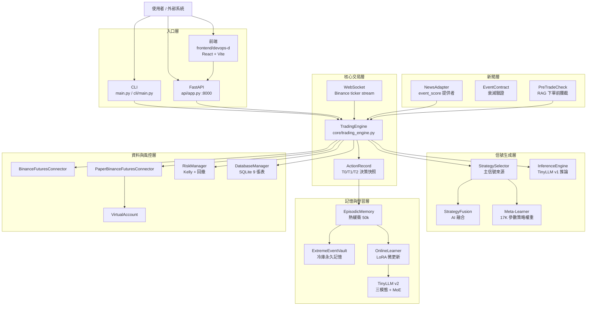

# BioNeuronAI 系統架構總覽

**版本**: v2.2（現役）/ v2.x（建設中）
**更新日期**: 2026-06-11

> 本文件描述程式碼**實際執行**的架構，而非設計目標。
> 未實作的功能在對應章節標注 `⚠️ 缺口` 或 `❌ 未完成`。

---

## 1. 整體架構圖


```mermaid
flowchart TD
    USER[使用者 / 外部系統]

    subgraph 入口層
        CLI[CLI\nmain.py / cli/main.py]
        API[FastAPI\napi/app.py :8000]
        FE[前端\nfrontend/devops-d\nReact + Vite]
    end

    subgraph 核心交易層
        TE[TradingEngine\ncore/trading_engine.py]
        WS[WebSocket\nBinance ticker stream]
        AR[ActionRecord\nT0/T1/T2 決策快照]
    end

    subgraph 信號生成層
        SS[StrategySelector\n主信號來源]
        SF[StrategyFusion\nAI 融合]
        IE[InferenceEngine\nTinyLLM v1 推論]
        ML[Meta-Learner\n17K 參數策略權重]
    end

    subgraph 新聞層
        NA[NewsAdapter\nevent_score 提供者]
        NE[EventContract\n衰減驗證]
        PTC[PreTradeCheck\nRAG 下單前攔截]
    end

    subgraph 記憶與學習層
        EM[EpisodicMemory\n熱緩衝 50k]
        EV[ExtremeEventVault\n冷庫永久記憶]
        OL[OnlineLearner\nLoRA 微更新]
        TM2[TinyLLM v2\n三模態 + MoE]
    end

    subgraph 資料與風控層
        BC[BinanceFuturesConnector]
        PB[PaperBinanceFuturesConnector]
        VA[VirtualAccount]
        RM[RiskManager\nKelly + 回撤]
        DB[DatabaseManager\nSQLite 9 張表]
    end

    USER --> CLI & API & FE
    CLI & API --> TE
    FE --> API
    WS --> TE
    TE --> SS & IE & AR
    SS --> SF & ML
    NA --> TE
    PTC --> TE
    AR --> EM
    EM --> EV
    EM --> OL
    OL --> TM2
    TE --> BC & PB
    PB --> VA
    TE --> RM & DB
```

---

## 2. 真實信號生成時序

```
1. WebSocket 收到 ticker data
2. _process_market_data(data, symbol)
   a. VirtualAccount.update_price(symbol, close, high, low)
      → _check_trigger_orders()             ← 每 tick 即時觸發 SL/TP 條件單
   b. NewsAdapter.get_event_context(symbol)  → event_score, event_context
3. generate_trading_signal(symbol, price, klines, event_score, event_context)
   a. [T0] _record_decision()               → 建立 ActionRecord，填 features + logits
   b. _generate_strategy_signal()
      → StrategySelector.get_actionable_signal(event_score=event_score)
         → 5 策略信號 + Meta-Learner 融合權重
         → event_score 在極端值時非對稱攔截（|score| > 5）
   c. InferenceEngine.predict()             → TinyLLM v1，若模型已載入
   d. _fuse_signals()                       → 策略 70% + AI 25% + 新聞 5%
4. _handle_trading_signal(signal)
   → auto_trade=False (預設) → 記錄 log，不下單
   → auto_trade=True → execute_trade(signal)
      a. 新聞/資金費率/流動性 多重風控
      b. connector.place_order()
      c. [T1] ActionRecord.fill_entry()
5. [T2] 平倉觸發（SL_HIT / TP_HIT / LIQUIDATION / MANUAL）
   → VirtualAccount._on_position_closed callback
   → TradingEngine._on_paper_close()
   → notify_trade_closed()
      → ActionRecord.fill_exit()              # 多目標 reward（core/reward.py）
      → EpisodicMemory.push()
      → OnlineLearner.record_outcome()
      → LoRA 微更新（每 100 筆）
      → AdaptiveLearningHub.record_trade()    # 2026-06-11：自適應閉環
         → 重算策略權重 → 注入 StrategySelector（下一筆交易立即生效）
```

---

## 3. 分層說明

### 3.1 入口層

| 模組 | 路徑 | 說明 |
|---|---|---|
| CLI | `src/bioneuronai/cli/main.py` | 統一命令列入口，支援 trade/pretrade/backtest/news/chat |
| FastAPI | `src/bioneuronai/api/app.py` | HTTP API，localhost:8000 |
| 前端 | `frontend/devops-d/` | Operations Dashboard，React 19 + Vite 7 |

### 3.2 核心交易層

`core/trading_engine.py`（2100+ 行）是所有邏輯的核心。

關鍵初始化參數：
- `auto_trade=False`：預設只監控，不執行
- `enable_ai_model=True`：AI 推論引擎初始化（但模型需另外 load）
- `paper_trading=False`：預設用真實連接器（testnet/mainnet）

關鍵方法：
- `start_monitoring(symbol)`: 啟動 WebSocket 監控
- `load_ai_model(model_name)`: 載入 TinyLLM 模型
- `enable_auto_trading()`: 開啟自動下單
- `notify_trade_closed(...)`: 平倉後通知，由 VirtualAccount 回調自動觸發
- `get_learning_status()`: 查詢記憶層 + LoRA 狀態

### 3.3 信號生成層

**StrategySelector**（`strategies/selector/`）是主信號來源：
- 5 種子策略：TrendFollowing / SwingTrading / MeanReversion / Breakout / DirectionChange
- Meta-Learner（17K 參數神經網路）動態調整各策略權重
- 輸出：`TradeSetup`（方向、強度、SL/TP）

**InferenceEngine**（`core/inference_engine.py`）是 AI 輔助信號：
- 載入 TinyLLM v1 模型（1024 維輸入 → 512 維輸出）
- 16 步滾動特徵視窗
- 輸出：`TradingSignal`（方向、信心、槓桿建議）
- 若模型未載入：返回 None，系統繼續用純策略信號

### 3.4 新聞層

新聞在現有架構中的**實際角色**是**非對稱過濾器**：

```
event_score < -5 (極度看空) → 攔截普通做多信號，放行做空
event_score > +5 (極度看多) → 攔截普通做空信號，放行做多
-5 ≤ event_score ≤ +5     → 策略信號正常通過
```

**設計目標（🧩 已留擴充點，未完整實現）**：新聞分析近期事件後提出主要方向建議，策略信號在方向框架內執行。
`NewsAdapter.get_direction_bias()` 已有 minimal 過渡版（由主導事件 event_score 推導，
`implemented_level="minimal"`），但尚未接入 `_fuse_signals()` 作為方向框架。詳見 PROJECT_STATUS P1。

### 3.5 記憶與學習層

| 模組 | 狀態 | 說明 |
|---|---|---|
| TinyLLM v2 | 🧩 架構完成，未接通推論引擎 | `nlp/tiny_llm_v2.py`，三模態 + MoE，65 維全監督；`enable_v2_mode()` 為誠實 stub |
| ActionRecord | ✅ T0/T1/T2 全接通 | VirtualAccount 平倉回調自動觸發 T2 |
| EpisodicMemory | ✅ 完成 | 熱緩衝 (50k 條，優先採樣) + 冷庫（極端事件永久保存） |
| OnlineLearner | ✅ 完成 | LoRA 微更新，每 100 筆完整記錄觸發，4 項損失函數 |
| 多目標 Reward | ✅ 完成（2026-06-11） | `core/reward.py`：盈虧 × 時間效率 × 校準 + 過度自信/爆倉懲罰 |
| AdaptiveLearningHub | ✅ 完成（2026-06-11） | `core/adaptive_hub.py`：結果 → 策略權重閉環，JSON 持久化跨重啟 |
| GoalTracker | 🧩 監測版（2026-06-11） | `planning/goal_manager.py`：每輪寫入 ledger，自動回饋風險參數未實作 |
| AutonomousOperator 持續迴圈 | ✅ 完成（2026-06-11） | `run_forever`：執行 → 結算 outcome 回寫 ledger → 自我修正下一輪 |

**EpisodicMemory 極端事件判定條件**（自動存入冷庫）：
- 5 分鐘價格變動 > 3σ
- 爆倉量 > 過去 24h 均值 × 5 倍
- 模型信心 > 0.8 但結果為巨虧（> 5%）

### 3.6 資料與風控層

| 模組 | 說明 |
|---|---|
| BinanceFuturesConnector | REST + WebSocket，支援 testnet 和 mainnet |
| PaperBinanceFuturesConnector | 真實市場數據 + 本地虛擬成交，不送 Binance 訂單 |
| VirtualAccount | 帳戶狀態、持倉管理、SL/TP 觸發 |
| RiskManager | Kelly 倉位計算、最大回撤 10%、每日最大交易次數 10 |
| DatabaseManager | SQLite，9 張表 |

---

## 4. TinyLLM 模型架構

### v1（現役）

```
輸入: 1024 維扁平向量（10 類市場特徵）
  ↓ Linear(1024 → 1536) → GELU → LayerNorm
  ↓ Linear(1536 → 768) → LayerNorm
  ↓ 12 層 Transformer（12 頭，FFN=3072）
  ↓ Signal Head: Linear(768 → 512)

輸出: 512 維
  [0:23]   有效信號（方向/信心/風險/槓桿/倉位/SL/TP/市場狀態）
  [23:512] 潛在嵌入空間（489 維，無監督目標，等同噪音）
```

### v2（建設中）

```
輸入（三模態）:
  數值: 16 根 K 線 × 64 特徵 → 16 個 patch token
  文字: 新聞/提問 → 最多 128 個 GPT-2 token（可選）
  圖像: K 線圖 → CNN → 16 個 patch token（可選）

架構:
  各模態 Encoder → 12 層 TransformerBlockV2
  （每隔 2 層用 MoE：6 專家，top-2 路由）
  （Cross-attention：數值 token 主動讀文字）
  → 最後數值 token → TradingSignalHead

輸出: 65 維（全監督）
  方向(3) + 信心(3) + 槓桿(10) + 倉位(1) + SL(1) + TP(1) +
  持倉時間(10) + 多時框一致性(5) + K線形態(20) + 不確定性(1) + 市場狀態(10)

LoRA: 整合在模型內，骨幹凍結後 0.25%（~203K）參數可訓練
```

---

## 5. 待完成缺口

| 缺口 | 影響 | 修正方向 |
|---|---|---|
| 新聞是過濾器而非主信號 | 不符合設計目標 | 加入 `news_direction_bias` 作為方向框架（P1） |
| 歷史 RL 訓練管線缺失 | 無法用歷史資料做策略強化 | 建立 `training/rl_trainer.py`（P2） |
| TinyLLM v2 未接上交易引擎 | v2 架構建完但無法使用 | 修改 InferenceEngine 支援 v2 格式（P3） |

---

## 6. 部署模式

```bash
# 監控模式（不下單）
python main.py trade --symbol BTCUSDT

# Paper trading（虛擬交易，自動下單）
python main.py trade --paper-live --paper-balance 10000

# Testnet（需 API 金鑰）
python main.py trade --symbol BTCUSDT --auto-trade

# API 服務
uvicorn bioneuronai.api.app:app --host 0.0.0.0 --port 8000
```

---

*最後更新：2026-06-07*
