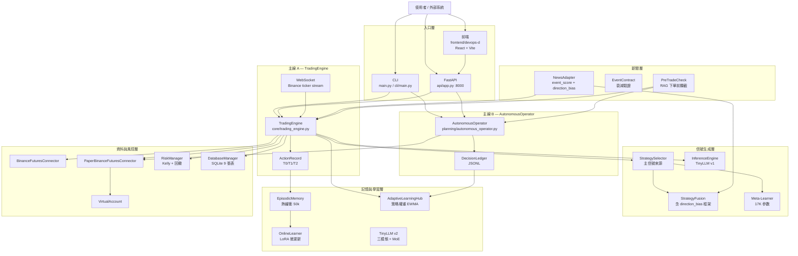

# BioNeuronAI 系統架構總覽

**套件版本**：v2.1（`pyproject.toml`）
**更新日期**：2026-06-15

> 本文件描述程式碼**實際執行**的架構，而非設計目標。
> 現況細節以 [`PROJECT_STATUS.md`](PROJECT_STATUS.md) 為準；本文件為架構導覽。

---

## 目錄

1. [整體架構圖](#1-整體架構圖)
2. [雙執行主線](#2-雙執行主線)
3. [主線 A：信號生成時序](#3-主線-a信號生成時序)
4. [分層說明](#4-分層說明)
   - [4.1 入口層](#41-入口層)
   - [4.2 核心交易層](#42-核心交易層)
   - [4.3 信號生成層](#43-信號生成層)
   - [4.4 新聞層](#44-新聞層)
   - [4.5 記憶與學習層](#45-記憶與學習層)
   - [4.6 資料與風控層](#46-資料與風控層)
5. [TinyLLM 模型架構](#5-tinyllm-模型架構)
6. [待完成缺口](#6-待完成缺口)
7. [部署模式](#7-部署模式)

---

## 1. 整體架構圖


```mermaid
flowchart TD
    USER[使用者 / 外部系統]

    subgraph 入口層
        CLI[CLI\nmain.py / cli/main.py]
        API[FastAPI\napi/app.py :8000]
        FE[前端\nfrontend/devops-d\nReact + Vite]
    end

    subgraph 主線A[主線 A — TradingEngine]
        TE[TradingEngine\ncore/trading_engine.py]
        WS[WebSocket\nBinance ticker stream]
        AR[ActionRecord\nT0/T1/T2]
    end

    subgraph 主線B[主線 B — AutonomousOperator]
        AO[AutonomousOperator\nplanning/autonomous_operator.py]
        LEDGER[DecisionLedger\nJSONL]
    end

    subgraph 信號生成層
        SS[StrategySelector\n主信號來源]
        SF[StrategyFusion\n含 direction_bias 框架]
        IE[InferenceEngine\nTinyLLM v1]
        ML[Meta-Learner\n17K 參數]
    end

    subgraph 新聞層
        NA[NewsAdapter\nevent_score + direction_bias]
        NE[EventContract\n衰減驗證]
        PTC[PreTradeCheck\nRAG 下單前攔截]
    end

    subgraph 記憶與學習層
        EM[EpisodicMemory\n熱緩衝 50k]
        OL[OnlineLearner\nLoRA 微更新]
        HUB[AdaptiveLearningHub\n策略權重 EWMA]
        TM2[TinyLLM v2\n三模態 + MoE]
    end

    subgraph 資料與風控層
        BC[BinanceFuturesConnector]
        PB[PaperBinanceFuturesConnector]
        VA[VirtualAccount]
        RM[RiskManager\nKelly + 回撤]
        DB[DatabaseManager\nSQLite 9 張表]
    end

    USER --> CLI & API & FE
    CLI & API --> TE & AO
    FE --> API
    WS --> TE
    TE --> SS & IE & AR
    SS --> SF & ML
    NA --> TE & SF
    PTC --> TE & AO
    AR --> EM --> OL
    TE --> HUB
    AO --> LEDGER --> HUB
    TE --> BC & PB
    AO --> PB
    PB --> VA
    TE --> RM & DB
```

---

## 2. 雙執行主線

| 維度 | 主線 A：TradingEngine | 主線 B：AutonomousOperator |
|------|----------------------|---------------------------|
| CLI | `python main.py trade [--paper-live]` | `python main.py autonomous [--execute-paper]` |
| 驅動方式 | WebSocket 即時 tick | 定時規劃迴圈（`run_forever`） |
| 決策來源 | StrategySelector + InferenceEngine | Plan → Pretrade → AdaptationController |
| 下單觸發 | `auto_trade=True` / `--paper-live` | `execute_paper=True` 且 adaptation 允許 |
| ActionRecord T0/T1/T2 | ✅ | ❌ |
| EpisodicMemory / LoRA | ✅（平倉回調） | ❌ |
| Decision Ledger | ❌ | ✅ |
| AdaptiveLearningHub | ✅ | ✅ |
| 完整學習閉環 | ✅ | 部分（僅 hub + ledger） |

**主線 B 執行層（2026-06-15）**：
- `_execute_paper_order()` 優先採 pretrade `order_parameters.quantity`（× `risk_multiplier`）；無效時 fallback `paper_notional_fraction`
- 下單前檢查既有持倉；重複進場回傳 `skipped=existing_position`
- 平倉回填 `confidence_calibrator.record_outcome_by_index()`；可選 `--reflect-every` 觸發 reflection_loop

---

## 3. 主線 A：信號生成時序

```
1. WebSocket 收到 ticker data
2. _process_market_data(data, symbol)
   a. VirtualAccount.update_price(symbol, close, high, low)
      → _check_trigger_orders()             ← 每 tick 即時觸發 SL/TP
   b. NewsAdapter.get_event_context(symbol)  → event_score, event_context
3. generate_trading_signal(...)
   a. [T0] _record_decision()               → ActionRecord
   b. _generate_strategy_signal()
      → StrategySelector.get_actionable_signal(event_score=event_score)
         → AIStrategyFusion.generate_fusion_signal()
            → get_direction_bias() 方向框架（minimal，攔截逆勢共識）
         → event_score 極端值非對稱攔截（|score| > 5）
   c. InferenceEngine.predict()             → TinyLLM v1（若已載入）
   d. _fuse_signals()                       → 策略 70% + AI 25% + event_score 5%
4. _handle_trading_signal(signal)
   → auto_trade=False (預設) → 記錄 log，不下單
   → auto_trade=True → execute_trade() → [T1] ActionRecord.fill_entry()
5. [T2] 平倉（SL_HIT / TP_HIT / LIQUIDATION / MANUAL）
   → VirtualAccount 回調 → notify_trade_closed()
      → ActionRecord.fill_exit() → EpisodicMemory → OnlineLearner → LoRA
      → AdaptiveLearningHub → 重注入 StrategySelector 權重
```

---

## 4. 分層說明

### 4.1 入口層

| 模組 | 路徑 | 說明 |
|---|---|---|
| CLI | `src/bioneuronai/cli/main.py` | 統一命令列：`trade` / `autonomous` / `pretrade` / `backtest` 等 |
| FastAPI | `src/bioneuronai/api/app.py` | HTTP API，localhost:8000 |
| 前端 | `frontend/devops-d/` | Operations Dashboard，React 19 + Vite 7 |

### 4.2 核心交易層

`core/trading_engine.py` 是主線 A 的核心。

關鍵初始化參數：
- `auto_trade=False`：預設只監控，不執行
- `enable_ai_model=True`：AI 推論引擎初始化（模型需另外 `load_ai_model()`）
- `paper_trading=False`：預設用真實連接器（testnet/mainnet）

關鍵方法：
- `start_monitoring(symbol)`：啟動 WebSocket 監控
- `notify_trade_closed(...)`：平倉後觸發 T2 + LoRA + hub 更新

`planning/autonomous_operator.py` 是主線 B 的編排器，不經過 TradingEngine。

### 4.3 信號生成層

**StrategySelector**（`strategies/selector/`）是主信號來源：
- 5 種子策略 + Meta-Learner（17K 參數）動態權重
- 透過 `AIStrategyFusion.generate_fusion_signal()` 產出融合信號

**InferenceEngine**（`core/inference_engine.py`）是 AI 輔助信號：
- TinyLLM v1：1024 維輸入 → 512 維輸出
- 模型未載入時返回 None，系統繼續用純策略信號

### 4.4 新聞層

新聞在系統中同時扮演**三種角色**：

| 角色 | 位置 | 狀態 |
|------|------|------|
| 極端 event_score 過濾器 | StrategySelector / event_score 非對稱攔截 | ✅ |
| 方向框架（Directional Guard） | `generate_fusion_signal()` + `get_direction_bias()` | ✅ minimal（2026-06-12） |
| event_score 加權融合 | `TradingEngine._fuse_signals()` | ✅（非 direction_bias） |
| 多事件時序聚合 | `NewsAdapter.get_direction_bias()` | 🧩 P1 待擴充 |

極端過濾規則：
```
event_score < -5 → 攔截普通做多，放行做空
event_score > +5 → 攔截普通做空，放行做多
-5 ≤ event_score ≤ +5 → 策略信號正常通過
```

### 4.5 記憶與學習層

| 模組 | 狀態 | 說明 |
|---|---|---|
| TinyLLM v2 | 🧩 未接通推論引擎 | `src/nlp/tiny_llm_v2.py`；`enable_v2_mode()` 為誠實 stub |
| ActionRecord | ✅ 主線 A | T0/T1/T2 全接通 |
| EpisodicMemory | ✅ 主線 A | 熱緩衝 50k + 極端事件冷庫 |
| OnlineLearner | ✅ 主線 A | LoRA 微更新，每 100 筆觸發 |
| AdaptiveLearningHub | ✅ A + B | 策略×幣對 EWMA → 動態權重，JSON 持久化 |
| GoalTracker | 🧩 監測版 | 寫入 ledger；風險自動回饋未實作 |
| AutonomousOperator | ✅ 主線 B | `run_forever` + outcome 回寫 ledger |
| 歷史 RL 訓練 | ✅ 離線 | `training/rl_trainer.py`（2026-06-12） |

### 4.6 資料與風控層

| 模組 | 說明 |
|---|---|
| BinanceFuturesConnector | REST + WebSocket，testnet / mainnet |
| PaperBinanceFuturesConnector | 真實行情 + 本地虛擬成交 |
| VirtualAccount | 持倉、SL/TP 觸發、平倉回調 |
| RiskManager | Kelly 倉位、最大回撤 10% |
| DatabaseManager | SQLite，9 張表 |

---

## 5. TinyLLM 模型架構

### v1（現役）

```
輸入: 1024 維扁平向量（10 類市場特徵）
  ↓ 12 層 Transformer
  ↓ Signal Head: Linear(768 → 512)

輸出: 512 維
  [0:23]   有效信號
  [23:512] 潛在嵌入空間（479 維，無監督目標）
```

### v2（建設中）

```
輸入: 16×64 patch + 文字 token（可選）+ 圖像 token（可選）
架構: MoE（6 專家，top-2）+ Cross-attention
輸出: 65 維全監督
LoRA: 骨幹凍結後 0.25%（~203K）參數可訓練
```

---

## 6. 待完成缺口

| 缺口 | 狀態 | 修正方向 |
|---|---|---|
| 新聞時序聚合 | 🧩 P1 | 擴充 `get_direction_bias()`，`implemented_level` → `"full"` |
| TinyLLM v2 接上引擎 | 🧩 P3 | FeaturePipeline 16×64 + SignalInterpreterV2 |
| GoalTracker 自動回饋 | 🧩 P4 | `recommended_risk_scale` → AdaptationController |
| 主線 B 執行脫節 | ⚠️ | 採用 pretrade quantity + 持倉檢查 |
| `_fuse_signals` 改用 direction_bias | 🧩 | 與 StrategyFusion 層對齊（可選） |

---

## 7. 部署模式

```bash
# 主線 A：監控（不下單）
python main.py trade --symbol BTCUSDT

# 主線 A：Paper trading（完整學習閉環）
python main.py trade --paper-live --paper-balance 10000

# 主線 B：自主規劃（建議模式）
python main.py autonomous --mode advisor --symbol BTCUSDT

# 主線 B：自主 paper 執行
python main.py autonomous --mode paper_auto --execute-paper --symbol BTCUSDT

# API 服務
uvicorn bioneuronai.api.app:app --host 0.0.0.0 --port 8000
```

---

*最後更新：2026-06-15*