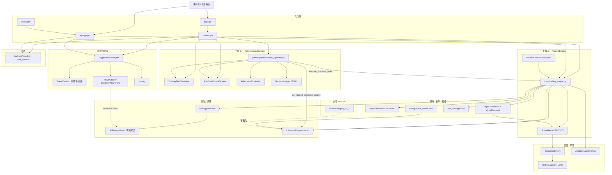

# BioNeuronAI 系統架構總覽

**套件版本**：v2.1（`pyproject.toml`）  
**更新日期**：2026-07-18  

> 本文件描述程式碼**實際執行**的架構與運作流程，而非空想設計。  
> **優先級與驗證哲學**以 [`CURRENT_DIRECTION.md`](CURRENT_DIRECTION.md) 為準。  
> **模組完成度**以 [`PROJECT_STATUS.md`](PROJECT_STATUS.md) 為準。  
> **工作順序**以 [`archive/WORK_ORDER.md`](archive/WORK_ORDER.md) 為準（五步＝**全專案**）。  
> 接手依賴細節另見 [`PROJECT_HANDOVER_MAP.md`](PROJECT_HANDOVER_MAP.md)。  
> 圖源：[`assets/architecture.mmd`](assets/architecture.mmd)、[`assets/tinyllm_inference_flow.mmd`](assets/tinyllm_inference_flow.mmd)。

---

## 目錄

0. [與現行方向的對齊](#0-與現行方向的對齊)
1. [整體架構圖](#1-整體架構圖)
2. [全專案入口表面](#2-全專案入口表面)
3. [雙執行主線](#3-雙執行主線)
4. [運作流程圖](#4-運作流程圖)
   - [F1 主線 A](#41-f1-主線-a交易-tick)
   - [F2 主線 B](#42-f2-主線-b自主迴圈)
   - [F3 回測／WF](#43-f3-回測與-walk-forward)
   - [F4 新聞事件](#44-f4-新聞事件不規則多空)
5. [分層與模組關係](#5-分層與模組關係)
6. [TinyLLM 模型架構](#6-tinyllm-模型架構)
7. [步驟 3 全案待調清單（分析登錄）](#7-步驟-3-全案待調清單分析登錄)
8. [待完成缺口](#8-待完成缺口)
9. [部署模式](#9-部署模式)
10. [修訂紀錄](#10-修訂紀錄)

---

## 0. 與現行方向的對齊

| 架構意涵 | 現行方向 |
|----------|----------|
| 雙 CLI 入口 | 控制方式不同；**模型與 paper 執行層共用** |
| 預設「AI 自主」 | **`autonomous` 長跑** 為主路徑；`trade --paper-live` 為 tick／T0–T2 觀測 |
| 新聞 | 事件**重要性**＋記憶；規則**不**輸出 LONG／SHORT |
| 交易即訓練 | 終局：平倉 → 記帳 → Hub／LoRA；工程未穩可只記錄 |
| 驗證 | 虛擬帳戶真實操作 + 歷史回測；**非** pytest 完成標準 |
| Colab | **訓練算力支線**，不取代本地主線、不算步驟 5 完成 |
| 商用多帳戶等 | 架構可擴，**本階段不實作、不阻塞** |
| 產品操作入口 | 目前以 CLI + `frontend/devops-d` 分開；目標收斂成手動啟動器 + 單一產品面板 + 唯一 `AutonomousOperator` runtime，尚待實作 |

---

## 1. 整體架構圖


```mermaid
flowchart TD
    USER[使用者 / 外部系統]

    subgraph ENTRY[入口層]
        MAIN[main.py]
        CLI[cli/main.py]
        API[api/app.py]
        FE[frontend/*]
    end

    subgraph LINE_A[主線 A — TradingEngine]
        TE[core/trading_engine.py]
        WS[Binance WebSocket ticker]
        AR[ActionRecord T0/T1/T2]
    end

    subgraph LINE_B[主線 B — AutonomousOperator]
        AO[planning/autonomous_operator.py]
        PLAN[TradingPlanController]
        PRE[PreTradeCheckSystem]
        ADAPT[AdaptationController]
        LEDGER[DecisionLedger JSONL]
    end

    subgraph SIGNAL[信號 / 策略]
        SS[StrategySelector]
        SF[AIStrategyFusion 戰術候選]
        IE[InferenceEngine shared]
    end

    subgraph NEWS[新聞 / RAG]
        CNA[CryptoNewsAnalyzer]
        EC[EventContract 重要性/衰減]
        NA[NewsAdapter direction=NEUTRAL]
        RAG[src/rag]
    end

    subgraph LEARN[記憶 / 學習]
        EM[EpisodicMemory]
        OL[OnlineLearner / LoRA]
        HUB[AdaptiveLearningHub]
    end

    subgraph DATA[資料 / 帳戶 / 風控]
        BFC[BinanceFuturesConnector]
        PAPER[Paper connector + VirtualAccount]
        RM[risk_management]
        CFG[config/active_model.json]
    end

    subgraph BT[回測]
        BTS[backtest/ service + walk_forward]
    end

    subgraph ARCH[封存 NEVER]
        LEG[archived/legacy_v1_*]
    end

    USER --> MAIN --> CLI
    USER --> API
    FE --> API
    CLI --> TE & AO & BTS & CNA & PLAN & PRE
    API --> TE & BTS & CNA

    WS --> TE
    TE --> SS & IE & AR
    SS --> SF
    AO --> PLAN & PRE & ADAPT & LEDGER
    AO -->|execute_prepared_order| TE
    AO -->|get_shared_inference_engine| IE
    TE --> IE
    CNA --> EC & NA & RAG
    NA -.->|NEUTRAL only| SF
    AR --> EM --> OL
    TE --> HUB
    TE --> BFC & PAPER & RM
    PAPER --> AR
    CFG --> IE
    LEG -.->|不載入| IE
```

靜態圖源：[`assets/architecture.mmd`](assets/architecture.mmd)（與上文同步維護）。

---

## 2. 全專案入口表面

### 2.1 CLI（`python main.py <command>` → `cli/main.py`）

| 命令 | 主要落到 | 角色 |
|------|----------|------|
| `status` | 健康檢查 | 煙霧測試 |
| `trade` | `TradingEngine` | 主線 A |
| `autonomous` | `AutonomousOperator` | 主線 B（預設自主） |
| `plan` | `TradingPlanController` | 每日 SOP 計畫 |
| `pretrade` | `PreTradeCheckSystem` | 進場前驗核 |
| `news` | `CryptoNewsAnalyzer` | 新聞抓取／分析 |
| `reflect` | reflection_loop | 記憶反思 |
| `chat` | ChatEngine + shared IE | 對話（同模型） |
| `backtest` | `backtest` + 引擎 | 歷史 replay |
| `strategy-backtest` | 策略套件 + WF | 策略／walk-forward |
| `readiness-gate` | readiness_gate | 上線門檻 |
| `simulate` | Mock 推進 | 紙交易模擬 |
| `backtest-data` / `backtest-runs` | catalog／runtime | 資料與 run 查詢 |
| `collect-signal-data` | 訓練 JSONL 收集 | 訓練資料支線 |
| `evolve` | StrategyArena | 過渡／競技場 |

### 2.2 API（`api/app.py` + `api/routes/*`）

| 路由模組 | 大致責任 |
|----------|----------|
| `trading.py` | 交易／引擎相關 |
| `analysis.py` | 分析 |
| `backtest.py` | 回測 API |
| `chat.py` | 對話 |
| `dashboard.py` | 儀表板 |
| `system.py` | 系統／模型狀態 |
| `training.py` | 訓練相關 |

### 2.3 前端

| 目錄 | 角色 |
|------|------|
| `frontend/devops-d` | 現行 Operations Dashboard（唯一目前主線） |
| `frontend/trading` | 現存交易 UI；僅供挑選可驗證元件，預定封存 |
| `frontend/admin-da` | 現存管理 UI；含舊／未對齊控制，預定封存 |
| `frontend/design-system` | 設計預覽 |

前端經 HTTP 打 API，**不**直接 import 核心 Python 套件。

> `frontend/app` 是已確認的單一產品面板目標，不是本圖已存在的目錄；本圖維持 as-is，完成實作與驗收後才替換前端結構。

### 2.4 設定與封存

| 路徑 | 角色 |
|------|------|
| `config/active_model.json` | 唯一現役模型宣告（`unified_v2_100m`，`trained: false` 直至有權重） |
| `config/event_rules.json`、`trading_costs.py` 等 | 事件／成本 SSOT |
| `archived/legacy_v1_*` | **NEVER** 進現役 loader |
| `tools/colab/`、`notebooks/*Colab*` | 訓練／遠端算力支線 |

---

## 3. 雙執行主線

| 維度 | 主線 A：TradingEngine | 主線 B：AutonomousOperator |
|------|----------------------|---------------------------|
| CLI | `trade [--paper-live]` | `autonomous [--execute-paper]` |
| 定位 | 即時 tick、T0–T2 觀測 | **預設 AI 自主長跑** |
| 驅動 | WebSocket → `start_monitoring` → `_process_market_data` | `run_once` / `run_forever` 定時規劃 |
| 決策 | StrategySelector 候選 + shared IE 最終 | Plan → shared IE → Pretrade → Adaptation |
| 下單 | `auto_trade` / `--paper-live` → `execute_trade` | `paper_auto` + `--execute-paper` → `execute_prepared_order` |
| Paper 執行 | 引擎 connector | **委派同一** `TradingEngine` |
| 模型 | `get_shared_inference_engine()` | **同一** shared instance |
| ActionRecord | 引擎主路徑 T0/T1/T2 | 平倉經 `_on_shared_paper_close` → 引擎 + ledger |
| Decision Ledger | 無 | 有（JSONL） |
| 學習鏈 | 平倉 → EM → LoRA → Hub | 同上（shared close）+ ledger outcome |

**不得**再寫成：B 線永遠獨立 paper 連接器、永遠無 LoRA、新聞規則決定多空。

---

## 4. 運作流程圖

### 4.1 F1 主線 A（交易 tick）

```text
python main.py trade [--paper-live] --symbol BTCUSDT
  → TradingEngine(...)
  → load_ai_model(unified_v2_100m)   # trained 可能 false
  → start_monitoring(symbol)
       → WebSocket ticker
       → _process_market_data
            ├─ [paper] VirtualAccount.update_price → SL/TP 觸發
            ├─ klines 拉取
            └─ generate_trading_signal
                 ├─ StrategySelector / Fusion → 戰術候選（event_score 固定 0）
                 ├─ InferenceEngine.predict → AI 最終 LONG/SHORT/HOLD
                 └─ _fuse_signals → 正式 TradingSignal
       → auto_trade? execute_trade → [T1] 進場
  → 平倉（SL/TP/…）
       → VirtualAccount callback
       → notify_trade_closed / _on_paper_close
            → [T2] ActionRecord → EpisodicMemory → OnlineLearner → Hub
```

### 4.2 F2 主線 B（自主迴圈）

```text
python main.py autonomous --mode paper_auto --execute-paper --cycles N
  → AutonomousOperator(config)
  → run_once / run_forever
       1. TradingPlanController.create_comprehensive_plan
       2. _run_unified_ai (shared InferenceEngine)
       3. PreTradeCheckSystem（技術／基本面／風險）
       4. AdaptationController → can_execute / risk_multiplier / action
       5. [若 PAPER_TRADE + execute_paper]
            → _execute_paper_order
                 ├─ 已有持倉 → skipped=existing_position
                 └─ TradingEngine.execute_prepared_order(...)
       6. DecisionLedger 寫入
       7. 等待 adaptation.next_interval_minutes → 下一輪
  → 平倉
       → _on_shared_paper_close
            ├─ TradingEngine._on_paper_close（T2／記憶／LoRA／Hub）
            └─ autonomous ledger / calibrator outcome
```

### 4.3 F3 回測與 Walk-Forward

```text
歷史 zip（backtest/data/...）
  → python main.py backtest | strategy-backtest | readiness-gate
  → backtest/service + data_stream + MockConnector
  → 可評估 TradingEngine / 策略套件
  → walk_forward：rolling 多窗 或 single（readiness 用 single）
  → runtime 產物：backtest/runtime/<run_id>/
```

回測**不**取代日常 paper 自主；與主線共用策略／引擎概念，資料路徑獨立。

### 4.4 F4 新聞事件（不規則多空）

```text
CoinDesk RSS + Google News RSS（fail-fast）
  → CryptoNewsAnalyzer
  → EventContract（重要性、有效期、衰減）
  → NewsAdapter.get_direction_bias → direction 固定 NEUTRAL
  → 濃縮 memory_snapshot → InferenceEngine / pretrade（重要性）
  → 最終 LONG/SHORT 只由 AI（或執行閘門）決定，不用關鍵字規則判多空
```

---

## 5. 分層與模組關係

### 5.1 套件地圖（全專案）

| 區塊 | 路徑 | 職責一句話 | 主要上游 | 主要下游 | 現役 |
|------|------|------------|----------|----------|:----:|
| 入口 | `main.py` | 統一轉 CLI | 使用者 | `cli/main.py` | ✅ |
| CLI | `cli/main.py` | 全命令表面 | main | TE/AO/backtest/… | ✅ |
| API | `api/` | HTTP 表面 | FE／外部 | 同核心模組 | ✅ |
| 核心交易 | `core/trading_engine.py` | 主線 A＋統一 paper 執行 | CLI/API/AO | connector/IE/AR | ✅ |
| 推論 | `core/inference_engine.py` | 唯一模型 holder（shared） | TE/AO/chat | unified_v2 | ✅ |
| 記帳 T0–T2 | `core/action_record.py` | 決策／進出場快照 | TE | EM/OL | ✅ |
| 在線學習 | `core/online_learner.py` | LoRA 微更新 | TE close | model | ✅ |
| Hub | `core/adaptive_hub.py` | 策略權重 EWMA | TE/AO | selector | ✅ |
| 自主 | `planning/autonomous_operator.py` | 主線 B 編排 | CLI | plan/pre/adapt/TE | ✅ |
| 計畫 | `planning/plan_controller.py` | 10 步 SOP | AO/CLI plan | 市場／策略 | ✅ |
| 進場前 | `planning/pretrade_automation.py` | 技術／基本面／風險 | AO/CLI | quantity 等 | ✅ |
| 適應 | `planning/adaptation_controller.py` | 可否執行／風險乘數 | AO | paper 決策 | ✅ |
| Ledger | `planning/decision_ledger.py` | B 線審計 JSONL | AO | 磁碟 | ✅ |
| 策略選擇 | `strategies/selector/` | 主信號來源 | TE | fusion/子策略 | ✅ |
| 融合 | `strategies/strategy_fusion.py` | 戰術候選；bias=NEUTRAL | selector | TE | ✅ |
| 子策略 | `strategies/*_trading.py` 等 | 單一風格 setup | fusion | — | ✅ |
| 新聞 | `analysis/news/` | 抓取／合約／評估 | CLI/AO | adapter/RAG | ✅ |
| RAG | `src/rag/` | 檢索／入庫 | news | pretrade/KB | ✅ |
| Schemas | `src/schemas/` | Pydantic SSOT | 全系統 | — | ✅ |
| 交易所 | `data/binance_futures.py` 等 | REST/WS | TE | 市場 | ✅ |
| 虛擬帳戶 | `trading/virtual_account.py` | paper 持倉／SLTP | paper connector | close cb | ✅ |
| 風控 | `risk_management/` | 倉位／校準等 | TE/pretrade | — | ✅ |
| 記憶 | `memory/episodic_memory.py` | 熱／冷情節 | TE | OL | ✅ |
| 回測 | `backtest/` | 正式 replay | CLI/API | runtime | ✅ |
| 訓練 | `training/`、collect-signal | 離線／資料 | CLI | 模型檔 | ⚠️ 支線 |
| 前端 | `frontend/*` | UI | 使用者 | API | ✅ |
| Colab 工具 | `tools/colab/` | 遠端 3.13+GPU | 人 | 訓練 | ⚠️ 支線 |
| v1 封存 | `archived/legacy_v1_*` | 舊模型 | — | **禁止 loader** | 📦 |

### 5.2 核心交易層要點

- `auto_trade=False` 預設只監控。  
- `--paper-live` 會開 auto_trade + paper connector。  
- `execute_prepared_order`：B 線／規劃通過後的**統一下單入口**。  
- `notify_trade_closed` / `_on_paper_close`：T2 + 記憶 + LoRA + Hub。

### 5.3 信號生成層要點

- StrategySelector：多子策略 + Meta-Learner 權重。  
- Fusion：只產戰術候選；`get_direction_bias` **強制 NEUTRAL**；不再用 signed event_score 做多空 ROE。  
- InferenceEngine：16×64 + 新聞記憶 + 策略摘要 → 65 維；`trained=false` 時須誠實標示。

### 5.4 新聞層要點

| 角色 | 位置 | 契約 |
|------|------|------|
| 來源 | CoinDesk + Google News RSS | 任一失敗 → 錯誤，不假中性成功 |
| 重要性／衰減 | EventContract | 不映射 LONG/SHORT |
| 相容 bias | NewsAdapter | `direction=NEUTRAL` |
| 平常 AI 輸入 | memory_snapshot | 類型／重要性／剩餘時間，非全文規則多空 |

---

## 6. TinyLLM 模型架構

### v1（已封存）

```
1024 扁平 → Transformer → 512 維（大量空置）
位置：archived/legacy_v1_20260711/  — loader 拒絕
```

### v2（唯一現役）

```
16×64 patch + 文字（可選）+ 圖像（可選）
→ 8 層 / 768d / MoE + LoRA
→ 65 維全監督
≈ 98.4M 參數；active_model：trained false 直至 unified_v2_100m.pth
TradingEngine / AutonomousOperator / Chat 共用 get_shared_inference_engine()
```

推論細節圖：[`assets/tinyllm_inference_flow.mmd`](assets/tinyllm_inference_flow.mmd)。

---

## 7. 步驟 3 全案待調清單（分析登錄）

> 本階段以**畫對架構／流程**為主；下列供步驟 3 全案調整使用。  
> 遵守 `CODE_FIX_GUIDE.md`：改現有檔、維持架構。

| ID | 區塊 | 觀察 | 建議（步驟 3） |
|----|------|------|----------------|
| S3-DOC-1 | `main.py` 頂部 docstring | 命令列表缺 autonomous／reflect／WF 等 | 與 `cli/main.py` 對齊 |
| S3-DOC-2 | `PROJECT_HANDOVER_MAP` CLI 圖 | 曾缺 autonomous 等（本輪已補） | 保持與 CLI 同步 |
| S3-DOC-3 | 舊 assets 圖語意 | 曾誤導（本輪已重寫 mmd） | 審圖後凍結 |
| S3-A | 新聞／RAG | domain 權重表仍可能含舊站名等 | 掃現役註解／README |
| S3-B | 策略／引擎 | 主路徑已 unified | 文件與 log 用詞一致 |
| S3-C | autonomous | quantity／持倉／ledger 已接；長跑對帳屬步驟 5 | 勿提早宣稱完成 |
| S3-D | backtest | WF 已接；資料覆蓋限制見 backtest docs | 步驟 5／手冊 |
| S3-E | config | event_rules 勿被 Colab export 蓋成重要性全 0 | 保護本地 SSOT |
| S3-F | CLI/API 表面 | 命令多；整套 manuals 未對齊 | 步驟 4 |
| S3-G | frontend | 多 app；與 API 契約需對表 | 步驟 3 批次 G |
| S3-H | Colab/tools | 僅訓練支線 | 文件勿寫成日常主入口 |

**已在步驟 3 切片做過（仍≠全案完成）**：fusion 取消 signed ROE、KB `event_score=0`、plan 改 importance、schema 範例、rag 說明來源敘述。

---

## 8. 待完成缺口

| 缺口 | 與本階段關係 |
|------|----------------|
| 預設自主長跑與對帳驗收 | 步驟 5（圖正確後） |
| 全案步驟 3 接線／殘留 | 依第 7 節清單 |
| 整套 manuals | 步驟 4 |
| v2 真實訓練權重 | 訓練階段；Colab 可輔助；不擋工程自主圖 |
| GoalTracker 自動回饋 | 非阻塞 |
| 多帳戶／API 認證 | 延後 |

---

## 9. 部署模式

```bash
# 主線 A：監控
python main.py trade --symbol BTCUSDT

# 主線 A：Paper（tick + 學習鏈）
python main.py trade --paper-live --paper-balance 10000

# 主線 B：自主（建議）
python main.py autonomous --mode advisor --symbol BTCUSDT
python main.py autonomous --mode paper_auto --execute-paper --cycles 10

# 回測 / WF
python main.py strategy-backtest --walk-forward ...
python main.py readiness-gate ...

# API
uvicorn bioneuronai.api.app:app --host 0.0.0.0 --port 8000

# 健康
python main.py status
```

---

## 10. 修訂紀錄

| 日期 | 說明 |
|------|------|
| 2026-06-15 | 雙主線與學習閉環敘述 |
| 2026-07-11 | unified v2、方向文件對齊 |
| 2026-07-18 | **全專案**架構圖＋F1–F4 流程；CLI 全表面；模組關係表；步驟 3 待調清單；新聞 NEUTRAL／共用執行層；與 WORK_ORDER「先圖後調」一致 |

---

*架構真相來源：本地 repo 現行程式與 CLI，而非 Export／Colab 快照。*
