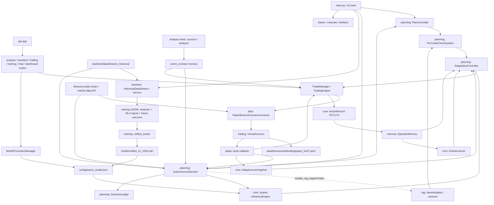
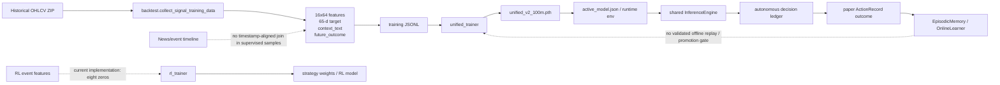
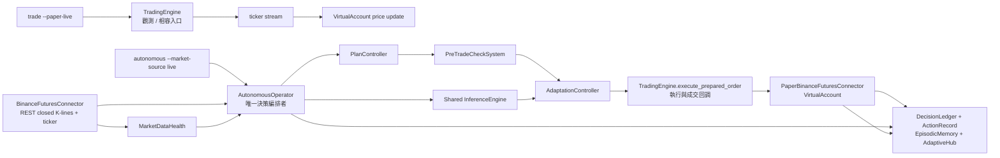

# 模組整合稽核與實際資料流圖

稽核日期：2026-07-19  
範圍：現役 Python 後端、CLI、AI 推論／學習、歷史回測、paper execution、API 與 RAG；前端與 Docker 依目前工作決策暫停，不作為本輪修正範圍。

本文件是依目前程式碼、CLI 實測與測試得到的 **as-is** 圖，不以理想設計替代實作。圖中的虛線是「目前沒有串上的實際斷點」，不是預定功能或模擬連線。

## 結論與訓練門檻

目前可以安全驗證的主線是：CLI → 自主決策 → pre-trade → 本地 paper execution → 實際成交／平倉 → ActionRecord／記憶／LoRA 觸發 → 決策帳本與自適應權重。這條線已補齊兩個會污染訓練樣本的斷點：重複記憶寫入，以及 autonomous paper 成交沒有建立 T0/T1 ActionRecord。

但 **不得先啟動正式訓練或模型升級**。`autonomous --market-source live` 已可取 Binance 已收盤 K 線並寫入資料健康紀錄；2026-07-19 CLI 實測取得 49 根 BTCUSDT 1h K 線，資料新鮮度通過。不過訓練資料仍沒有時間對齊的新聞／事件特徵，也沒有 promotion gate，因此尚不能把 live paper 結果當作可升級模型的訓練資料。

| 門檻 | 實際狀態 | 證據與判定 |
|---|---|---|
| G-01：成交到 ActionRecord T0/T1/T2 | 已修正並有測試 | `TradingEngine.execute_prepared_order()` 僅在 `FILLED` 時以本輪 16×64 patch、65 維 raw signal、文字脈絡建立 T0/T1；平倉 callback 寫入 T2。 |
| G-02：每筆 outcome 只進記憶一次 | 已修正並有測試 | `TradingEngine` 先寫 EpisodicMemory，`OnlineLearner.record_outcome(..., memory_already_recorded=True)` 只計數／更新。 |
| G-03：paper outcome 的 AdaptiveHub 不重複更新 | 已修正 | shared callback 先由 TradingEngine 寫入唯一 AdaptiveHub，operator 只寫 outcome ledger；operator 同步使用 engine 的 hub 與 learner/memory 狀態。 |
| G-04：自主決策資料是現況市場資料 | 已接通（僅 paper／advisor 驗證） | `AutonomousOperator` 透過 `TradingEngine.get_recent_klines()` 讀取 Binance K 線，只採用已收盤 bar；資料逾時會拒絕本輪決策，並把 `MarketDataHealth` 寫入 AI snapshot／ledger。 |
| G-05：訓練資料有時間對齊的新聞／事件真實特徵 | 阻塞 | supervised 回測樣本以未來 K 線標籤；RL 的 8 維 event features 目前明確全為 0。 |
| G-06：訓練與 promotion 前可重播驗證 | 待建立 | 現有 decision ledger 保存輸入／輸出，但尚無「資料版本＋切分＋回測＋paper 結果」的 promotion gate。 |

## 全專案實際架構圖



## 自主 AI／paper 主線流程圖

```mermaid
sequenceDiagram
  participant C as CLI autonomous
  participant O as AutonomousOperator
  participant D as HistoricalDataStream or Binance closed K-lines
  participant N as News analyzer + event memory
  participant P as PlanController
  participant I as Shared InferenceEngine
  participant Q as PreTradeCheckSystem
  participant A as AdaptationController
  participant E as TradingEngine
  participant V as Paper connector + VirtualAccount
  participant M as ActionRecord / Memory / LoRA
  participant L as DecisionLedger + AdaptiveHub

  C->>O: run_once()
  O->>V: settle prior positions with live ticker price
  V-->>O: possible close callback
  O->>D: load K-lines (historical or --market-source live)
  D-->>O: closed OHLCV + freshness status
  O->>P: create_comprehensive_plan(OHLCV)
  P-->>O: plan + candidate symbols
  O->>N: analyze_news(); refresh event memory
  N-->>O: compact event/economic snapshot
  O->>I: predict(OHLCV, compact text context)
  I-->>O: signal + exact 16x64 input + exact 65-d output
  alt AI signal is BUY or SELL
    O->>Q: pre-trade each candidate
    Q-->>O: assessment + order parameters
    O->>A: evaluate(plan, pretrade, ledger, learning state)
    alt paper trade allowed
      O->>E: execute_prepared_order(verified AI snapshot)
      E->>V: MARKET paper order
      V-->>E: FILLED order result
      E->>M: T0/T1 from actual model snapshot + filled price
      E-->>O: paper execution record
    else gate does not permit execution
      O->>L: decision record without order
    end
  else neutral / HOLD
    O->>A: evaluate without pre-trade
    O->>L: observe/advice decision record
  end
  V->>E: later close callback
  E->>M: T2, EpisodicMemory push once, LoRA trigger
  E->>L: AdaptiveHub outcome once
  V->>O: same close callback
  O->>L: trade_outcome ledger + calibrator outcome
```

## 資料、訓練與模型 promotion 流程圖



## 模組逐項核對

| 模組群 | 實際入口與產物 | 上游 → 下游契約 | 狀態 |
|---|---|---|---|
| CLI | `main.py` → `bioneuronai.cli.main` | argparse 指令 → JSON／JSONL artifacts；`--output` 會建立父資料夾 | 可操作；已與手冊修正同步。 |
| Planning | `plan_controller.py`, `pretrade_automation.py`, `adaptation_controller.py`, `decision_ledger.py` | OHLCV／帳戶 → plan → pre-trade → adaptation → ledger | 已串接；HOLD 不做 pre-trade 是正確的安全行為。 |
| Autonomous | `autonomous_operator.py` | plan、新聞事件、策略候選、AI 快照 → paper/ledger | 唯一自動決策線；`--market-source live` 只採 closed K 線，逾時拒絕。 |
| Market data | `HistoricalDataStream`, `BinanceFuturesConnector`, `MarketDataHealth` | ZIP 歷史 K 線或 Binance public K 線 → autonomous；ticker → paper 價格更新 | live 資料來源、最新收盤時間與延遲已寫入 AI snapshot／ledger。 |
| Analysis/news/RAG | `analysis/news/*`, `event_contract.py`, `rag/services/news_adapter.py` | 新聞 → event memory；RAG → pre-trade retrieval | event memory 已入 AI context；autonomous refresh 不 ingest RAG。 |
| Strategy/risk | `strategies/*`, `risk_management/*` | OHLCV／事件 → strategy candidate；pre-trade/risk → order params | 可供 AI 與 pre-trade 使用；RL 事件特徵尚未真實接入。 |
| Core AI | `inference_engine.py`, `tiny_llm_v2.py` | 16×64 + text token → 65 維 raw signal → decoded decision | 現役模型唯一；T0 不再以 zero vector 或固定機率補造資料。 |
| Execution | `trading_engine.py`, `paper_binance.py`, `virtual_account.py` | allowed adaptation → local virtual order → state snapshot／JSONL／callback | paper 不送 Binance POST；倉位與保護單會保存至 `paper_state.json` 並於重啟後恢復。 |
| Memory/online learning | `action_record.py`, `episodic_memory.py`, `online_learner.py`, `adaptive_hub.py` | filled T0/T1 + close T2 → memory / LoRA / weights | autonomous paper 閉環已接通；尚需真實、新鮮且累積足夠的樣本。 |
| AI runtime evaluation | `autonomous_operator.py`, `decision_ledger.py` | 到期 AI decision + live ticker → direction correctness / return / Brier score | 不需下單即可驗證 AI 是否準確；只記錄，不自動訓練或調權重。 |
| Backtest/training | `backtest/service.py`, `training/unified_trainer.py`, `training/rl_trainer.py` | historical samples → model weights → active model | 只適合離線基準；不可冒充 live learning dataset。 |
| API | `api/app.py` 與 route modules | HTTP → observer engine/training/promotion | API 交易入口已限定為觀測；直接 auto 模式明確拒絕。 |
| Frontend/Docker | `frontend/`, container files | API presentation/deployment | 依工作決策暫停，未納入本輪驗收。 |

## 本輪實際修補與驗證

1. `execute_prepared_order()` 現在只對 `FILLED` paper 成交建立 ActionRecord；資料不足時會明確跳過記錄，不補零、不偽造訓練樣本。
2. `notify_trade_closed()` 已避免同一筆 ExperienceRecord 被 EpisodicMemory 與 OnlineLearner 各寫一次。
3. shared paper close callback 改為 AdaptiveHub 只由 TradingEngine 寫一次；operator 保存自己的 ledger outcome 與 calibration outcome。
4. TradingEngine 一般決策路徑缺少真實 v2 snapshot 時也會跳過 T0，不再以零向量／固定機率替代。
5. `TradingEngine.get_recent_klines()` 現為唯一既有 K 線轉換／快取入口；AutonomousOperator 在 `live` 模式只使用已收盤 K 線，並以 `MarketDataHealth` 新鮮度守門。
6. `trade --auto-trade` 與 API 的直接 auto 模式已拒絕；`trade`／API 僅保留 ticker 觀測與 VirtualAccount 價格同步，不再生成策略訊號或下單。
7. 驗證：新增 live 資料單測 2 項通過；實際 CLI `autonomous --market-source live` 取得 BTCUSDT 49 根已收盤 1h K 線、`fresh=True`；`trade --paper-live --auto-trade` 以退出碼 2 拒絕。
8. `VirtualAccount` 的倉位、保護單、帳戶數值、統計與已處理的 intent id 改由 `PaperBinanceFuturesConnector` 原子保存至 `paper_state.json`；重啟後 AutonomousOperator 會把恢復倉位接回重複進場防護與風控。舊倉沒有可驗證的 T0 快照時會明確標示不可回補學習資料。
9. AutonomousOperator 以已收盤 K 線、AI raw signal、方向、數量與保護價產生穩定 `intent_id`；paper connector 對同 id 的重試或重啟重送只回傳原成交，不會再次開倉。
10. 到期的 live AI 決策現在會以當下 ticker 價格結算，記錄方向正確性、實際價格報酬、延遲與 Brier 校準誤差；這不修改權重，只提供 AI runtime 是否準確的可稽核事實。
11. `autonomous --forever` 會持續運行同一條自主決策線，直到安全 STOP 或 Ctrl+C；它不會自行建立作業系統開機自啟或背景服務。

## 自主常駐生命週期：現況、邊界與實作計畫

本節刻意不畫「目標架構圖」。使用者要求的圖必須是已實作的完整實際圖；下列內容是尚待完成的計畫與驗收契約，完成並實測後才會補入 as-is 圖。

### 現況（2026-07-19）

| 生命週期環節 | 現有實作 | 尚未具備，因此不能宣稱已完成 |
|---|---|---|
| 手動啟動 | `python main.py autonomous ... --forever` 在同一個 Python 程序中啟動 ticker 觀測與自主循環。 | Windows 開機自啟、程序崩潰後重啟、單一實例保護。 |
| 市場與決策 | ticker 只更新 paper 帳戶價格；每輪只以 REST 已收盤 K 線決策，逾時資料會拒絕該輪。 | ticker heartbeat、斷線／重連後 gap backfill 稽核、可查詢的 runtime health。 |
| 執行與狀態 | paper 帳戶、倉位、保護單、帳戶數字及 client intent id 以原子檔案保存；重啟會恢復並避免同一 intent 重複開倉。 | runtime session 的最後健康狀態、停機原因、未完成 recovery 的明確記錄。 |
| 使用者停止 | `run_forever()` 的 `finally` 會停止 ticker 連線；帳戶每次事實變更已保存。 | 明確的停止請求、停止新倉、等待本輪收尾、寫入「正常停止完成」紀錄，以及停止逾時的結果。 |
| AI 記憶與評估 | decision ledger、paper state、成交記憶與 AdaptiveHub 各依既有職責保存；到期 AI 決策可用 live ticker 記錄正確性與 Brier score，且不自動訓練。 | 啟動前統一檢查所有持久化 artifact 是否完整、可讀且時間一致。 |

### 目標行為（唯一自主線）

使用者在開機後手動開啟本程式，系統只能走既有 `AutonomousOperator` 這一條線：先取得單一實例鎖，再載入紙上帳戶與決策帳本，執行模型／tokenizer、資料、帳戶和保護單檢查。所有檢查通過才開始新的自主決策；任何資料或持久化檢查失敗時進入「降級監測」，停止新開倉但持續嘗試恢復與記錄原因。使用者關閉程式、按 Ctrl+C 或關機時，系統先禁止新意圖，再完成當前可中斷工作、保存狀態、關閉行情串流並留下正常停止紀錄。下一次由使用者開啟程式時，先恢復既有倉位與保護單，再恢復決策。

這不是 24 小時無人值守服務，也不需要 Windows 開機自啟或工作排程器；程式存活期間才運作，程式停止期間只保留已持久化的記憶與帳戶事實。

不會在停止時強制平掉 paper 倉位；是否平倉必須仍由現有風控／保護單或使用者另行指令決定。這樣下次啟動才是「接著管理同一份狀態」，而不是偽裝成無倉位的新程序。

### 實作順序與責任歸屬

| 優先級 | 要補的能力 | 修改位置（既有檔案優先） | 負責元件 | 完成驗收 |
|---|---|---|---|---|
| P0-1 | 單一實例鎖、runtime session 狀態、啟動／停止原因與心跳寫入。 | `planning/autonomous_operator.py`、`planning/decision_ledger.py`、現有 CLI。若現有 schema 不足才擴充 `schemas/`。 | `AutonomousOperator` 持有 lifecycle；ledger 為稽核事實。 | 第二個程序無法同時啟動；正常停止／異常中斷／重啟可由 artifact 區分。 |
| P0-2 | 啟動 recovery gate：驗證模型與 tokenizer artifact、paper state、ledger 可讀性、現有倉位與保護單覆蓋，並把結果寫入 runtime health。 | `planning/autonomous_operator.py`、`data/paper_binance.py`、`core/trading_engine.py`。 | Operator 決定能否產生新意圖；connector 只提供帳戶事實。 | 損壞 state、缺失 artifact、無保護單的恢復倉位都不得新開倉，且原因可查。 |
| P0-3 | ticker heartbeat、重連與 REST backfill 後的 gap 稽核；資料不健康時只降級監測。 | `data/binance_futures.py`、`core/trading_engine.py`、既有 `MarketDataHealth`。 | connector 回報連線事實；TradingEngine 正規化；Operator gate。 | 人為斷線、停 tick、恢復連線三種情況都有可查紀錄，且不會用未知資料下新單。 |
| P0-4 | 受控停止：停止新決策、取消可取消工作、持久化、關 websocket、釋放鎖，並提供 CLI stop/status。 | `planning/autonomous_operator.py`、`cli/main.py`。 | Operator 統一收尾；CLI 只送請求／顯示狀態。 | Ctrl+C 與明確 stop 均留下 completed stop；下一次啟動能 recover，且不重送 intent。 |
| P1 | 長跑 paper 驗證與品質摘要：健康率、decision outcome、保護單覆蓋、斷線恢復、停止／重啟的證據。 | `decision_ledger.py`、現有 manuals／audit。 | ledger 聚合事實；不改模型權重。 | 以真實長跑與受控故障測試產出報告；未達標不進訓練或正式交易。 |

### 明確不做的事

- 不建立第二條 tick → strategy → order 的自動交易線；所有新能力都放入既有 `AutonomousOperator` 主線。
- 不以「訓練」取代 runtime 正確性驗收；評估只記錄事實，不能因為單次結果就改權重。
- 不做 Docker、前端或正式網下單。
- 不建立 Windows 開機自啟、工作排程器或背景常駐服務；由使用者手動開啟與關閉程式。

### 單一產品面板收斂（已決定，尚待實作）

| 現有前端 | 事實盤點 | 收斂處置 |
|---|---|---|
| `frontend/devops-d` | Docker、主要手冊與目前 API 都指向它；含 Operations、驗證、設定、開發工具與 chat。 | 作為唯一產品面板的遷移基底；改接真正的 runtime API，並移除開發／訓練入口。 |
| `frontend/trading` | 有可借用的交易／分析版型，但有 mock 資料、舊 API 假設與 observer 啟停。 | 僅移植已對上真實資料契約的呈現元件；原 app 封存。 |
| `frontend/admin-da` | 部分 API／WebSocket 路徑未對齊，且含直接送單／平倉控制。 | 不可作日常入口；保留歷史參考後封存。 |

此表是已確認的目標與盤點，不是已完成的架構圖。完成後才更新本文件的 as-is 圖；在此之前，`frontend/devops-d` 仍是唯一現行 UI。

## 對照成熟開源系統後新增的缺口

本節以成熟開源系統的**已實作能力**作為檢查清單，而不是要求把它們的框架搬進本專案。重點是補足本專案現有主線的契約與驗收證據。

| 優先級 | 成熟系統的可驗證做法 | 本專案實際對照結果 | 必須補的能力 |
|---|---|---|---|
| P0 | NautilusTrader 以同一核心元件執行回測與 live；其 BacktestEngine 明確使用與 live 相同的 engine、cache、message bus、portfolio 與 execution components。 | 已收斂為一條自動決策線：`autonomous` 以 historical 或 live closed K 線 → Plan → PreTrade → Adaptation → `execute_prepared_order()`；`trade` 不再直接交易，paper intent id 可持久化去重。 | 尚缺相同資料事件的完整 replay 契約。 |
| P0 | Freqtrade 將 dry-run 視為 live forward test，且對策略提供 lookahead 與 recursive analysis；文件也明確提醒回測與 live 的完整資料窗差異。 | 有 rolling walk-forward 與 readiness-gate，但它們沒有被接到 unified model 的訓練產物／promotion；`collect_signal_training_data()` 也沒有對每一筆樣本輸出 feature timestamp、資料版本與 leakage audit 結果。 | 在資料集建立與 promotion 前強制跑 data freshness、lookahead／recursive、切分與 timestamp 對齊檢查；失敗不得產生可 promotion 的 checkpoint。 |
| P0 | Qlib 的 workflow/recorder 將資料、模型、回測、分析與 online serving 放在可追溯工作流；其設計包含 Point-In-Time data 概念。 | `ModelPromotionManager.promote()` 目前只驗證 checkpoint 路徑與 TinyLLMv2 state_dict 形狀，就可寫入 `active_model.json`；並不要求 walk-forward、paper 結果、資料版本或模型評估 artifact。 | 做 promotion manifest：dataset hash/時間區間、feature schema/tokenizer、訓練設定、commit、walk-forward、paper 指標、批准人／rollback target；promotion 僅接受已驗證 manifest。 |
| P0 | Freqtrade dry-run 與 Nautilus matching engine 都把成交、未成交、部分成交、手續費、滑點與交易所／帳戶狀態視為一級資料；Nautilus 也強化了 order acknowledgements、queue/liquidity 與 reconciliation。 | paper 已恢復帳戶、未平倉、保護單與 client intent id；AutonomousOperator 也把恢復倉位接回防重複進場與風控。仍沒有完整 order lifecycle state machine 或外部帳戶 reconciliation。 | 補訂單生命週期、外部帳戶 reconciliation；再以 orderbook/成交深度保存預期與實際 fill 差異。 |
| P1 | Freqtrade 對 WebSocket 提供 REST fallback；成熟 live engine 會把資料中斷、資料延遲與恢復後回補視為顯式狀態。 | 已有 REST closed K 線與 `MarketDataHealth`（來源、最新收盤時間、age、完整性）；ticker 仍有重連。 | 補 sequence gap、ticker heartbeat 與 reconnect 後 backfill 稽核；現有 freshness gate 已會阻止過期 K 線決策。 |
| P1 | Hummingbot 以標準 connector 與 order/trade 查詢 API 管理訂單生命週期，並把 order book 可成交深度暴露給策略。 | 本專案已有成本／微結構與 VirtualAccount，但紙上成交的 decision trace 未保存進場時 order book snapshot、可成交深度、預估滑點與實際 fill 差。 | 將 execution quality 寫入 ActionRecord／ledger，納入 paper-vs-model 偏差、滑點分布、拒單率與持倉保護單覆蓋率。 |
| P1 | Qlib/成熟研究工作流把研究評估與線上服務分開，但由可重播 artifact 串接。 | 即使 T0/T1/T2 已接通，TradingEngine 一般即時路徑仍以 unavailable 的 market microstructure 欄位寫入 0；這些欄位與「真實值為零」無法區分。 | 為每個特徵加 availability／source／timestamp；未知值以 null 與缺失遮罩保存，禁止以 0 當替代資料進入學習或評估。 |

### 外部參考（只作能力基準）

- [NautilusTrader Backtesting](https://nautilustrader.io/docs/nightly/concepts/backtesting/)：回測使用與 live 相同的核心元件。
- [Freqtrade strategy customization](https://github.com/freqtrade/freqtrade/blob/develop/docs/strategy-customization.md)：lookahead／recursive analysis 與回測資料窗風險。
- [Freqtrade dry-run configuration](https://github.com/freqtrade/freqtrade/blob/develop/docs/configuration.md)：dry-run 的交易生命週期與市場資料處理。
- [Microsoft Qlib documentation](https://github.com/microsoft/qlib/blob/main/docs/index.rst)：workflow、experiment recorder、Point-In-Time data 與 online serving。
- [Hummingbot connectors](https://hummingbot.org/connectors/)：標準化 connector、order book 與訂單操作介面。

### 因此重排後的處理順序

1. **先合併兩條交易主線**：將 `trade --paper-live` 的 live K 線／WebSocket data adapter 接入自主決策，但不得略過 Plan、PreTrade、Adaptation 與同一個 ExecutionIntent。
2. **補交易恢復與 data health**：重啟 reconciliation、client intent id、資料 freshness/gap gate；完成前只可做可中斷的觀測，不可宣稱連續 paper 驗證。
3. **再補可重播資料與 promotion manifest**：接上 readiness-gate／walk-forward、dataset lineage、paper metrics 與 rollback。
4. **最後才決定是否需要訓練**：先以 runtime accuracy 與 paper 結果確認 AI 的實際問題，再考慮任何權重更新。

## 收斂後的實際主線：一條決策線、兩個資料使用點

### 決策

`trade --paper-live` 的 WebSocket／即時資料能力沒有刪除，但已不再是決策線。唯一可自動執行的主線是 `AutonomousOperator`；`trade` 和 API trade manager 僅保留行情觀測及 VirtualAccount 價格同步，不能繞過 Plan、PreTrade、Adaptation。



### 模組責任與放置位置

| 責任 | 放置位置 | 負責元件 | 禁止承擔的責任 |
|---|---|---|---|
| 即時／歷史市場資料與健康訊號 | `src/bioneuronai/core/trading_engine.py`、既有 connector；資料契約在 `src/schemas/market.py` | `TradingEngine.get_recent_klines()` / `MarketDataHealth` | 不做策略判斷、不直接下單。 |
| 資料來源選擇、freshness/gap gate、完整決策編排 | `src/bioneuronai/planning/autonomous_operator.py` | `AutonomousOperator` | 不自行模擬成交、不持有第二套帳戶。 |
| 計劃、交易前檢查、准入判定 | 現有 `planning/plan_controller.py`、`pretrade_automation.py`、`adaptation_controller.py` | 各既有 controller | 不碰 WebSocket、不直接送單。 |
| 唯一可執行交易入口 | `src/bioneuronai/planning/autonomous_operator.py` → `src/bioneuronai/core/trading_engine.py` | `AutonomousOperator._execute_paper_order()` / `TradingEngine.execute_prepared_order()` | 不承載 connector 實作或訓練邏輯。 |
| 下單、訂單狀態、成交回調、ActionRecord T1/T2 | `src/bioneuronai/core/trading_engine.py` | `TradingEngine` | `start_market_observer()` 只觀測；不能成為 tick → signal → auto-order 線。 |
| Paper 帳戶、訂單事件持久化、重啟恢復 | `src/bioneuronai/data/paper_binance.py`、`src/bioneuronai/trading/virtual_account.py` | Paper connector / VirtualAccount | 不決定是否交易。 |
| 決策／資料／訂單的可重播稽核 | `src/bioneuronai/planning/decision_ledger.py`；現有 `core/action_record.py` | Ledger / ActionRecord | 不改寫模型權重。 |
| 訓練、walk-forward、promotion gate | `backtest/`、`src/bioneuronai/training/`、`src/bioneuronai/api/app.py` | backtest service / trainer / ModelPromotionManager | 不可直接繞過 manifest 改 `active_model.json`。 |
| CLI 相容與安全預設 | `src/bioneuronai/cli/main.py` | `autonomous` / `trade` command handlers | 不重複實作任何交易規則。 |

### 發佈與切換方式

| 版本 | 內容 | 預設行為 | 驗收與回滾 |
|---|---|---|---|
| R1：資料健康版 | 在既有 schema 加入 `MarketDataHealth`；ledger／AI snapshot 記錄 source、最新收盤時間與延遲。 | historical 或 live 均可 advisor；live 逾時拒絕。 | 舊 JSONL 可讀；live CLI 已通過一輪。 |
| R2：主線收斂版 | `AutonomousOperator` 新增 `--market-source live|historical`，直接重用 TradingEngine K 線轉換；`trade --auto-trade` 與 API direct auto 拒絕。 | `autonomous --mode paper_auto --execute-paper` 是唯一 paper 自動執行入口。 | 已驗證 live advisor；下一步需長跑 paper 驗證與重啟對帳。 |
| R3：paper 恢復與去重版 | VirtualAccount state 由 paper connector 原子保存；重啟後恢復倉位與保護單，operator 重新納入風控；相同 `intent_id` 會對帳到原 order。 | 已恢復的舊倉可管理與結算，但不會補造遺失的 AI T0/T1 學習樣本。 | 已以暫存 connector 驗證；仍需多次中斷／重啟長跑驗證。 |
| R4：runtime 準確度版 | 到期 live AI 決策以 ticker 結算，ledger 匯總方向準確率、實際報酬與 Brier score。 | advisor／paper 都可量測；不因量測而下單或訓練。 | 已以真實 CLI 入口結算一筆到期 decision；需累積足量 live 樣本才可判讀統計。 |
| R4：恢復與品質版 | paper snapshot restore、intent id、order lifecycle、重送去重、execution quality。 | paper 連續運行。 | 人為中斷／重啟後，倉位與保護單必須一致；失敗時停止新倉。 |
| R5：模型治理版 | dataset manifest、walk-forward/readiness gate、paper metrics、promotion manifest、rollback target。 | 訓練仍不自動 promotion。 | promotion gate 全通過才可寫 `active_model.json`；可回退前一個已簽核 checkpoint。 |

### 責任分配原則

- **資料層負責「資料是否新鮮、完整、可追溯」**；不判斷交易。
- **AutonomousOperator 負責「是否可以交易」**；所有自動交易必須經過它。
- **TradingEngine 負責「如何執行已核准的意圖、何時回報成交」**；不再自行產生可直接執行的交易決策。
- **paper connector/VirtualAccount 負責「成交與帳戶事實」**；重啟後必須可還原。
- **訓練與 promotion 負責「模型是否可替換」**；不能靠 CLI 或 API 的單一請求直接跳過驗收。

## 下一個正確順序

1. 為 ticker 補 heartbeat、sequence gap 與 reconnect backfill 稽核，並補完整訂單生命週期，讓長跑與重啟後可稽核執行品質。
2. 將新聞／event 記憶依 timestamp 對齊到 supervised 與 RL dataset，移除 RL 的全零事件特徵；建立切分與防洩漏驗證。
3. 補上 replay／promotion gate：離線驗證、paper 結果、最大回撤與校準門檻都通過後，才允許寫入 `active_model.json`。
4. 累積足量 live decision outcomes 與 paper 結果後，先判讀 AI 實際準確度；只有證據顯示需要改善，才決定是否進行任何訓練。期間不做 Docker 或前端擴張。
