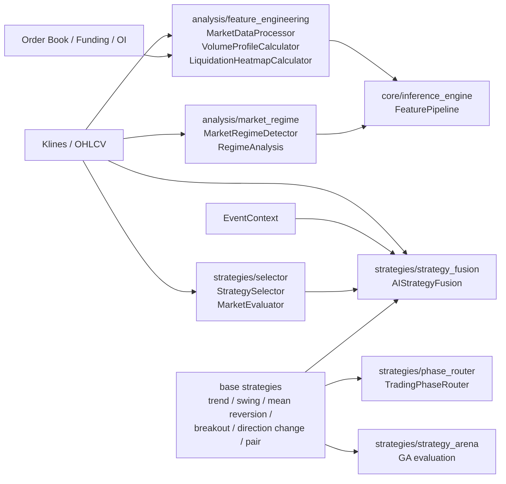
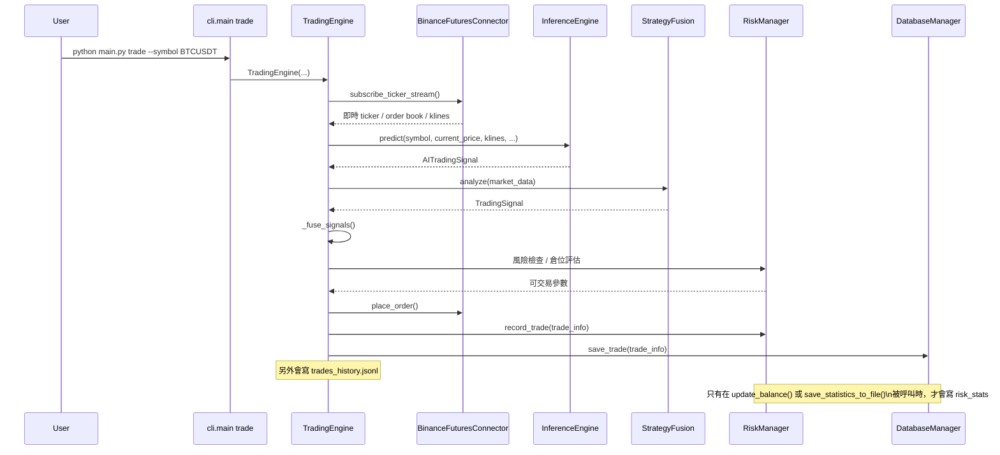
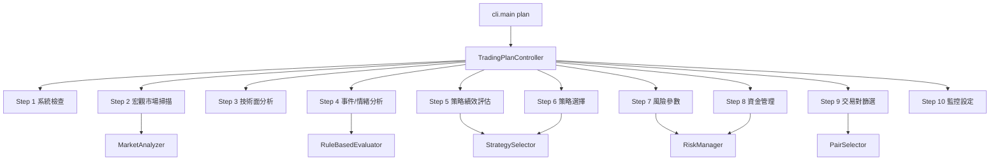
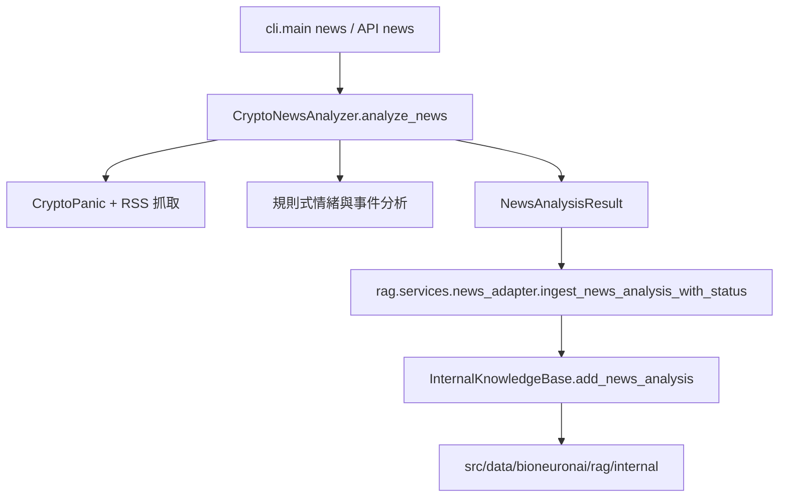
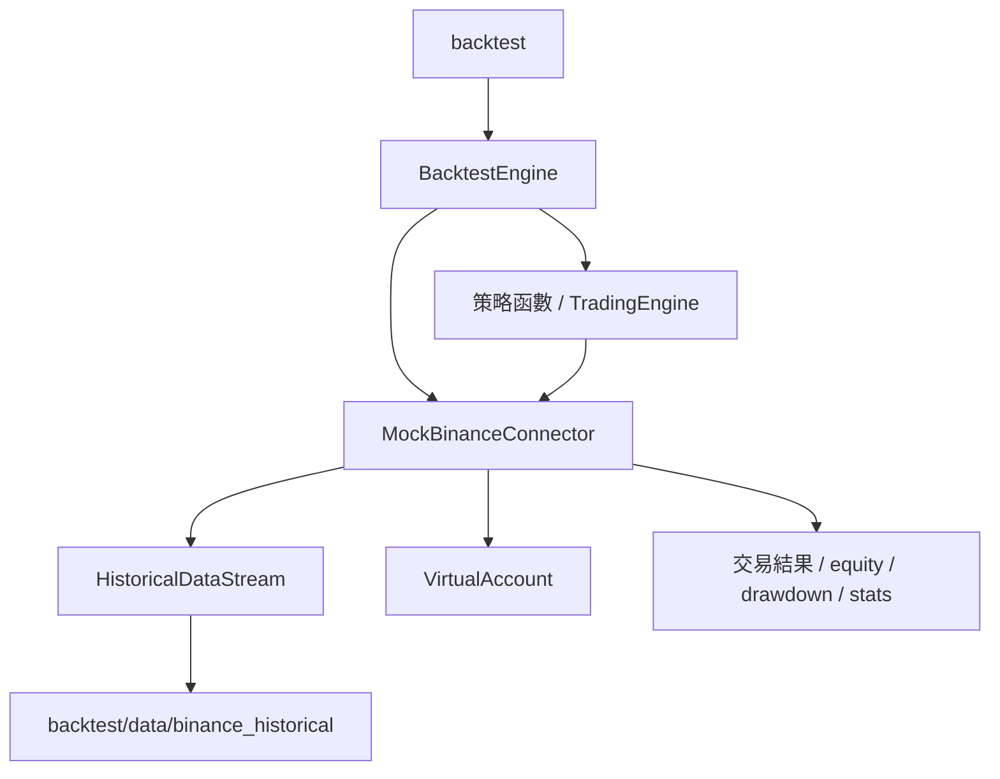
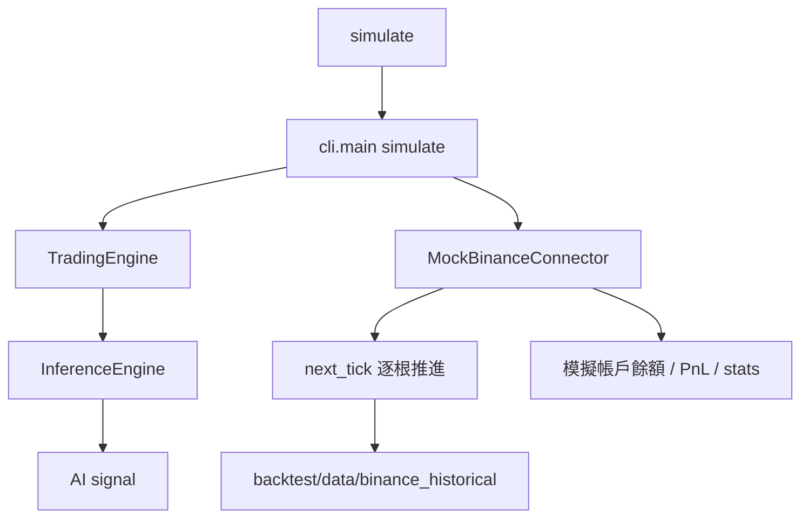

# BioNeuronai 接手地圖
> 更新日期: 2026-04-05
> 目的: 提供接手開發時最需要的兩份資訊
> 1. 模組依賴圖與實際資料流
> 2. 核心檔案與舊版殘留/過渡檔案清單

---

## 1. 模組依賴圖

### 1.1 對外入口到核心執行鏈

```mermaid
flowchart TD
    USER[使用者 / 外部系統]
    USER --> MAIN[main.py]
    USER --> CLI[src/bioneuronai/cli/main.py]
    USER --> API[src/bioneuronai/api/app.py]

    MAIN --> CLI

    CLI --> STATUS[status]
    CLI --> PLAN[plan]
    CLI --> PRETRADE[pretrade]
    CLI --> NEWS[news]
    CLI --> BACKTEST[backtest]
    CLI --> SIMULATE[simulate]
    CLI --> TRADE[trade]
    CLI --> EVOLVE[evolve]

    PLAN --> TPC[TradingPlanController]
    PRETRADE --> PTC[PreTradeCheckSystem]
    NEWS --> CNA[CryptoNewsAnalyzer]
    TRADE --> TE[TradingEngine]
    BACKTEST --> BTE[BacktestEngine]
    SIMULATE --> MOCKSIM[MockBinanceConnector]
    EVOLVE --> ARENA[StrategyArena]

    API --> CNA
    API --> TE
    API --> BFC[data.BinanceFuturesConnector]
    API --> BTAPI[/api/v1/backtest/*]
    %% 注意：API 目前仍無 /plan 端點，TPC 僅由 CLI plan 命令呼叫

    TE --> IE[InferenceEngine]
    TE --> SS2[StrategySelector]
    TE --> SF[AIStrategyFusion]
    TE --> TRM[trading.risk_manager.RiskManager]
    TE --> BFC[data.BinanceFuturesConnector]
    TE --> DB[data.DatabaseManager]
    TE --> CNA
    TE --> PTC

    TPC --> MA[MarketAnalyzer]
    TPC --> SS[strategies.selector.StrategySelector]
    TPC --> PS[PairSelector]
    TPC --> TRM

    CNA --> RAGADAPTER[rag.services.news_adapter]
    RAGADAPTER --> IKB[rag.internal.InternalKnowledgeBase]

    IE --> MODEL[model/my_100m_model.pth]
    IE --> FP[FeaturePipeline]
    FP --> FEAT[1024 維特徵]
```

### 1.2 契約層與基礎設施依賴

```mermaid
flowchart TB
    subgraph CONTRACT["契約層"]
        SCH["src/schemas"]
    end

    subgraph INFRA["基礎設施層"]
        DATA["src/bioneuronai/data"]
        MODELS["model/"]
        STORE["data/"]
    end

    subgraph ANALYSIS["分析層"]
        AN_MAIN["src/bioneuronai/analysis"]
        AN_NEWS["analysis/news"]
        AN_KEY["analysis/keywords"]
        AN_FE["analysis/feature_engineering"]
        AN_REG["analysis/market_regime"]
        AN_DR["analysis/daily_report"]
    end

    subgraph STRATEGY["策略層"]
        ST_MAIN["src/bioneuronai/strategies"]
        ST_SEL["strategies/selector"]
        ST_FUSION["strategies/strategy_fusion"]
        ST_PHASE["strategies/phase_router"]
        ST_ARENA["strategies/strategy_arena"]
    end

    subgraph ORCH["交易編排層"]
        TR_MAIN["src/bioneuronai/trading"]
        TR_PLAN["trading/plan_controller"]
        TR_PRE["trading/pretrade_automation"]
        TR_MKT["trading/market_analyzer"]
        TR_RISK["trading/risk_manager"]
    end

    subgraph RUNTIME["核心執行層"]
        CORE["src/bioneuronai/core"]
        CORE_TE["core/trading_engine"]
        CORE_IE["core/inference_engine"]
    end

    subgraph KNOW["知識與模型"]
        RAG["src/rag"]
        NLP["src/nlp"]
    end

    subgraph VALID["驗證與回測"]
        BT1["backtest/"]
        BT2["backtesting/"]
    end

    SCH --> DATA
    SCH --> AN_MAIN
    SCH --> ST_MAIN
    SCH --> TR_MAIN
    SCH --> CORE
    SCH --> RAG
    SCH --> BT1
    SCH --> BT2

    DATA --> AN_NEWS
    DATA --> AN_DR
    DATA --> TR_MKT
    DATA --> TR_PRE
    DATA --> CORE_TE
    DATA --> BT1
    MODELS --> CORE_IE
    STORE --> BT1
    STORE --> BT2

    AN_MAIN --> AN_NEWS
    AN_MAIN --> AN_KEY
    AN_MAIN --> AN_FE
    AN_MAIN --> AN_REG
    AN_MAIN --> AN_DR

    AN_NEWS --> RAG
    AN_FE --> CORE_IE
    AN_REG --> CORE_IE
    AN_FE --> CORE_TE
    AN_REG --> CORE_TE

    ST_SEL --> ST_FUSION
    ST_ARENA --> ST_MAIN
    ST_PHASE --> ST_MAIN
    ST_MAIN --> TR_PLAN
    ST_MAIN --> CORE_TE

    TR_PLAN --> TR_MKT
    TR_PLAN --> ST_SEL
    TR_PLAN --> TR_RISK
    TR_PRE --> RAG
    TR_MAIN --> CORE_TE

    CORE --> CORE_TE
    CORE --> CORE_IE
    CORE_TE -. connector 替換 .-> BT1
```



### 1.3 策略 / Regime / 特徵工程子系統



### 1.4 Regime 相關型別現況

目前專案內和「市場狀態 / Regime」有關的概念不是只有一套，接手時要特別小心不要混用。

| 名稱 | 位置 | 性質 | 用途 |
|------|------|------|------|
| `analysis.market_regime.MarketRegime` | `src/bioneuronai/analysis/market_regime.py` | 分析層 enum | 給 `RegimeAnalysis` 與 `MarketRegimeDetector` 使用，偏技術分析/市場環境識別 |
| `schemas.enums.MarketRegime` | `src/schemas/enums.py` | 契約層 enum | 給 `strategies/selector` 使用，偏策略推薦與資料契約 |
| `strategies.strategy_fusion.MarketRegime` | `src/bioneuronai/strategies/strategy_fusion.py` | 策略層 dataclass | 給 `AIStrategyFusion` 內部使用，描述融合策略的 regime 狀態 |

這三者目前並未完全統一，文件與程式閱讀時應視為三套不同型別，而不是同一個 `MarketRegime`。

---

## 2. 實際資料流

### 2.1 即時交易資料流



### 2.2 盤前計劃資料流



### 2.3 新聞分析到 RAG 入庫資料流



### 2.4 回測資料流



### 2.5 紙交易模擬資料流



### 2.6 API 實際端點

目前 `src/bioneuronai/api/app.py` 實際提供的是：

- `GET /api/v1/status`
- `POST /api/v1/binance/validate`
- `POST /api/v1/news`
- `POST /api/v1/pretrade`
- `POST /api/v1/trade/start`
- `POST /api/v1/trade/stop`
- `GET /api/v1/backtest/catalog`
- `GET /api/v1/backtest/inspect`
- `POST /api/v1/backtest/simulate`
- `POST /api/v1/backtest/run`
- `GET /api/v1/backtest/runs`
- `GET /api/v1/backtest/runs/{run_id}`
- `GET /backtest/ui`

目前沒有：

- `/api/v1/plan`

### 2.7 實際寫入情況

這裡只列「目前程式真的有呼叫到」的寫入，不列只有 DB API 但主流程沒接上的表。

#### 即時交易主鏈

- `trades`
  觸發點: `TradingEngine.execute_trade()` -> `_save_trade_to_file()` -> `DatabaseManager.save_trade()`
- `trades_history.jsonl`
  觸發點: `TradingEngine._save_trade_to_file()` 同步追加
- `risk_stats`
  觸發點 1: `RiskManager.update_balance()` 被呼叫時
  觸發點 2: `RiskManager.save_statistics_to_file()` 被呼叫時
- `signals_history.json`
  觸發點: `TradingEngine.save_all_data()` / `save_signals_history()`
- `strategy_weights.json`
  觸發點: `TradingEngine.save_all_data()`
- `risk_statistics.json`
  觸發點: `TradingEngine.save_all_data()`
- `risk_config.json`
  觸發點: `TradingEngine.save_all_data()`

#### 目前有資料表或保存函式，但不是這條主鏈自動寫入

- `signals`
  `DatabaseManager.save_signal()` 存在，但目前 `TradingEngine` 主流程沒有呼叫
- `pretrade_checks`
  `DatabaseManager.save_pretrade_check()` 存在，但目前 `PreTradeCheckSystem.execute_pretrade_check()` 沒有接到 DB
- `news_analysis`
  `DatabaseManager.save_news_analysis()` 存在，但 `CryptoNewsAnalyzer.analyze_news()` 目前主寫入是 RAG 知識庫，不是此表

---

## 3. 核心檔案

### 3.1 第一層核心

這些檔案決定系統主行為，接手時應先讀。

| 類型 | 檔案 | 作用 |
|------|------|------|
| 入口 | `main.py` | 根目錄統一入口 |
| CLI | `src/bioneuronai/cli/main.py` | 所有命令的真入口 |
| API | `src/bioneuronai/api/app.py` | REST API 包裝層 |
| 核心引擎 | `src/bioneuronai/core/trading_engine.py` | 即時交易主流程 |
| AI 推論 | `src/bioneuronai/core/inference_engine.py` | 載模、特徵、推論、訊號解釋 |
| 交易編排 | `src/bioneuronai/trading/plan_controller.py` | 10 步驟計劃總控 |
| 盤前檢查 | `src/bioneuronai/trading/pretrade_automation.py` | 單筆交易前檢查 |
| 新聞分析 | `src/bioneuronai/analysis/news/analyzer.py` | 新聞抓取、情緒、事件、RAG 入庫入口 |
| 交易所連接 | `src/bioneuronai/data/binance_futures.py` | Binance REST / WebSocket |
| 持久化 | `src/bioneuronai/data/database_manager.py` | 主資料庫接口 |
| 回測主鏈 | `backtest/backtest_engine.py` | 與 TradingEngine 對接的主回測系統 |
| 策略進化 | `src/bioneuronai/strategies/strategy_arena.py` | `evolve` 命令對應入口 |

### 3.2 第二層核心

這些檔案是第一層核心的直接支撐模組。

| 類型 | 檔案 | 作用 |
|------|------|------|
| 風控協調 | `src/bioneuronai/trading/risk_manager.py` | 交易流程風控 |
| 風控資料結構 | `src/bioneuronai/risk_management/position_manager.py` | RiskParameters / PositionSizing |
| 市場分析 | `src/bioneuronai/trading/market_analyzer.py` | 宏觀、技術、情緒整合 |
| 交易對篩選 | `src/bioneuronai/trading/pair_selector.py` | 24h 行情篩選 |
| 策略選擇 | `src/bioneuronai/strategies/selector/core.py` | 策略權重與主/備選策略 |
| 策略融合 | `src/bioneuronai/strategies/strategy_fusion.py` | AI 融合與 regime adaptive 權重 |
| 階段路由 | `src/bioneuronai/strategies/phase_router.py` | 入場/持倉/出場分階段策略路由 |
| 市場狀態 | `src/bioneuronai/analysis/market_regime.py` | 市場 regime 偵測與 `RegimeAnalysis` |
| 特徵工程 | `src/bioneuronai/analysis/feature_engineering.py` | `MarketMicrostructure` / 成交量分布 / 清算熱圖 |
| 外部資料 | `src/bioneuronai/data/web_data_fetcher.py` | 恐慌貪婪、全球市場、DeFi、穩定幣 |
| RAG 橋接 | `src/rag/services/news_adapter.py` | 新聞分析結果入庫 / RAG 兼容接口 |
| RAG 知識庫 | `src/rag/internal/knowledge_base.py` | 內部知識存儲 |
| 共享契約 | `src/schemas/*.py` | 全系統 Single Source of Truth |
| 模擬交易 | `backtest/mock_connector.py` | `simulate` 命令的實際核心 |

---

## 4. 舊版殘留與過渡區

這些不是無用檔案，但閱讀與修改時要先判斷它們是正式路徑、向後兼容，還是仍在收斂中。

### 4.1 舊版但仍在正式路徑中

| 檔案 | 現況 |
|------|------|
| `src/bioneuronai/data/database.py` | 舊 DB 管理器，仍保留獨特表，尚未完全併入 `database_manager.py` |
| `src/nlp/rag_system.py` | 舊 RAG 路徑，文件已明示正式路徑改為 `src/rag/` |
| `src/bioneuronai/strategies/selector/evaluator_new.py` | `MarketEvaluator` 的候選重構版本，目前未接入主流程；主流程使用 `evaluator.py` |

### 4.2 新舊並行中的模組群

| 模組 | 並行情況 |
|------|------|
| `backtest/` 與 `backtesting/` | 前者偏 TradingEngine 對接；後者偏分析/驗證工具 |
| `risk_management/` 與 `trading/risk_manager.py` | 一個是核心資料與算法，一個是交易流程封裝 |
| `analysis/daily_report/` 與 `trading/plan_controller.py` | 兩者都涉及盤前/計劃流程，現行 CLI `plan` 已收斂到 `TradingPlanController` |

### 4.3 文件或實作中的過渡訊號

| 位置 | 訊號 |
|------|------|
| `TradingPlanController` | 部分步驟仍有 `default_fallback`、`config_defaults`、示例值 |
| `MarketAnalyzer` | 多個子分析函式仍是保守預設值導向 |
| `MarketRegime` 相關型別 | 分散在 `analysis/`、`schemas/`、`strategies/strategy_fusion.py` 三處，名稱相同但不是同一型別 |
| `strategies/selector` 與 `strategy_fusion` | 兩者都做策略層面的 market/regime 判斷，但依賴的型別與評估邏輯不同 |
| `analysis/daily_report/market_data.py` | 外部 API 仍直接打 `requests`，尚未完全收斂到 `data/` 層 |
| `analysis/news/analyzer.py` | 單檔過大，混合抓取、情緒、聚合、入庫 |

### 4.4 策略子系統目前結構

| 模組 | 角色 | 現況 |
|------|------|------|
| `base_strategy.py` | 所有策略共同基類與資料結構 | 基礎層 |
| `trend_following.py` / `swing_trading.py` / `mean_reversion.py` / `breakout_trading.py` | 基礎策略實作 | 正式策略層 |
| `direction_change_strategy.py` | DC 類策略 | 正式策略層 |
| `pair_trading_strategy.py` | 配對交易 / 統計套利 | 正式策略層 |
| `strategy_fusion.py` | 多策略 + EventContext 融合 | 策略整合層 |
| `selector/` | 根據 market regime 與績效推薦策略 | 策略決策層 |
| `phase_router.py` | 把入場/持倉/出場拆成階段式路由 | 編排型策略層，尚未接主線 |
| `strategy_arena.py` | 遺傳演算法式策略競技場 | 進化/優化層，已改接正式 replay |
| `portfolio_optimizer.py` | 投組/組合層輔助 | 支援型，已改接正式 replay |
| `rl_fusion_agent.py` | RL 融合代理 | 實驗/進階型 |

---

## 5. 修改優先順序建議

### 5.1 可直接放心修改

- `src/bioneuronai/api/app.py`
- `src/bioneuronai/cli/main.py`
- `src/bioneuronai/trading/plan_controller.py`
- `src/bioneuronai/trading/pretrade_automation.py`
- `src/bioneuronai/data/web_data_fetcher.py`

### 5.2 修改前要先確認相依影響

- `src/bioneuronai/core/trading_engine.py`
- `src/bioneuronai/core/inference_engine.py`
- `src/bioneuronai/data/database_manager.py`
- `src/bioneuronai/strategies/selector/core.py`

### 5.3 先不要當成唯一真相來源

- `src/bioneuronai/data/database.py`
- `src/nlp/rag_system.py`
- `backtesting/` 內的分析型腳本
- `archived/` 內所有內容

---

## 6. 版本一致性說明

2026-04-04 已將對外主版本收斂為 `4.4.1`，至少包含：

- `README.md`
- `pyproject.toml`
- `src/bioneuronai/__init__.py`
- `src/bioneuronai/api/app.py`

注意：

- 其他子模組 README 內的版本號很多是子系統文件版本，不一定等同套件版本。
- 若未來要做全面版本治理，建議把「套件版本」與「文件版本」分欄管理，避免再混淆。

---

## 7. 建議閱讀順序

1. `main.py`
2. `src/bioneuronai/cli/main.py`
3. `src/bioneuronai/core/trading_engine.py`
4. `src/bioneuronai/core/inference_engine.py`
5. `src/bioneuronai/trading/plan_controller.py`
6. `src/bioneuronai/trading/pretrade_automation.py`
7. `src/bioneuronai/analysis/news/analyzer.py`
8. `src/bioneuronai/data/binance_futures.py`
9. `src/bioneuronai/data/database_manager.py`
10. `backtest/backtest_engine.py`
