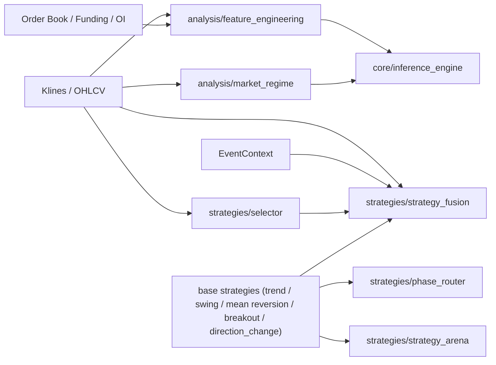
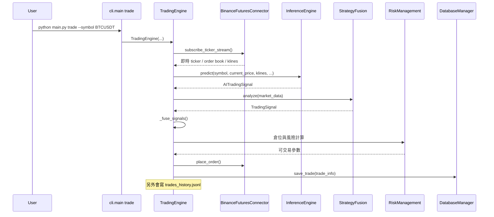
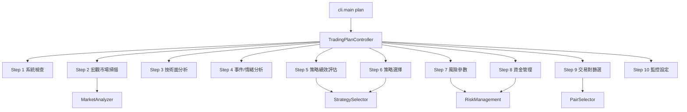
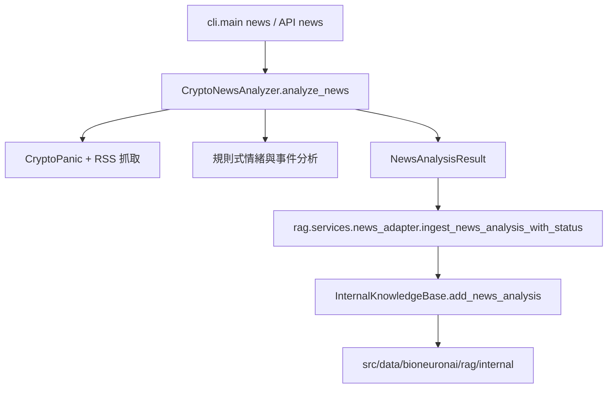
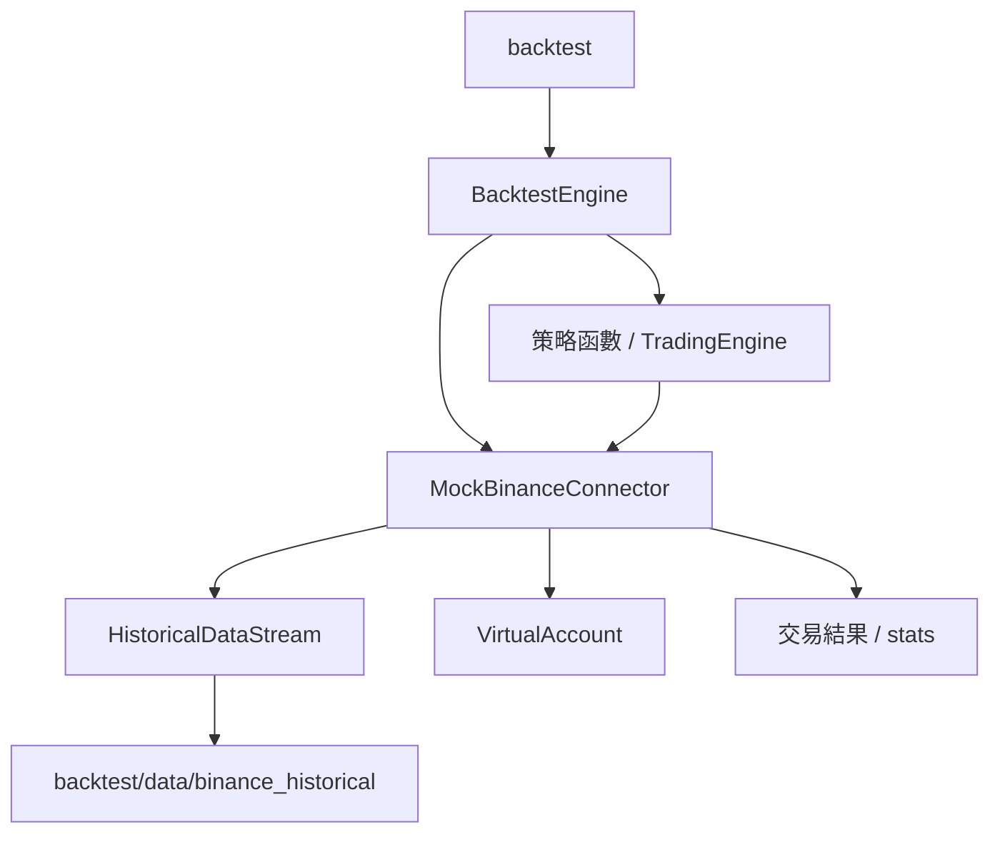
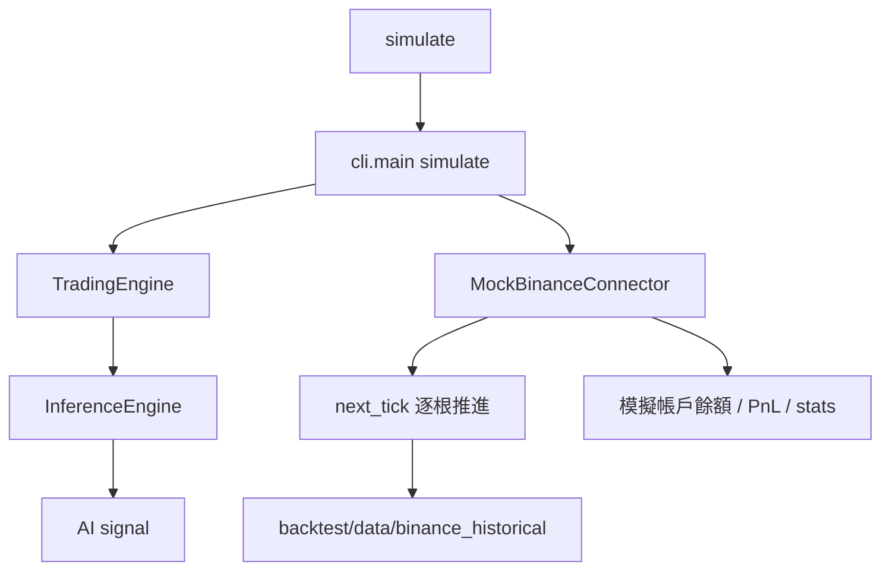

# BioNeuronai 接手地圖
**版本**: v2.1
**更新日期**: 2026-04-06
**目的**: 提供接手開發時最需要的兩份資訊
1. 模組依賴圖與實際資料流
2. 核心檔案與舊版殘留/過渡檔案清單

## 目錄

1. 模組依賴圖
2. 實際資料流
3. 核心檔案
4. 舊版與過渡區注意事項
5. 修改優先順序建議
6. 建議閱讀順序

---

## 1. 模組依賴圖

### 1.1 對外入口到核心執行鏈

```mermaid
flowchart TD
    USER[使用者 / 外部系統]
    USER --> MAIN[main.py]
    USER --> CLI[src/bioneuronai/cli/main.py]
    USER --> API[src/bioneuronai/api/app.py]

    MAIN --> CLI

    CLI --> STATUS[status]
    CLI --> PLAN[plan]
    CLI --> PRETRADE[pretrade]
    CLI --> NEWS[news]
    CLI --> BACKTEST[backtest]
    CLI --> SIMULATE[simulate]
    CLI --> TRADE[trade]
    CLI --> EVOLVE[evolve]
    CLI --> CHAT[chat]

    PLAN --> TPC[TradingPlanController]
    PRETRADE --> PTC[PretradeAutomation]
    NEWS --> CNA[CryptoNewsAnalyzer]
    TRADE --> TE[TradingEngine]
    BACKTEST --> BTE[BacktestEngine]
    SIMULATE --> MOCKSIM[MockBinanceConnector]
    EVOLVE --> ARENA[StrategyArena]
    CHAT --> CE[nlp/chat_engine.ChatEngine]

    API --> CNA
    API --> TE
    API --> BFC[data.BinanceFuturesConnector]
    API --> BTAPI[/api/v1/backtest/*]
    API --> CHATAPI[/api/v1/chat]
    CHATAPI --> CE

    TE --> IE[InferenceEngine]
    TE --> SS[StrategySelector]
    TE --> SF[AIStrategyFusion]
    TE --> RM[risk_management]
    TE --> T_ACC[trading/virtual_account.py]
    TE --> BFC[data.BinanceFuturesConnector]
    TE --> DB[data.DatabaseManager]
    TE --> CNA
    TE --> PTC

    TPC --> MA[MarketAnalyzer]
    TPC --> SS
    TPC --> PS[PairSelector]
    TPC --> RM

    CNA --> RAGADAPTER[rag.services.news_adapter]
    RAGADAPTER --> IKB[rag.internal.InternalKnowledgeBase]

    IE --> MODEL[model/my_100m_model.pth]
    CE --> CHATMODEL[model/tiny_llm_100m.pth]
    IE --> FP[FeaturePipeline]
    FP --> FEAT[1024 維特徵]
```

> 補充：目前正式交易訊號由 `InferenceEngine -> model/my_100m_model.pth` 處理；對話功能由 `ChatEngine -> model/tiny_llm_100m.pth` 處理，兩條模型路徑已分離。

### 1.2 契約層與基礎設施依賴

```mermaid
flowchart TB
    subgraph CONTRACT["契約層"]
        SCH["src/schemas"]
    end

    subgraph INFRA["基礎設施層"]
        DATA["src/bioneuronai/data"]
        MODELS["model/"]
        STORE["data/"]
    end

    subgraph ANALYSIS["分析層"]
        AN_MAIN["src/bioneuronai/analysis"]
        AN_NEWS["analysis/news"]
        AN_KEY["analysis/keywords"]
        AN_FE["analysis/feature_engineering"]
        AN_REG["analysis/market_regime"]
        AN_DR["analysis/daily_report"]
    end

    subgraph STRATEGY["策略層"]
        ST_MAIN["src/bioneuronai/strategies"]
        ST_SEL["strategies/selector"]
        ST_FUSION["strategies/strategy_fusion"]
        ST_PHASE["strategies/phase_router"]
        ST_ARENA["strategies/strategy_arena"]
    end

    subgraph PLANNING["規劃層"]
        PLN_MAIN["src/bioneuronai/planning"]
        PLN_TPC["planning/plan_controller"]
        PLN_PRE["planning/pretrade_automation"]
        PLN_MKT["planning/market_analyzer"]
    end

    subgraph RUNTIME["核心執行與帳本層"]
        CORE["src/bioneuronai/core"]
        CORE_TE["core/trading_engine"]
        CORE_IE["core/inference_engine"]
        TRD["trading/virtual_account.py"]
        RM["risk_management/"]
    end

    subgraph KNOW["知識與模型"]
        RAG["src/rag"]
        NLP["src/nlp"]
    end

    subgraph VALID["驗證與回測"]
        BT1["backtest/"]
    end

    SCH --> DATA
    SCH --> AN_MAIN
    SCH --> ST_MAIN
    SCH --> PLN_MAIN
    SCH --> CORE
    SCH --> RAG
    SCH --> BT1

    DATA --> AN_NEWS
    DATA --> AN_DR
    DATA --> PLN_MKT
    DATA --> PLN_PRE
    DATA --> CORE_TE
    DATA --> BT1
    MODELS --> CORE_IE
    STORE --> BT1

    AN_MAIN --> AN_NEWS
    AN_MAIN --> AN_KEY
    AN_MAIN --> AN_FE
    AN_MAIN --> AN_REG
    AN_MAIN --> AN_DR

    AN_NEWS --> RAG
    AN_FE --> CORE_IE
    AN_REG --> CORE_IE
    AN_FE --> CORE_TE
    AN_REG --> CORE_TE

    ST_SEL --> ST_FUSION
    ST_ARENA --> ST_MAIN
    ST_PHASE --> ST_MAIN
    ST_MAIN --> PLN_TPC
    ST_MAIN --> CORE_TE

    PLN_TPC --> PLN_MKT
    PLN_TPC --> ST_SEL
    PLN_TPC --> RM
    PLN_PRE --> RAG
    PLN_MAIN --> CORE_TE

    CORE --> CORE_TE
    CORE --> CORE_IE
    RM --> CORE_TE
    TRD --> CORE_TE
    CORE_TE -. connector 替換 .-> BT1
```



### 1.3 策略 / Regime / 特徵工程子系統



---

## 2. 實際資料流

### 2.1 即時交易資料流



### 2.2 盤前計劃資料流



### 2.3 新聞分析到 RAG 入庫資料流



### 2.4 回測資料流



### 2.5 紙交易模擬資料流



---

## 3. 核心檔案

### 3.1 第一層核心

| 類型 | 檔案 | 作用 |
|------|------|------|
| 入口 | `main.py` | 根目錄統一入口 |
| CLI | `src/bioneuronai/cli/main.py` | 所有命令的真入口 |
| API | `src/bioneuronai/api/app.py` | REST API 包裝層 |
| 核心引擎 | `src/bioneuronai/core/trading_engine.py` | 即時交易主流程 |
| AI 推論 | `src/bioneuronai/core/inference_engine.py` | 載模、特徵、推論、訊號解釋 |
| 交易編排 | `src/bioneuronai/planning/plan_controller.py` | 10 步驟計劃總控 |
| 盤前檢查 | `src/bioneuronai/planning/pretrade_automation.py` | 單筆交易前檢查 |
| 新聞分析 | `src/bioneuronai/analysis/news/analyzer.py` | 新聞抓取、情緒、事件、RAG 入庫入口 |
| 交易所連接 | `src/bioneuronai/data/binance_futures.py` | Binance REST / WebSocket |
| 持久化 | `src/bioneuronai/data/database_manager.py` | 主資料庫接口 |
| 回測主鏈 | `backtest/backtest_engine.py` | 與 TradingEngine 對接的主回測系統 |
| 策略進化 | `src/bioneuronai/strategies/strategy_arena.py` | `evolve` 命令對應入口 |

### 3.2 第二層核心

| 類型 | 檔案 | 作用 |
|------|------|------|
| 風控資料結構 | `src/bioneuronai/risk_management/` | RiskParameters / PositionSizing |
| 市場分析 | `src/bioneuronai/planning/market_analyzer.py` | 宏觀、技術、情緒整合 |
| 交易對篩選 | `src/bioneuronai/planning/pair_selector.py` | 24h 行情篩選 |
| 策略選擇 | `src/bioneuronai/strategies/selector/core.py` | 策略權重與主/備選策略 |
| 策略融合 | `src/bioneuronai/strategies/strategy_fusion.py` | AI 融合與 regime adaptive 權重 |
| 市場狀態 | `src/bioneuronai/analysis/market_regime.py` | 市場 regime 偵測 |
| 特徵工程 | `src/bioneuronai/analysis/feature_engineering.py` | MarketMicrostructure / 成交量分布 / 清算熱圖 |
| 外部資料 | `src/bioneuronai/data/web_data_fetcher.py` | 恐慌貪婪、全球市場、DeFi、穩定幣 |
| RAG 橋接 | `src/rag/services/news_adapter.py` | 新聞分析結果入庫 / RAG 兼容接口 |
| 共享契約 | `src/schemas/*.py` | 全系統 Single Source of Truth |
| 模擬交易 | `backtest/mock_connector.py` | `simulate` 命令的實際核心 |

---

## 4. 舊版與過渡區注意事項

接手本專案時，需特別留意下列在架構重構 (v2.1) 後可能遺留的歷史與並行模組：

### 4.1 新舊並行中的模組群

| 模組 | 並行情況 |
|------|------|
| `src/rag/` 與 `src/nlp/rag_system.py` | 正式的 RAG 現在請使用 `src/rag/`，舊的 NLP script 不再直接作為知識庫掛載點 |

### 4.2 已退役或明確刪除的模組（切勿作為參考）

| 檔案路徑 | 現況說明 |
|----------|---------|
| `src/bioneuronai/trading_strategies.py` | 舊的巨大策略檔，已刪除，請使用 `strategies/` 目錄。 |
| `src/bioneuronai/trading/risk_manager.py` | 舊的交易風控封裝，已刪除，請直接使用 `risk_management/`。 |
| `src/bioneuronai/trading/trading_plan_system.py` | 舊的計畫自動化模組，已刪除，現由 `planning/plan_controller.py` 負責。 |
| `src/bioneuronai/strategies/selector/evaluator_new.py` | 棄用的評估器版本。 |

### 4.3 策略子系統目前結構

| 模組 | 角色 | 現況 |
|------|------|------|
| `base_strategy.py` | 所有策略共同基類與資料結構 | 基礎層 |
| `trend_following.py` / `swing_trading.py` / 等 | 基礎策略實作 | 正式策略層 |
| `strategy_fusion.py` | 多策略 + EventContext 融合 | 策略整合層 |
| `selector/` | 根據 market regime 與績效推薦策略 | 策略決策層 |

---

## 5. 修改優先順序建議

### 5.1 可直接放心修改
- `src/bioneuronai/api/app.py`
- `src/bioneuronai/cli/main.py`
- `src/bioneuronai/planning/plan_controller.py`
- `src/bioneuronai/planning/pretrade_automation.py`

### 5.2 修改前要先確認相依影響
- `src/bioneuronai/core/trading_engine.py`
- `src/bioneuronai/core/inference_engine.py`
- `src/bioneuronai/data/database_manager.py`
- `src/bioneuronai/strategies/selector/core.py`

### 5.3 先不要當成唯一真相來源
- `archived/` 內所有內容

---

## 6. 建議閱讀順序

1. `main.py`
2. `src/bioneuronai/cli/main.py`
3. `src/bioneuronai/core/trading_engine.py` (即時交易)
4. `src/bioneuronai/core/inference_engine.py` (AI 推論)
5. `src/bioneuronai/planning/plan_controller.py` (計畫與大盤分析)
6. `src/bioneuronai/planning/pretrade_automation.py` (交易前檢查)
7. `src/bioneuronai/risk_management/` (風險管理與控制)
8. `backtest/backtest_engine.py` (回測引擎)
