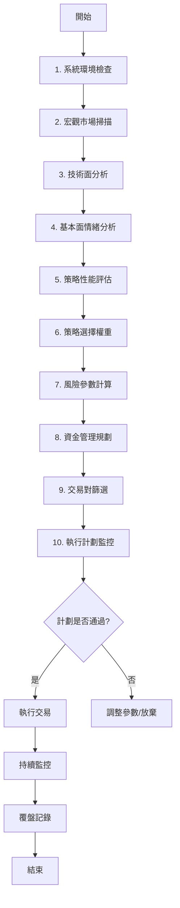

# 🎯 交易計劃制定系統 - 10步驟框架

**版本**: 1.0  
**最後更新**: 2026年1月19日  
**作者**: BioNeuronai Team

---

## 📊 系統概述

本交易計劃制定系統採用科學化的**10步驟流程**，從環境檢查到執行監控，確保每筆交易都經過完整的分析與驗證。

---

## 🔟 十大步驟詳解

### 1️⃣ 系統環境檢查
**數據來源**: 幣安 API  
**狀態**: ✅ 支援  
**建議**: 實現

**檢查項目**:
- API 連接狀態（主網/測試網）
- 網絡延遲測試（< 100ms）
- 帳戶權限驗證
- 可用保證金確認
- WebSocket 連接穩定性
- 系統時間同步

**實現位置**: `src/bioneuronai/core/trading_engine.py`

```python
# 範例代碼
async def check_system_environment(self):
    """步驟1: 系統環境檢查"""
    results = {
        'api_connection': await self._test_api_connection(),
        'network_latency': await self._measure_latency(),
        'account_permissions': await self._verify_permissions(),
        'available_margin': await self._get_available_margin(),
        'websocket_status': await self._check_websocket(),
        'time_sync': await self._verify_time_sync()
    }
    return all(results.values())
```

---

### 2️⃣ 宏觀市場掃描
**數據來源**: CoinGecko + Alternative.me  
**狀態**: ✅ 支援  
**建議**: 實現（分頻率檢查）

**📅 每日必查指標**（變化快，影響交易決策）:
- ✅ 恐慌與貪婪指數（0-100）
- ✅ 全球市值變化率（24h %）
- ✅ 24小時交易量變化

**📊 每週選查指標**（變化慢，趨勢觀察）:
- 🔄 BTC 主導率 (BTC Dominance)
- 🔄 DeFi TVL 變化
- 🔄 穩定幣供應總量

**🚨 突發事件監控**（新聞系統自動捕捉）:
- ✅ BTC主導率劇變 → RAG新聞會報導
- ✅ 穩定幣大額流動 → RAG新聞會報導
- ✅ DeFi協議遭駭 → RAG新聞會報導

**數據接口**:
- CoinGecko API: `https://api.coingecko.com/api/v3/global`
- Alternative.me Fear & Greed: `https://api.alternative.me/fng/`
- DefiLlama API: `https://api.llama.fi/v2/protocols`（週查）

**實現位置**: `src/bioneuronai/trading_plan/market_scanner.py`

> 💡 **優化策略**: 依賴RAG新聞系統捕捉突發變化，避免過度查詢低頻指標

---

### 3️⃣ 技術面分析
**數據來源**: 幣安 API  
**狀態**: ✅ 支援  
**建議**: 完善

**分析維度**:
- 趨勢識別（EMA 交叉、布林通道）
- 支撐/壓力位計算
- 成交量分析（OBV, Volume Profile）
- 動量指標（RSI, MACD, Stochastic）
- 波動率評估（ATR, Bollinger Bandwidth）
- 多時間框架確認（15m, 1h, 4h, 1d）

**實現位置**: `src/bioneuronai/strategies/technical_indicators.py`

---

### 4️⃣ 基本面情緒分析
**數據來源**: 新聞 API (已有) + Alternative.me  
**狀態**: ✅ 支援  
**建議**: 添加恐慌指數

**分析來源**:
- ✅ RSS 新聞抓取（CoinTelegraph, CoinDesk）
- ✅ AI 情緒分析（-1.0 到 1.0）
- ✅ 關鍵字匹配系統（181個關鍵字）
- 🆕 恐慌與貪婪指數整合
- 🆕 社交媒體情緒（Twitter, Reddit）
- 🆕 Google 搜尋趨勢

**已實現功能**:
- `src/bioneuronai/rag/news_crawler.py` - 新聞爬蟲
- `src/bioneuronai/rag/pre_trade_checker.py` - 風險評估
- `src/bioneuronai/analysis/market_keywords.py` - 關鍵字管理

**待添加**:
```python
async def fetch_fear_greed_index(self):
    """獲取恐慌與貪婪指數"""
    url = "https://api.alternative.me/fng/?limit=7"
    # 實現細節...
```

---

### 5️⃣ 策略性能評估
**數據來源**: 本地數據庫  
**狀態**: ✅ 支援  
**建議**: 完善

**評估指標**:
- 歷史勝率（Win Rate）
- 平均回報率（Avg Return）
- 最大回撤（Max Drawdown）
- 夏普比率（Sharpe Ratio）
- 盈虧比（Profit Factor）
- 近期表現（最近10筆交易）
- 市場條件適配度

**數據庫表結構**:
```sql
CREATE TABLE strategy_performance (
    strategy_name TEXT,
    timestamp DATETIME,
    total_trades INT,
    win_rate REAL,
    avg_return REAL,
    max_drawdown REAL,
    sharpe_ratio REAL,
    profit_factor REAL
);
```

**實現位置**: `src/bioneuronai/trading_plan/strategy_selector_v2.py`

---

### 6️⃣ 策略選擇權重
**數據來源**: 本地計算  
**狀態**: ✅ 支援  
**建議**: 優化

**權重分配邏輯**:
```python
strategy_score = (
    market_condition_match * 0.30 +    # 市場條件匹配度
    recent_performance * 0.25 +        # 近期表現
    risk_adjusted_return * 0.20 +     # 風險調整回報
    volatility_adaptation * 0.15 +    # 波動率適應性
    news_sentiment_alignment * 0.10   # 新聞情緒對齊度
)
```

**策略池**:
- 趨勢跟隨（Trend Following）
- 均值回歸（Mean Reversion）
- 動量突破（Momentum Breakout）
- 波段操作（Swing Trading）
- 套利策略（Arbitrage）

**實現位置**: `src/bioneuronai/trading_plan/strategy_selector.py`

---

### 7️⃣ 風險參數計算
**數據來源**: 本地計算  
**狀態**: ✅ 支援  
**建議**: 完整

**風險控制參數**:
- 單筆風險上限（預設 2%）
- 每日最大虧損（預設 5%）
- 每週最大虧損（預設 15%）
- 每月最大虧損（預設 30%）
- 最大同時持倉數（預設 3）
- 最大槓桿倍數（預設 10x）
- 相關性限制（< 0.7）

**動態調整規則**:
```python
if current_drawdown > 10%:
    risk_per_trade *= 0.5  # 減半風險
elif win_streak >= 5:
    risk_per_trade *= 1.2  # 增加20%風險（最多到3%）
```

**實現位置**: `src/bioneuronai/trading_plan/risk_manager.py`

---

### 8️⃣ 資金管理規劃
**數據來源**: 幣安 API  
**狀態**: ✅ 支援  
**建議**: 實現

**資金分配策略**:
- **固定比例法** (Fixed Fractional): 每筆交易固定2%風險
- **凱利公式** (Kelly Criterion): `f = (bp - q) / b`
- **波動率調整** (Volatility-based): 根據ATR調整倉位
- **等權重法** (Equal Weight): 多個策略平均分配

**倉位計算公式**:
```python
position_size = (
    account_balance * 
    risk_per_trade / 
    (entry_price - stop_loss_price)
)
```

**實現位置**: `src/bioneuronai/risk_management/position_sizer.py`

---

### 9️⃣ 交易對篩選
**數據來源**: 幣安 API  
**狀態**: ✅ 支援  
**建議**: 完善

**篩選標準**:
1. **流動性評分** (0-100)
   - 24小時交易量 > $10M
   - 買賣價差 < 0.1%
   
2. **波動率評分** (0-100)
   - ATR 在合理範圍（不過高不過低）
   - 近期波動穩定
   
3. **技術設定評分** (0-100)
   - 趨勢明確（EMA 排列）
   - 突破關鍵位
   - 量價配合
   
4. **新聞敏感度** (0-100)
   - 關鍵字匹配數量
   - 新聞情緒分數

**綜合評分**:
```python
overall_score = (
    liquidity_score * 0.30 +
    volatility_score * 0.25 +
    technical_score * 0.30 +
    news_sentiment_score * 0.15
)
```

**實現位置**: `src/bioneuronai/trading_plan/pair_selector.py`

---

### 🔟 執行計劃監控
**數據來源**: 幣安 API + WebSocket  
**狀態**: ✅ 支援  
**建議**: 實現

**監控項目**:
- 實時價格變化（WebSocket）
- 持倉盈虧狀態
- 止損止盈觸發
- 保證金使用率
- 市場異常波動警報
- 新聞突發事件

**警報系統**:
```python
class AlertLevel:
    INFO = "🟢"      # 正常
    CAUTION = "🟡"   # 注意
    WARNING = "🟠"   # 警告
    DANGER = "🔴"    # 危險
```

**實現位置**: `src/bioneuronai/core/trading_engine.py`

---

## 🔄 完整工作流程



---

## 📁 模組對應關係

| 步驟 | 模組 | 檔案位置 |
|------|------|----------|
| 1. 系統環境檢查 | TradingEngine | `core/trading_engine.py` |
| 2. 宏觀市場掃描 | MarketAnalyzer | `trading_plan/market_analyzer.py` |
| 3. 技術面分析 | TechnicalAnalysis | `strategies/technical_indicators.py` |
| 4. 基本面情緒分析 | RAG System | `rag/pre_trade_checker.py` |
| 5. 策略性能評估 | StrategySelector | `trading_plan/strategy_selector_v2.py` |
| 6. 策略選擇權重 | StrategySelector | `trading_plan/strategy_selector.py` |
| 7. 風險參數計算 | RiskManager | `trading_plan/risk_manager.py` |
| 8. 資金管理規劃 | PositionSizer | `risk_management/position_sizer.py` |
| 9. 交易對篩選 | PairSelector | `trading_plan/pair_selector.py` |
| 10. 執行計劃監控 | TradingEngine | `core/trading_engine.py` |

---

## 🚀 使用範例

```python
from src.bioneuronai.trading_plan import TradingPlanController

# 初始化控制器
controller = TradingPlanController()

# 執行完整的10步驟計劃
plan = await controller.create_comprehensive_plan()

# 查看計劃結果
print(f"計劃ID: {plan['id']}")
print(f"步驟狀態: {plan['steps_status']}")
print(f"推薦交易對: {plan['recommended_pairs']}")
print(f"風險評級: {plan['risk_level']}")

# 執行計劃（需要用戶確認）
if plan['is_executable']:
    await controller.execute_plan(plan)
```

---

## ⚠️ 注意事項

1. **步驟順序**: 10個步驟必須按順序執行，不可跳過
2. **失敗處理**: 任何步驟失敗，整個計劃將中止
3. **人工審核**: 高風險交易（> 5%）需要人工確認
4. **回測驗證**: 新策略必須先通過回測才能實盤
5. **風險優先**: 風險管理永遠是第一優先級

---

## 📊 性能指標

| 指標 | 目標值 | 當前值 |
|------|--------|--------|
| 系統檢查耗時 | < 2秒 | 待測試 |
| 市場掃描耗時 | < 5秒 | 待測試 |
| 技術分析耗時 | < 3秒 | 待測試 |
| 新聞分析耗時 | < 8秒 | ✅ 6秒 |
| 完整計劃耗時 | < 30秒 | 待測試 |

---

## 📝 版本歷史

- **v1.0** (2026-01-19): 初始版本，定義10步驟框架
- 待補充...

---

## 🔗 相關文檔

- [加密貨幣交易 SOP](./CRYPTO_TRADING_SOP.md)
- [交易策略指南](./TRADING_STRATEGIES_GUIDE.md)
- [RAG 新聞系統](../src/bioneuronai/rag/README.md)
- [關鍵字管理系統](./tech/MARKET_KEYWORDS_SYSTEM.md)
